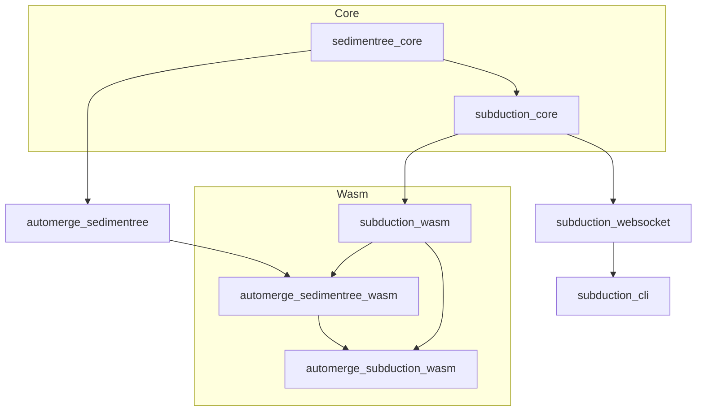

# Subduction

[](https://github.com/inkandswitch/subduction/actions/workflows/build.yml)
[](https://github.com/inkandswitch/subduction/actions/workflows/test-host.yml)
[](https://github.com/inkandswitch/subduction/actions/workflows/test-wasm.yml)
[](LICENSE-APACHE)

> [!CAUTION]
> This is an early release preview. It has a very unstable API. No guarantees are given. DO NOT use for production use cases at this time. USE AT YOUR OWN RISK.

**Subduction** is a peer-to-peer synchronization protocol and implementation for [CRDTs]. It enables efficient synchronization of encrypted, partitioned data between peers without requiring a central server.

## Features

- **Efficient Sync Protocol**: Uses [Sedimentree] for history sharding, diffing, and efficient incremental synchronization
- **Encryption-Friendly**: Designed to work with encrypted data partitions without requiring decryption during sync
- **No Central Server**: True peer-to-peer synchronization via WebSocket connections
- **Multi-Platform**: Runs on native Rust, WebAssembly (browser & Node.js), and provides a CLI tool
- **Automerge Integration**: While not the only data that can be synced via Subduction, [Automerge] was the original target.

## Architecture

Subduction is organized as a Rust workspace with multiple crates:



| Crate                  | Description                                                                             |
|------------------------|-----------------------------------------------------------------------------------------|
| `sedimentree_core`     | The core data partitioning scheme that enables efficient metadata-based synchronization |
| `subduction_core`      | The main synchronization protocol implementation                                        |
| `subduction_websocket` | WebSocket transport layer for peer-to-peer connections                                  |

### Platform Bindings

| Crate                        | Description                                                |
|------------------------------|------------------------------------------------------------|
| `subduction_wasm`            | WebAssembly bindings for browser and Node.js environments  |
| `automerge_sedimentree`      | Sedimentree adapter for Automerge documents                |
| `automerge_sedimentree_wasm` | Wasm bindings for Automerge + Sedimentree                  |
| `automerge_subduction_wasm`  | Wasm bindings for Automerge + Subduction (full sync stack) |

### Tools

| Crate            | Description                                                  |
|------------------|--------------------------------------------------------------|
| `subduction_cli` | Command-line tool for running Subduction servers and clients |

## Sedimentree

[Sedimentree][sedimentree-design] is a novel data structure for organizing encrypted data into hierarchical layers (strata). Each layer contains metadata (hashes) that represent fragments of a larger file or log. This enables:

1. **Efficient Diffing**: Compare metadata to determine which fragments need synchronization
2. **Privacy**: Sync without exposing plaintext data
3. **Incremental Updates**: Only transfer changed fragments

Sedimentree uses a depth-based partitioning scheme where fragments are organized by the number of leading zero bytes in their hashes, creating natural hierarchical layers.

## Quick Start

### Using Nix ❄️ 

If you use Nix, the Subduction server is wrapped in a flake:

```bash
# Run the server directly
nix run github:inkandswitch/subduction -- server --socket 0.0.0.0:8080

# Run the ephemeral relay
nix run github:inkandswitch/subduction -- relay --socket 0.0.0.0:8081

# Install to your profile
nix profile install github:inkandswitch/subduction
```

The flake also provides NixOS and Home Manager modules for running Subduction as a system service:

```nix
{
  inputs.subduction.url = "github:inkandswitch/subduction";

  outputs = { nixpkgs, subduction, ... }: {
    nixosConfigurations.myhost = nixpkgs.lib.nixosSystem {
      modules = [
        subduction.nixosModules.default
        {
          services.subduction.server.enable = true;
          services.subduction.relay.enable = true;
        }
      ];
    };
  };
}
```

See the [CLI README] for full configuration options including Home Manager and reverse proxy setup.

### Prerequisites

- Rust 1.90 or later
- For Wasm development: [wasm-pack]
- For browser testing: Node.js 22+ and pnpm

### Building

Build all workspace crates:

```bash
cargo build --release
```

Build Wasm packages:

```bash
cd subduction_wasm
pnpm install
pnpm build
```

### Running Tests

Run all Rust tests:

```bash
cargo test
```

Run Wasm browser tests:

```bash
cd subduction_wasm
pnpm install
npx playwright install
npx playwright test
```

### Using the CLI

Start a WebSocket server:

```bash
cargo run --release -p subduction_cli -- start --socket 127.0.0.1:8080
```

## Usage Examples

### Rust

```rust
use subduction_core::Subduction;
use subduction_core::storage::MemoryStorage;

// Create a Subduction instance with in-memory storage
let storage = MemoryStorage::new();
let subduction = Subduction::new(storage);

// Connect to peers, sync data...
```

### WebAssembly (Browser)

```typescript
import * as subduction from '@automerge/subduction';

// Create a Subduction instance
const storage = new subduction.MemoryStorage();
const syncer = new subduction.Subduction(storage);

// Connect to a WebSocket server
const ws = new WebSocket('ws://localhost:8080');
const peerId = new subduction.PeerId(new Uint8Array(32)); // Your peer ID
const subductionWs = await subduction.SubductionWebSocket.connect(
  new URL('ws://localhost:8080'),
  peerId,
  5000
);

// Register the connection
await syncer.register(subductionWs);

// Start syncing...
```

## Development

### Project Structure

```
subduction/
├── sedimentree_core/           # Core Sedimentree data structure
├── subduction_core/            # Sync protocol implementation
├── subduction_websocket/       # WebSocket transport
├── subduction_wasm/            # Wasm bindings
├── subduction_cli/             # CLI for server & client nodes
├── automerge_sedimentree/      # Automerge integration
├── automerge_sedimentree_wasm/ # Wasm wrapper for automerge_sedimentree
└── automerge_subduction_wasm/  # Wasm wrapper for automerge_sedimentree + subduction
```

### Testing

The project uses several testing strategies:

| Strategy             | Description                                                     |
|----------------------|-----------------------------------------------------------------|
| Unit Tests           | Standard `cargo test` for Rust code                             |
| Property-based Tests | [`bolero`] for fuzz testing                                     |
| E2E Tests            | Playwright tests for Wasm bindings (see `subduction_wasm/e2e/`) |
| Integration Tests    | WebSocket connection tests with real peer interactions          |

<!-- Internal Links -->

[CLI README]: ./subduction_cli/README.md#running-as-a-system-service
[Sedimentree]: ./sedimentree_core

<!-- External Links -->

[Automerge]: https://automerge.org/
[`bolero`]: https://github.com/camshaft/bolero
[CRDTs]: https://crdt.tech/
[Ink & Switch]: https://www.inkandswitch.com/
[sedimentree-design]: https://github.com/inkandswitch/keyhive/blob/main/design/sedimentree.md
[wasm-pack]: https://rustwasm.github.io/wasm-pack/
