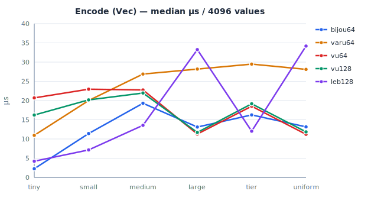
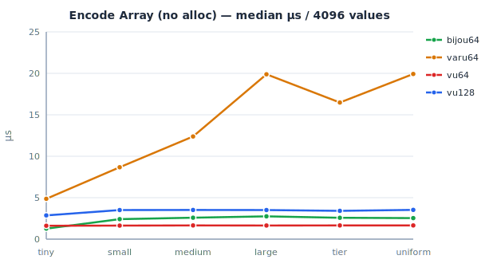
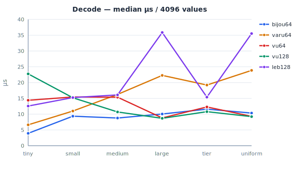
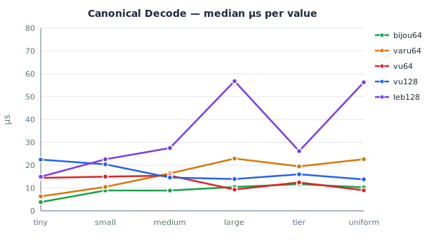
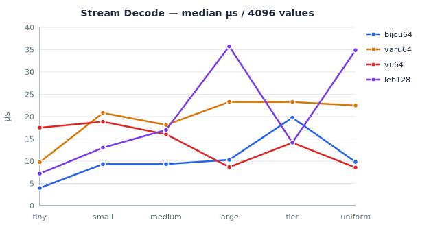

# bijou64 Benchmark Shootout

> Criterion benchmarks comparing bijou64 against varu64, vu64, vu128, and leb128. All times are median µs over 4096 values. 🏆 marks the best in each row. The ratio column shows bijou64's time divided by the best competitor (< 1x means bijou64 wins).
>
> Run: `cargo bench -p bijou64 --bench shootout`

## Machine

|         |                         |
|---------|-------------------------|
| CPU     | Apple M2 Pro            |
| Memory  | 32 GB                   |
| OS      | macOS 26.3.1            |
| Rust    | 1.90.0                  |
| Profile | `bench` (opt-level = 3) |

## Encode

Encode to a `Vec<u8>`.

| Distribution    | bijou64      | varu64 | vu64         | vu128 | leb128       | bijou64 rank | bijou64 vs other best |
|-----------------|--------------|--------|--------------|-------|--------------|--------------|----------------------|
| tiny (0-247)    | **2.26** 🏆  | 10.96  | 20.69        | 16.23 | 4.21         | #1           | 0.54x                |
| small (248-64k) | 11.41        | 20.00  | 22.96        | 20.17 | **7.16** 🏆  | #2           | 1.59x                |
| medium (64k-4B) | 19.29        | 26.89  | 22.76        | 21.95 | **13.55** 🏆 | #2           | 1.42x                |
| large (>4B)     | 13.11        | 28.19  | **11.30** 🏆 | 11.70 | 33.25        | #3           | 1.16x                |
| tier boundaries | 16.26        | 29.47  | 18.52        | 19.15 | **12.03** 🏆 | #2           | 1.35x                |
| uniform random  | 13.15        | 28.10  | **11.21** 🏆 | 11.84 | 34.17        | #3           | 1.17x                |

Chart

## Encode Array

Encode to a fixed `[u8; 9]` with no allocation. leb128 is excluded because its API requires a `Write` implementor.

| Distribution    | bijou64     | varu64 | vu64        | vu128 | bijou64 rank | bijou64 vs other best |
|-----------------|-------------|--------|-------------|-------|--------------|----------------------|
| tiny (0-247)    | **1.27** 🏆 | 4.87   | 1.62        | 2.87  | #1           | 0.78x                |
| small (248-64k) | 2.41        | 8.67   | **1.63** 🏆 | 3.51  | #2           | 1.48x                |
| medium (64k-4B) | 2.59        | 12.38  | **1.65** 🏆 | 3.52  | #2           | 1.57x                |
| large (>4B)     | 2.75        | 19.88  | **1.64** 🏆 | 3.51  | #2           | 1.68x                |
| tier boundaries | 2.58        | 16.48  | **1.65** 🏆 | 3.41  | #2           | 1.56x                |
| uniform random  | 2.54        | 19.92  | **1.65** 🏆 | 3.53  | #2           | 1.54x                |

Chart

## Decode

Decode from a `&[u8]` buffer.

| Distribution    | bijou64     | varu64 | vu64  | vu128       | leb128 | bijou64 rank | bijou64 vs other best |
|-----------------|-------------|--------|-------|-------------|--------|--------------|----------------------|
| tiny (0-247)    | **3.93** 🏆 | 6.62   | 14.40 | 22.76       | 12.57  | #1           | 0.59x                |
| small (248-64k) | **9.36** 🏆 | 10.99  | 15.43 | 15.18       | 15.24  | #1           | 0.85x                |
| medium (64k-4B) | **8.77** 🏆 | 16.24  | 15.37 | 10.70       | 16.09  | #1           | 0.82x                |
| large (>4B)     | 10.05       | 22.27  | 8.80  | **8.67** 🏆 | 35.86  | #3           | 1.16x                |
| tier boundaries | 11.59       | 19.21  | 12.27 | **10.78** 🏆| 15.39  | #2           | 1.07x                |
| uniform random  | 10.34       | 23.86  | 9.30  | **9.22** 🏆 | 35.52  | #3           | 1.12x                |

Chart

## Canonical Decode

Decode with a guarantee that the encoding is minimal (no overlong representations accepted). This matters for protocols that need deterministic serialisation -- if two peers can encode the same value differently, content-addressed hashes break.

bijou64 achieves canonicality structurally: its disjoint tier ranges make overlong encodings impossible, so the canonical decode path is identical to regular decode with zero overhead. varu64 and vu64 always perform a runtime minimality check (there's no way to opt out). vu128 and leb128 accept overlong encodings by design, so we wrap them with a decode-then-re-encode-and-compare-length check to simulate what a canonical-aware caller would need to do.

| Distribution    | bijou64     | varu64 | vu64        | vu128 | leb128 | bijou64 rank | bijou64 vs other best |
|-----------------|-------------|--------|-------------|-------|--------|--------------|----------------------|
| tiny (0-247)    | **3.85** 🏆 | 6.34   | 14.43       | 22.42 | 14.95  | #1           | 0.61x                |
| small (248-64k) | **8.93** 🏆 | 10.50  | 14.97       | 20.36 | 22.59  | #1           | 0.85x                |
| medium (64k-4B) | **8.88** 🏆 | 16.41  | 15.46       | 14.60 | 27.50  | #1           | 0.61x                |
| large (>4B)     | 10.46       | 22.88  | **9.32** 🏆 | 13.95 | 56.79  | #2           | 1.12x                |
| tier boundaries | **11.68** 🏆| 19.48  | 12.47       | 16.00 | 26.15  | #1           | 0.94x                |
| uniform random  | 10.27       | 22.62  | **8.98** 🏆 | 13.77 | 56.29  | #2           | 1.14x                |

Chart

The cost of canonicality varies wildly by crate. bijou64 and the plain decode numbers are identical because there's nothing extra to check. varu64 and vu64 pay their runtime check regardless -- their numbers here match the regular decode table. vu128 and leb128 take a significant hit from the re-encode step, especially for large values where leb128's byte-at-a-time `Write`/`Read` API makes the round trip expensive (56µs vs 36µs without the check).

For protocols that _require_ canonical encoding -- and content-addressed systems generally do -- this is the table that matters.

## Stream Decode

Decode a concatenated stream of encoded values. vu128 is excluded because its API requires a fixed `[u8; 9]` input.

| Distribution    | bijou64     | varu64 | vu64         | leb128 | bijou64 rank | bijou64 vs other best |
|-----------------|-------------|--------|--------------|--------|--------------|----------------------|
| tiny (0-247)    | **3.98** 🏆 | 9.77   | 17.51        | 7.20   | #1           | 0.55x                |
| small (248-64k) | **9.34** 🏆 | 20.82  | 18.84        | 13.02  | #1           | 0.72x                |
| medium (64k-4B) | **9.34** 🏆 | 18.12  | 16.03        | 17.02  | #1           | 0.58x                |
| large (>4B)     | 10.31       | 23.29  | **8.68** 🏆  | 35.76  | #2           | 1.19x                |
| tier boundaries | 19.76       | 23.28  | **14.14** 🏆 | 14.15  | #3           | 1.40x                |
| uniform random  | 9.81        | 22.48  | **8.57** 🏆  | 34.89  | #2           | 1.15x                |

Chart

## Encoded Size

Bytes per value compared to a raw 8-byte `u64`. All tag-byte formats (bijou64, varu64, vu64/vu128) add 1 byte of overhead for multi-byte values. leb128 uses 1 continuation bit per byte instead.

bijou64 and varu64 share the same tag threshold (248), so their 1-byte range is wider than vu64/vu128 (0-247 vs 0-127). bijou64's per-tier offsets shift the multi-byte boundaries slightly, but the encoded sizes end up identical to varu64 at every value.

| Value    | Raw `u64` | bijou64          | varu64           | vu64 / vu128     | leb128           |
|----------|-----------|------------------|------------------|------------------|------------------|
| 0        | 8         | 1 (12.5%)        | 1 (12.5%)        | 1 (12.5%)        | 1 (12.5%)        |
| 127      | 8         | 1 (12.5%)        | 1 (12.5%)        | 1 (12.5%)        | 1 (12.5%)        |
| 128      | 8         | **1 (12.5%)** 🏆 | **1 (12.5%)** 🏆 | 2 (25%)          | 2 (25%)          |
| 247      | 8         | **1 (12.5%)** 🏆 | **1 (12.5%)** 🏆 | 2 (25%)          | 2 (25%)          |
| 248      | 8         | 2 (25%)          | 2 (25%)          | 2 (25%)          | 2 (25%)          |
| 255      | 8         | 2 (25%)          | 2 (25%)          | 2 (25%)          | 2 (25%)          |
| 256      | 8         | **2 (25%)** 🏆   | 3 (37.5%)        | **2 (25%)** 🏆   | **2 (25%)** 🏆   |
| 503      | 8         | **2 (25%)** 🏆   | 3 (37.5%)        | **2 (25%)** 🏆   | **2 (25%)** 🏆   |
| 504      | 8         | 3 (37.5%)        | 3 (37.5%)        | **2 (25%)** 🏆   | **2 (25%)** 🏆   |
| 1,000    | 8         | 3 (37.5%)        | 3 (37.5%)        | **2 (25%)** 🏆   | **2 (25%)** 🏆   |
| 16,383   | 8         | 3 (37.5%)        | 3 (37.5%)        | **2 (25%)** 🏆   | **2 (25%)** 🏆   |
| 16,384   | 8         | 3 (37.5%)        | 3 (37.5%)        | 3 (37.5%)        | 3 (37.5%)        |
| 65,535   | 8         | 3 (37.5%)        | 3 (37.5%)        | 3 (37.5%)        | 3 (37.5%)        |
| 65,536   | 8         | **3 (37.5%)** 🏆 | 4 (50%)          | **3 (37.5%)** 🏆 | **3 (37.5%)** 🏆 |
| 66,039   | 8         | **3 (37.5%)** 🏆 | 4 (50%)          | **3 (37.5%)** 🏆 | **3 (37.5%)** 🏆 |
| 100,000  | 8         | 4 (50%)          | 4 (50%)          | **3 (37.5%)** 🏆 | **3 (37.5%)** 🏆 |
| 2^24 - 1 | 8         | 4 (50%)          | 4 (50%)          | 4 (50%)          | 4 (50%)          |
| 2^32 - 1 | 8         | 5 (62.5%)        | 5 (62.5%)        | 5 (62.5%)        | 5 (62.5%)        |
| 2^40 - 1 | 8         | 6 (75%)          | 6 (75%)          | 6 (75%)          | 6 (75%)          |
| 2^48 - 1 | 8         | 7 (87.5%)        | 7 (87.5%)        | 7 (87.5%)        | 7 (87.5%)        |
| 2^56 - 1 | 8         | 8 (100%)         | 8 (100%)         | 8 (100%)         | 8 (100%)         |
| 2^64 - 1 | 8         | 9 (112.5%)       | 9 (112.5%)       | 9 (112.5%)       | 10 (125%)        |

🏆 marks the smallest encoding in each row. Three patterns emerge:

- **128-247**: bijou64 and varu64 win vs vu64/leb128. Their wider 1-byte tier (threshold 248 vs 128) keeps these values in a single byte.
- **256-503, 65536-66039, etc.**: bijou64 wins vs varu64. The per-tier offsets extend each tier's range slightly past the power-of-256 boundary where varu64 steps up. This pattern repeats at every tier boundary.
- **504-16383, 66040-2097151, etc.**: vu64 and leb128 win vs bijou64/varu64. vu64 packs 7 value bits into the first byte, giving it wider multi-byte tiers. This pattern also repeats at every tier.

For values 0-127, every format agrees: 1 byte, an 8x reduction over raw `u64`. The trade-offs only appear in the 128-16,383 range, and which format "wins" depends on which part of that range your workload hits. Above 16,384 the formats converge again and stay within 1 byte of each other all the way to `u64::MAX`.

## Summary

On this particular machine and workload, bijou64 is the fastest _decoder_ for tiny, small, and medium values -- the distributions we _believe_ dominate the protocol's hot path (blob sizes, counts, offsets under 64k). It also wins stream decode for those same ranges. On the encode side, bijou64 leads only for tiny values; leb128 is faster for small-and-above Vec encoding, and vu64 dominates encode-to-array across all non-tiny distributions. Different hardware, compiler versions, or real-world access patterns could easily shift the picture.

For large values and uniform random distributions, vu64 tends to win decode and stream decode. This is probably inherent to the format: its power-of-2 tier boundaries are cheaper to work with than bijou64's offset-adjusted boundaries.

The canonical decode benchmark tells the most important story for content-addressed protocols. bijou64 wins 4 of 6 distributions and trails vu64 by only 1.12-1.14x on the remaining two -- while getting canonicality for free. The crates that _don't_ natively guarantee canonicality (vu128, leb128) pay a steep re-encode penalty, with leb128 reaching 56µs for large values. For any system that needs deterministic serialisation, bijou64's structural canonicality is a meaningful advantage.

The Vec-based encode path is bijou64's weakest point outside the tiny range. The `extend_from_slice` with a variable-length tail appears to inhibit vectorisation that competitors achieve with simpler layouts. The allocation-free `encode_array` path narrows the gap considerably (1.48-1.68x behind vu64, vs 1.59x behind leb128 for Vec encode), suggesting the overhead is partly in the Vec interaction rather than the tier calculation itself.
