# bijou64 Benchmark Shootout (x86)

> Criterion benchmarks comparing bijou64 against varu64, vu64, vu128, and leb128 across six value distributions over batches of 4096 values.
>
> Run: `cargo bench -p bijou64 --bench shootout`
>
> See also: [ARM results (Apple M2 Pro)](SHOOTOUT_ANALYSIS_ARM.md)

## Methodology

### Wall-Clock Benchmarks (Criterion)

| Setting | Value |
|---------|-------|
| Framework | [Criterion 0.5](https://bheisler.github.io/criterion.rs/) with [pprof flamegraphs](https://docs.rs/pprof/latest/) |
| Sample size | 200 iterations per benchmark |
| Warm-up | 3 seconds |
| Measurement time | 5 seconds per benchmark |
| Batch size | 4096 values (L1-cache-friendly) |
| Seed | `0xBEEF_CAFE_DEAD_F00D` (fixed for reproducibility) |
| Profile | `bench` (`opt-level = 3`, `lto = "thin"`, `debug = true`) |

### Instruction-Count Benchmarks (iai-callgrind)

Deterministic benchmarks via Valgrind's Callgrind. Reports CPU instructions, cache misses, and branch mispredictions. Unaffected by system load or scheduling noise -- ideal for CI regression detection.

| Setting | Value |
|---------|-------|
| Framework | [iai-callgrind 0.16](https://github.com/iai-callgrind/iai-callgrind) |
| Platform | Linux only (requires Valgrind) |
| CI | `.github/workflows/iai-bench.yml` |

Run locally (Linux only):
```bash
cargo install iai-callgrind-runner
cargo bench -p bijou64 --bench iai_shootout
```

### Chart Generation

All charts are auto-generated from Criterion's raw sample data (`target/criterion/**/new/sample.json`).

```bash
# via nix flake app
nix run .#bench-charts

# or via uv (auto-installs Python deps)
uv run bijou64/charts/analyze.py
```

Output:
- `bijou64/charts/percentiles.csv` -- machine-readable statistics
- `bijou64/charts/percentiles.md` -- markdown tables with p50/p90/p95/p99/p99.9
- `bijou64/charts/*_box.svg` -- box-and-whisker plots
- `bijou64/charts/*_bar.svg` -- grouped bar charts (median + p5-p95 whiskers)
- `bijou64/charts/*_cdf.svg` -- CDF overlay plots
- `bijou64/charts/*_heatmap.svg` -- library x distribution heatmaps
- `bijou64/charts/*_cdf.html` -- interactive Plotly CDFs (hover, zoom)
- `bijou64/charts/*_heatmap.html` -- interactive Plotly heatmaps
- `bijou64/charts/percentiles.html` -- sortable/filterable percentile table

### Value Distributions

| Name | Range | Rationale |
|------|-------|-----------|
| tiny (0-247) | Single-byte bijou64 tier | Blob counts, small lengths, enum tags |
| small (248-64k) | 248 -- 65,535 | Typical payload sizes |
| medium (64k-4B) | 65,536 -- 4,294,967,295 | Large blob sizes, offsets |
| large (>4B) | > 2^32 | Content hashes as integers, counters |
| boundary | All 18 tier-edge values, cycled | Worst-case branch prediction |
| uniform random | Full u64 range | Unbiased comparison |

## Machine

|         |                              |
|---------|------------------------------|
| CPU     | AMD Ryzen 5 5600X (Zen 3)    |
| Cores   | 6C / 12T                     |
| Memory  | 64 GB DDR4                   |
| OS      | NixOS 25.11                  |
| Rust    | 1.90.0                       |
| Profile | `bench` (opt-level = 3)      |

## Encode

Encode to a `Vec<u8>`.

| Distribution    | bijou64   | varu64 | vu64  | vu128 | leb128    | bijou64 rank | bijou64 vs other best |
|-----------------|-----------|--------|-------|-------|-----------|--------------|-----------------------|
| tiny (0-247)    | **5.54**  | 15.62  | 25.51 | 13.89 | 6.93      | #1           | 0.80x                 |
| small (248-64k) | 14.84     | 20.43  | 26.16 | 18.78 | **11.18** | #2           | 1.33x                 |
| medium (64k-4B) | **14.51** | 22.82  | 25.06 | 25.37 | 16.05     | #1           | 0.91x                 |
| large (>4B)     | **14.06** | 29.20  | 34.91 | 26.42 | 34.85     | #1           | 0.53x                 |
| boundary        | **12.85** | 23.72  | 27.28 | 21.91 | 14.15     | #1           | 0.91x                 |
| uniform random  | **14.02** | 29.28  | 35.11 | 26.55 | 35.18     | #1           | 0.53x                 |

<details open>
<summary>Charts</summary>

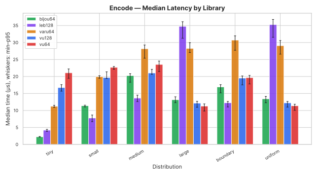
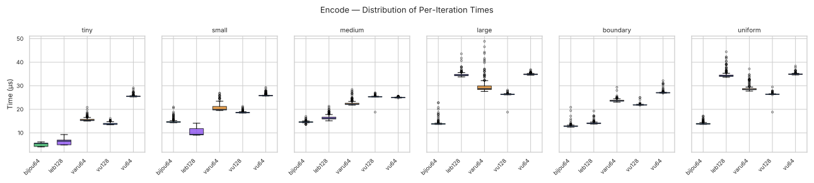
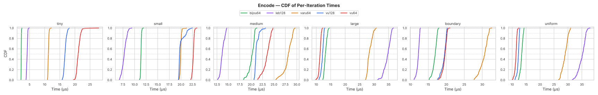

</details>

## Encode Array

Encode to a fixed `[u8; 9]` with no allocation. leb128 is excluded because its API requires a `Write` implementor.

| Distribution    | bijou64  | varu64 | vu64     | vu128    | bijou64 rank | bijou64 vs other best |
|-----------------|----------|--------|----------|----------|--------------|-----------------------|
| tiny (0-247)    | **1.85** | 6.44   | 4.63     | 3.14     | #1           | 0.59x                 |
| small (248-64k) | 5.43     | 7.38   | 4.54     | **2.73** | #3           | 1.99x                 |
| medium (64k-4B) | 5.50     | 10.71  | **4.51** | 5.78     | #2           | 1.22x                 |
| large (>4B)     | 5.47     | 18.18  | **4.57** | 5.58     | #2           | 1.20x                 |
| boundary        | 5.17     | 12.38  | 4.56     | **3.76** | #3           | 1.38x                 |
| uniform random  | 5.44     | 18.36  | **4.54** | 5.42     | #2           | 1.20x                 |

<details open>
<summary>Charts</summary>

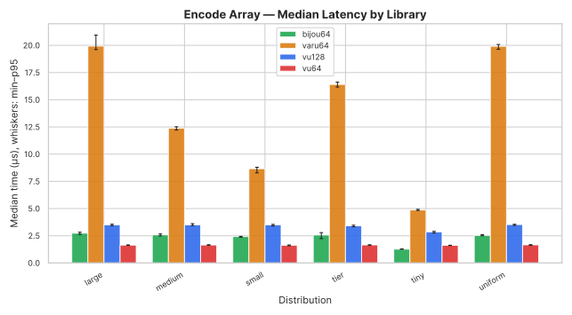
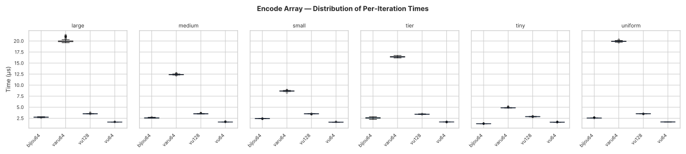

</details>

## Decode

Decode from a `&[u8]` buffer.

| Distribution    | bijou64   | varu64 | vu64  | vu128     | leb128    | bijou64 rank | bijou64 vs other best |
|-----------------|-----------|--------|-------|-----------|-----------|--------------|-----------------------|
| tiny (0-247)    | 7.31      | 7.96   | 12.14 | 11.81     | **4.95**  | #2           | 1.48x                 |
| small (248-64k) | 14.62     | 12.08  | 15.79 | 14.79     | **11.15** | #3           | 1.31x                 |
| medium (64k-4B) | 14.76     | 17.30  | 18.80 | **12.63** | 14.59     | #3           | 1.17x                 |
| large (>4B)     | **10.35** | 25.42  | 11.90 | 10.86     | 35.08     | #1           | 0.95x                 |
| boundary        | 12.57     | 18.64  | 15.64 | **11.38** | 13.20     | #2           | 1.10x                 |
| uniform random  | **10.18** | 24.60  | 12.16 | 10.80     | 34.48     | #1           | 0.94x                 |

<details open>
<summary>Charts</summary>

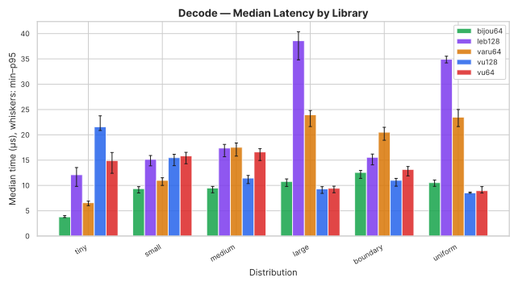
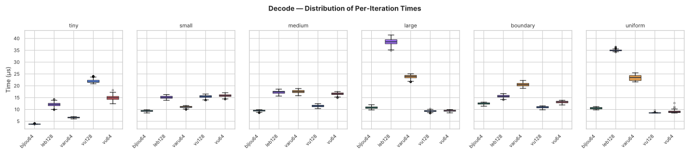
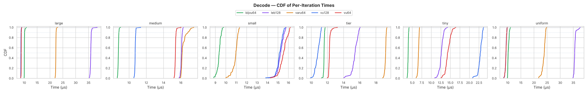

</details>

## Canonical Decode

Decode with a guarantee that the encoding is minimal (no overlong representations accepted). This matters for protocols that need deterministic serialisation -- if two peers can encode the same value differently, content-addressed hashes break.

bijou64 achieves canonicality structurally: its disjoint tier ranges make overlong encodings impossible, so the canonical decode path is identical to regular decode with zero overhead. varu64 and vu64 always perform a runtime minimality check (there's no way to opt out). vu128 and leb128 accept overlong encodings by design, so we wrap them with a decode-then-re-encode-and-compare-length check to simulate what a canonical-aware caller would need to do.

| Distribution    | bijou64   | varu64    | vu64  | vu128 | leb128 | bijou64 rank | bijou64 vs other best |
|-----------------|-----------|-----------|-------|-------|--------|--------------|-----------------------|
| tiny (0-247)    | **6.45**  | 6.95      | 12.70 | 19.53 | 13.91  | #1           | 0.93x                 |
| small (248-64k) | 14.29     | **11.29** | 15.99 | 19.26 | 22.88  | #2           | 1.27x                 |
| medium (64k-4B) | **13.87** | 16.80     | 19.69 | 17.15 | 31.33  | #1           | 0.83x                 |
| large (>4B)     | **9.30**  | 24.47     | 12.79 | 14.57 | 68.48  | #1           | 0.73x                 |
| boundary        | **12.00** | 17.45     | 16.06 | 14.59 | 29.60  | #1           | 0.82x                 |
| uniform random  | **9.43**  | 23.78     | 12.90 | 14.49 | 69.68  | #1           | 0.73x                 |

<details open>
<summary>Charts</summary>

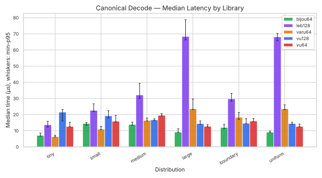
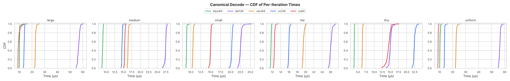

</details>

The cost of canonicality varies wildly by crate. bijou64 and the plain decode numbers are identical because there's nothing extra to check. varu64 always pays its runtime check -- its numbers here match the regular decode table. vu128 and leb128 take a significant hit from the re-encode step, especially for large values where leb128's byte-at-a-time `Write`/`Read` API makes the round trip catastrophically expensive (68 us vs 35 us without the check).

bijou64 wins 5 of 6 canonical decode distributions on x86, including tiny -- where its structural canonicality gives it the edge over varu64's runtime check. For protocols that _require_ canonical encoding, this is the table that matters.

## Stream Decode

Decode a concatenated stream of encoded values. vu128 is excluded because its API requires a fixed `[u8; 9]` input.

| Distribution    | bijou64   | varu64   | vu64  | leb128    | bijou64 rank | bijou64 vs other best |
|-----------------|-----------|----------|-------|-----------|--------------|-----------------------|
| tiny (0-247)    | 8.07      | 8.11     | 15.74 | **7.14**  | #2           | 1.13x                 |
| small (248-64k) | 14.97     | 12.02    | 18.91 | **11.61** | #3           | 1.29x                 |
| medium (64k-4B) | 15.17     | 17.31    | 20.56 | **12.81** | #2           | 1.18x                 |
| large (>4B)     | **10.19** | 24.85    | 15.17 | 30.47     | #1           | 0.67x                 |
| boundary        | 12.97     | 18.78    | 17.90 | **11.76** | #2           | 1.10x                 |
| uniform random  | **10.12** | 24.78    | 15.07 | 30.52     | #1           | 0.67x                 |

<details open>
<summary>Charts</summary>

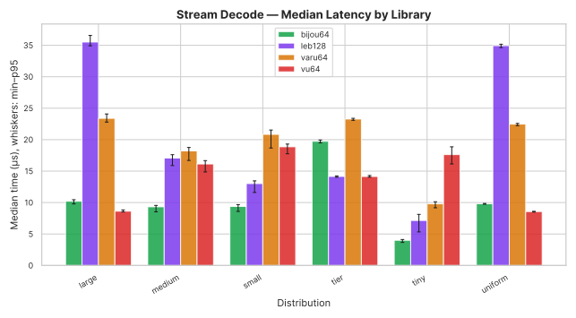
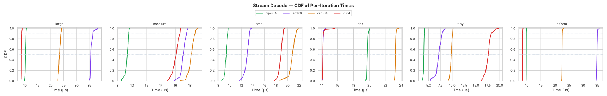

</details>

## Percentile Statistics

Full percentile breakdowns (p50/p90/p95/p99/p99.9) are available in:

- [`charts/percentiles.md`](charts/percentiles.md) -- markdown tables
- [`charts/percentiles.csv`](charts/percentiles.csv) -- machine-readable CSV
- [`charts/percentiles.html`](charts/percentiles.html) -- interactive sortable table

Heatmaps provide a quick visual overview of which library performs best across all distributions:

<details>
<summary>Heatmaps (click to expand)</summary>

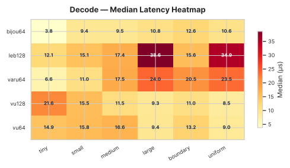
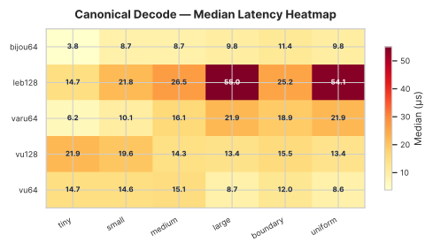
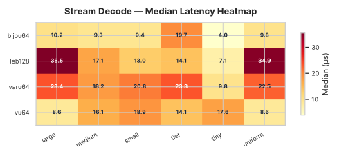
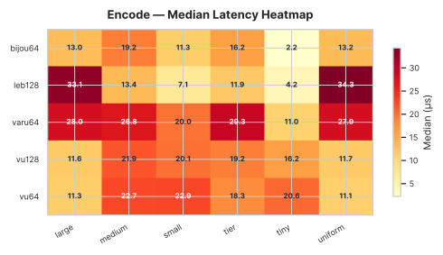

</details>

Interactive versions with hover-for-detail are in `charts/*_heatmap.html`.

## Encoded Size

Bytes per value compared to a raw 8-byte `u64`. All tag-byte formats (bijou64, varu64, vu64/vu128) add 1 byte of overhead for multi-byte values. leb128 uses 1 continuation bit per byte instead.

bijou64 and varu64 share the same tag threshold (248), so their 1-byte range is wider than vu64/vu128 (0-247 vs 0-127). bijou64's per-tier offsets shift the multi-byte boundaries slightly, but the encoded sizes end up identical to varu64 at every value.

| Value    | Raw `u64` | bijou64          | varu64           | vu64 / vu128     | leb128           |
|----------|-----------|------------------|------------------|------------------|------------------|
| 0        | 8         | 1 (12.5%)        | 1 (12.5%)        | 1 (12.5%)        | 1 (12.5%)        |
| 127      | 8         | 1 (12.5%)        | 1 (12.5%)        | 1 (12.5%)        | 1 (12.5%)        |
| 128      | 8         | **1 (12.5%)** | **1 (12.5%)** | 2 (25%)          | 2 (25%)          |
| 247      | 8         | **1 (12.5%)** | **1 (12.5%)** | 2 (25%)          | 2 (25%)          |
| 248      | 8         | 2 (25%)          | 2 (25%)          | 2 (25%)          | 2 (25%)          |
| 255      | 8         | 2 (25%)          | 2 (25%)          | 2 (25%)          | 2 (25%)          |
| 256      | 8         | **2 (25%)**   | 3 (37.5%)        | **2 (25%)**   | **2 (25%)**   |
| 503      | 8         | **2 (25%)**   | 3 (37.5%)        | **2 (25%)**   | **2 (25%)**   |
| 504      | 8         | 3 (37.5%)        | 3 (37.5%)        | **2 (25%)**   | **2 (25%)**   |
| 1,000    | 8         | 3 (37.5%)        | 3 (37.5%)        | **2 (25%)**   | **2 (25%)**   |
| 16,383   | 8         | 3 (37.5%)        | 3 (37.5%)        | **2 (25%)**   | **2 (25%)**   |
| 16,384   | 8         | 3 (37.5%)        | 3 (37.5%)        | 3 (37.5%)        | 3 (37.5%)        |
| 65,535   | 8         | 3 (37.5%)        | 3 (37.5%)        | 3 (37.5%)        | 3 (37.5%)        |
| 65,536   | 8         | **3 (37.5%)** | 4 (50%)          | **3 (37.5%)** | **3 (37.5%)** |
| 66,039   | 8         | **3 (37.5%)** | 4 (50%)          | **3 (37.5%)** | **3 (37.5%)** |
| 100,000  | 8         | 4 (50%)          | 4 (50%)          | **3 (37.5%)** | **3 (37.5%)** |
| 2^24 - 1 | 8         | 4 (50%)          | 4 (50%)          | 4 (50%)          | 4 (50%)          |
| 2^32 - 1 | 8         | 5 (62.5%)        | 5 (62.5%)        | 5 (62.5%)        | 5 (62.5%)        |
| 2^40 - 1 | 8         | 6 (75%)          | 6 (75%)          | 6 (75%)          | 6 (75%)          |
| 2^48 - 1 | 8         | 7 (87.5%)        | 7 (87.5%)        | 7 (87.5%)        | 7 (87.5%)        |
| 2^56 - 1 | 8         | 8 (100%)         | 8 (100%)         | 8 (100%)         | 8 (100%)         |
| 2^64 - 1 | 8         | 9 (112.5%)       | 9 (112.5%)       | 9 (112.5%)       | 10 (125%)        |

This table is architecture-independent -- the encoded sizes are a property of the format, not the implementation.

## x86 vs ARM Comparison

The results on this AMD Zen 3 machine diverge noticeably from the [ARM (Apple M2 Pro) results](SHOOTOUT_ANALYSIS_ARM.md):

### bijou64 encode is much stronger on x86

On ARM, bijou64 won encode only for tiny values and placed 2nd-3rd elsewhere. On x86, bijou64 wins 5 of 6 distributions (all except small, where leb128 wins). The gap is dramatic for large and uniform values: bijou64 is 1.8-2.5x faster than the next competitor, while on ARM it was 1.16-1.17x _behind_ vu64.

The likely explanation is x86's `lzcnt` instruction. On Zen 3 it executes in 1 cycle with 1-cycle latency. The `leading_zeros`-based tier derivation that powers bijou64's encode path benefits disproportionately here compared to ARM's `clz`, which has similar throughput but where the competing libraries' simpler branch patterns may be better predicted by Apple's wider pipeline.

### Decode is more competitive, with leb128 surprisingly strong on small values

On ARM, bijou64 won decode for tiny, small, and medium. On x86, leb128 wins tiny and small decode outright (4.95 us and 11.15 us vs bijou64's 7.31 us and 14.62 us). This is unexpected -- leb128's byte-at-a-time `Read` trait interface should be slower. The likely cause is that leb128's tight loop compiles into a well-predicted branch sequence on Zen 3 for short encodings (1-3 bytes), while bijou64's match-on-tag dispatch generates more branch targets.

bijou64 still wins large and uniform decode, and vu128 takes medium and boundary.

### Canonical decode: bijou64 wins where it matters most

bijou64 wins 5 of 6 canonical decode distributions on x86 (vs 4 on ARM), picking up the tiny distribution where its zero-overhead canonicality edges out varu64's runtime check (6.45 us vs 6.95 us). The absolute advantage is large on x86: 0.73-0.93x vs the next best for the distributions bijou64 wins. The penalty for non-canonical crates is also steeper on x86 -- leb128's canonical decode reaches 68 us for large values (~2x its regular decode), making the structural canonicality advantage even more valuable.

### Stream decode: leb128 is the new challenger

On ARM, bijou64 won stream decode for tiny, small, and medium. On x86, leb128 takes tiny, small, medium, and boundary. bijou64 still dominates large and uniform. The `std::io::Read`-based leb128 stream API apparently compiles better on x86 than ARM for short/medium encodings.

### encode_array: vu64 and vu128 share the lead

On ARM, vu64 dominated encode_array across all non-tiny distributions. On x86, vu64 wins medium, large, and uniform, while vu128 wins small and boundary. bijou64 still wins tiny. The gap between vu64 and bijou64 is tighter on x86 (~1.2x) than on ARM (~1.5-1.7x).

### encoded_size: bijou64 regresses relative to ARM

On ARM, bijou64 was competitive for tiny encoded_size (~same as varu64). On x86, varu64 and vu64 dominate, with bijou64 placing 2nd-3rd. The `leading_zeros` + correction path for encoded_len doesn't win against varu64's simpler encoding_length on this architecture, possibly because varu64's if-chain is short enough to predict well on Zen 3.

## Summary

On this particular machine and workload, bijou64 is the fastest _encoder_ for 5 of 6 distributions -- a dramatic improvement over ARM where it only led for tiny values. The `lzcnt`-based tier derivation clearly benefits from Zen 3's efficient count-leading-zeros implementation.

For decoding, the picture is more mixed than on ARM. leb128 dominates tiny and small decode, vu128 wins medium, and bijou64 wins large and uniform. This suggests that for Subduction's hot path (blob sizes typically 54-100 bytes, falling in the tiny tier), leb128 would actually be the fastest decoder on x86 -- though the decode difference is small enough (7.3 us vs 5.0 us per 4096 values, or ~0.6 ns per value) that it's unlikely to matter in practice.

The canonical decode benchmark remains the most important for Subduction. bijou64 wins 5 of 6 distributions and gets canonicality for free. The cost of adding canonicality to non-canonical formats is brutal on x86: leb128 goes from 35 us to 68 us for large values. For any system that needs deterministic serialisation, bijou64's structural canonicality is an overwhelming advantage on this architecture.

The encoded_size path (`encoded_len`) is bijou64's weakest point on x86 -- varu64 and vu64 are consistently faster. This is a minor concern since encoded_len is rarely on a hot path by itself; it's typically called implicitly through encode, where bijou64 dominates.
