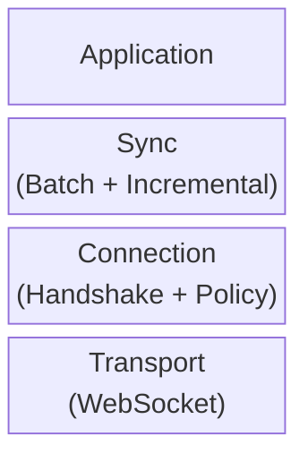
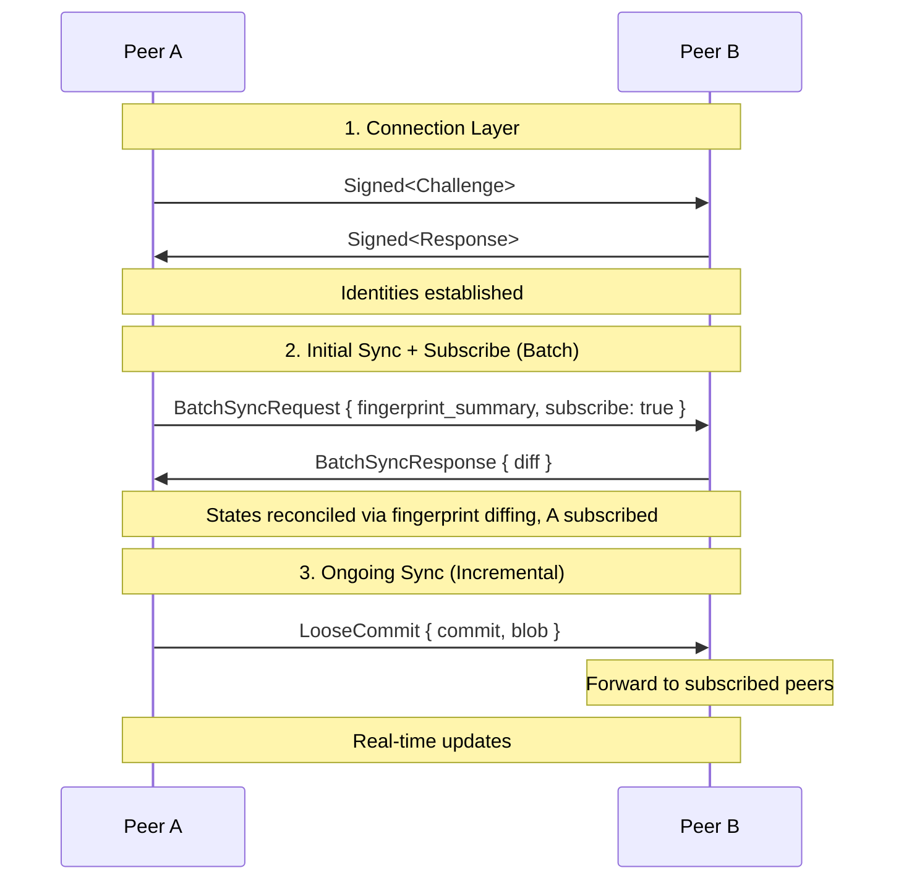

# Subduction Protocol Design

This directory contains protocol design documents for Subduction.

## Documents

| Document                          | Purpose                                      |
|-----------------------------------|----------------------------------------------|
| [`assumptions`](./assumptions.md) | Protocol assumptions and invariants          |
| [`handshake`](./handshake.md)     | Mutual authentication via Ed25519 signatures |
| [`protocol`](./protocol.md)       | Binary format, serialization, cryptographic choices |
| [`security/`](./security/)        | Threat model and security rationale          |
| [`sedimentree`](./sedimentree.md) | Depth-based data partitioning scheme         |
| [`sync/`](./sync/)                | Sync protocol overview and comparison        |

## Protocol Layers

## Typical Flow

## Design Principles

- **no_std compatible** — Core protocol logic works without std
- **Transport agnostic** — All messages use canonical binary format, transport is pluggable
- **Policy separation** — Authentication (handshake) is separate from authorization (policy)
- **Subscription-based** — Updates forwarded only to subscribed and authorized peers
- **Content addressed** — All data identified by BLAKE3 hash
- **Idempotent** — Receiving the same data twice is safe
