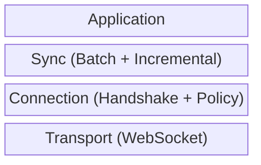
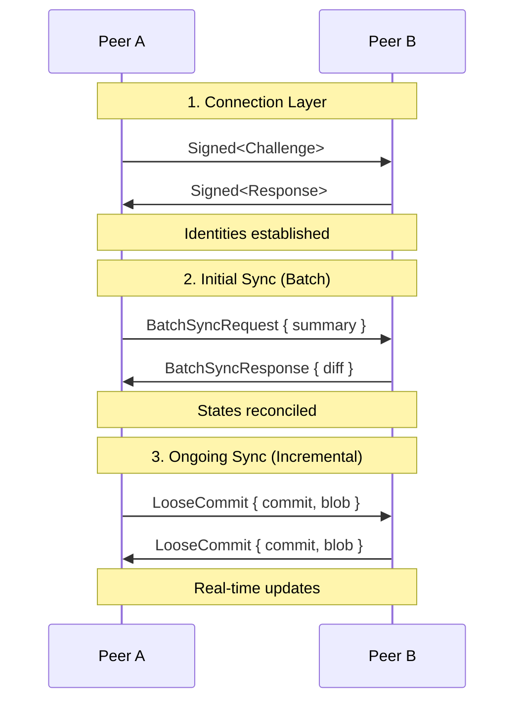

# Subduction Protocol Design

This directory contains protocol design documents for Subduction.

## Documents

| Document | Purpose |
|----------|---------|
| [handshake.md](./handshake.md) | Mutual authentication via Ed25519 signatures |
| [sedimentree.md](./sedimentree.md) | Depth-based data partitioning scheme |
| [sync/](./sync/) | Sync protocol overview and comparison |
| [sync/batch.md](./sync/batch.md) | Pull-based full sedimentree reconciliation |
| [sync/incremental.md](./sync/incremental.md) | Push-based real-time change propagation |
| [threat_model.md](./threat_model.md) | Security assumptions, threats, mitigations |

## Protocol Layers

## Typical Flow

## Design Principles

- **no_std compatible** — Core protocol logic works without std
- **Transport agnostic** — Protocol messages are CBOR, transport is pluggable
- **Policy separation** — Authentication (handshake) is separate from authorization (policy)
- **Content addressed** — All data identified by BLAKE3 hash
- **Idempotent** — Receiving the same data twice is safe
