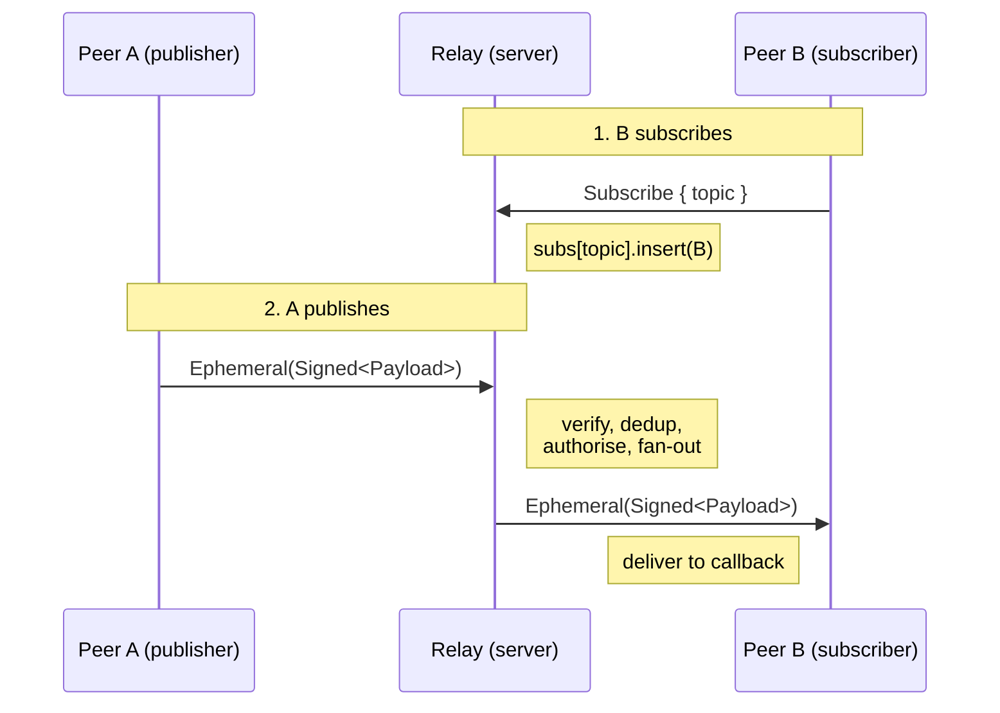
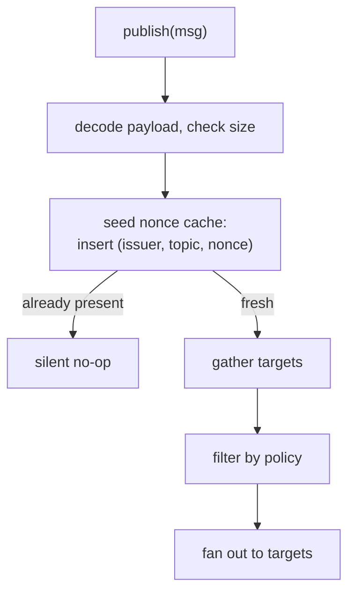

# Ephemeral Messaging

Authenticated, fire-and-forget pub/sub for transient signals — cursor positions, selections, presence, typing indicators. Distinct from sync: no persistence, no consistency guarantees, best-effort delivery.

The protocol layer lives in [`subduction_ephemeral`]. The core sync crate knows nothing about ephemeral behavior; the two are composed at the application layer via a wire-envelope enum (see [`ComposedHandler`]).

[`subduction_ephemeral`]: ../subduction_ephemeral/src/lib.rs
[`ComposedHandler`]: ../subduction_ephemeral/src/composed.rs

## Overview



Three message types travel under the `SUE\x00` schema:

| Tag    | Variant                               | Purpose                                                                    |
|--------|---------------------------------------|----------------------------------------------------------------------------|
| `0x00` | `Ephemeral(Signed<EphemeralPayload>)` | A signed publication (issuer + topic + nonce + timestamp + opaque payload) |
| `0x01` | `Subscribe { topics }`                | "I want messages for these topics from you"                                |
| `0x02` | `Unsubscribe { topics }`              | Inverse of the above                                                       |
| `0x03` | `SubscribeRejected { topics }`        | Some subscribes were rejected by policy                                    |

Authentication is per-message: each `Ephemeral` carries an Ed25519 signature over the payload, the issuer key, and the wire schema. Authorization is per-topic via [`EphemeralPolicy`].

[`EphemeralPolicy`]: ../subduction_ephemeral/src/policy.rs

## Subscription Model

Two independent maps live on each relay:

| State                     | Type                       | Meaning                                                                                                                                            |
|---------------------------|----------------------------|----------------------------------------------------------------------------------------------------------------------------------------------------|
| `ephemeral_subscriptions` | `Map<Topic, Set<PeerId>>`  | _Inbound_: peers that subscribed to **me** for this topic. I fan out to them.                                                                       |
| `outgoing_subscriptions`  | `Set<Topic>`               | _Outbound_: topics **I** want messages for. When I publish on one of these, I also send to all connected peers (they are my upstream relays).      |

The two roles are symmetric: a peer is simultaneously a subscriber to its upstream(s) and a relay for its downstream(s). A simple client typically has only outgoing subscriptions; a relay server typically has mostly inbound; meshed federations have both.

### Subscribe

```rust
EphemeralHandler::subscribe(topics)
  ├── outgoing_subscriptions ∪= topics
  └── for each connected peer P:
        send P Subscribe { topics }
```

`subscribe_peer(P)` is the post-connect variant: when a new peer connects, resend our outgoing list to that one peer so they know to relay to us.

### Recv Subscribe

```rust
recv_subscribe(conn, topics)
  for each topic in topics:
    policy.authorize_subscribe(peer, topic)?  ── reject if disallowed
    ephemeral_subscriptions[topic].insert(peer)
  if any rejected:
    send peer SubscribeRejected { rejected_topics }
```

Authorization is rechecked at fan-out time as well (`filter_authorized_subscribers`) so revocation is honored without flushing the subscription map.

## Message Lifecycle

### Publish (`EphemeralHandler::publish`)



Targets in publish are the union of:

1. `ephemeral_subscriptions[topic]` — peers who asked us for this topic.
2. All connected peers, _if_ `topic ∈ outgoing_subscriptions` — those are our own upstream relays; we send so they can re-fan-out on our behalf.

The nonce-cache seed at step C is structurally important. See [Bounce-back amplification](#bounce-back-amplification) below.

### Recv (`EphemeralHandler::recv_ephemeral`)

| Step | Phase       | Action                                                                                                |
|------|-------------|-------------------------------------------------------------------------------------------------------|
| 1    | pre-verify  | Decode unverified payload (issuer / topic / nonce)                                                    |
| 2a   | pre-verify  | Payload-size check                                                                                    |
| 2b   | pre-verify  | Message-age check                                                                                     |
| 2c   | pre-verify  | Nonce-cache `contains()` probe (read-only)                                                            |
| 3    | verify      | Signature verify (Ed25519)                                                                            |
| 4    | post-verify | Nonce-cache `check_and_insert` (the only cache write)                                                 |
| 5    | post-verify | `authorize_publish` (policy)                                                                          |
| 6    | post-verify | Deliver to local callback channel                                                                     |
| 7    | post-verify | Fan out to `ephemeral_subscriptions[topic]` minus relay (immediate hop) and sender (originator)       |

The cheap checks (steps 1–2) run first so that demonstrably invalid wire bytes, stale timestamps, oversized payloads, and known-duplicate nonces are all dropped before the receiver pays for an Ed25519 verify.

The cache is mutated **only** at step 4 and **only** after step 3 succeeds, so the read-only probe at step 2c can never put state in the cache that wasn't authenticated. See [Threat model](#threat-model).

## Dedup Model

```
EphemeralNonceCache:
                ┌──────────────────────────────────────┐
                │           Map<(sender, topic), …>    │
                └──────────────────────────────────────┘
                                  │
                                  ▼
                       ┌────────────────────┐
                       │  current  │ previous │
                       │  bucket   │  bucket  │
                       └────────────────────┘
                       ↑                    ↑
                       └── Set<u64> ────────┘
                            (nonces)
```

Each `(sender, topic)` pair has two time-bucketed nonce sets. A nonce is "duplicate" if it appears in **either** bucket. Buckets rotate when the current bucket's age exceeds `window_duration` (default 30 s); after `2 × window_duration` of idleness, both buckets reset.

| Bucket lifecycle                              | After                |
|-----------------------------------------------|----------------------|
| Insert into `current`                         | new nonces           |
| Rotate `current → previous`, new `current`    | window elapses       |
| Drop `previous`                               | 2× window elapses    |

Two access methods:

| Method                                        | Effect                                                                                                                | Used by                                          |
|-----------------------------------------------|-----------------------------------------------------------------------------------------------------------------------|--------------------------------------------------|
| `contains(sender, topic, nonce, now)`         | Returns whether the nonce is known; rotates _existing_ entries lazily; **never** allocates a new entry                | Pre-verify probe (recv step 2c)                  |
| `check_and_insert(sender, topic, nonce, now)` | Returns `false` if duplicate, otherwise inserts and returns `true`; will create a fresh entry for an unseen `(sender, topic)` | Post-verify write (recv step 4) and publish-seed |

The split exists so that pre-verify code paths cannot mutate cache state. See [Threat model](#threat-model).

### Volume attack resistance

Eviction is **time-driven only**. A peer flooding the cache with distinct nonces fills the current bucket but cannot cause earlier nonces in `previous` to be evicted any faster. There is no LRU.

## Bounce-back Amplification

The fan-out filter in recv step 7 excludes only:

| Excluded peer                          | Why                                                |
|----------------------------------------|----------------------------------------------------|
| `relay` (`conn.peer_id()`)             | They just sent us this message                     |
| `sender` (the message's signed issuer) | They wrote it; sending it back would be pointless  |

That covers the _immediate previous hop_ and the _origin_, but not peers further back in the gossip path. In a meshed topology a peer can legitimately forward our own message back to us via a longer cycle:

```
                  cycle through A, B, …, C
              ┌─────────────────────────┐
              │                         │
              ▼                         │
   S ──publish──► A ──► B ──► … ──► C ──┘

   S receives the bounce: relay=C, sender=S
```

Without intervention, S would treat the bounce as a brand-new message because nothing in the cache marks `(S, topic, nonce)` as already-seen. That triggers two problems:

1. **Self-echo** — S delivers its own message to its own callback channel as if a peer had sent it.
2. **Re-fan-out** — S sends the message to every other subscriber in `subs[topic] \ {C, S}`, all of whom already received the original publish from S directly.

In a star topology with `k` downstream subscribers the second failure mode grows super-linearly in `k`, because each downstream that bounces back triggers another `O(k)` fan-out.

### Mitigation

`publish()` seeds the nonce cache before fan-out:

```rust
cache.check_and_insert(issuer, topic, nonce, now);
```

Any bounce-back arriving via _any_ relay path then hits the dedup short-circuit at recv step 2c (or step 4 in the racing case) and is silently dropped.

### Invariant

> If S has fanned out `(S, topic, nonce)` at any point, then `cache.contains(S, topic, nonce)` is `true` for the entire retention window.

This holds because:

- `publish()` inserts before any send (`handler.rs::publish`).
- `recv_ephemeral` step 4 inserts after verify, before fan-out.
- Both insertions use `check_and_insert`, which is idempotent.

### Test coverage

In [`tests/amplification.rs`]:

- `publish_bounce_back_triggers_self_callback` — pins down the self-echo failure mode.
- `publish_bounce_back_triggers_re_fanout_to_other_subscribers` — pins down the re-fan-out failure mode.

[`tests/amplification.rs`]: ../subduction_ephemeral/tests/amplification.rs

## Cross-path Duplicates

In dense topologies the same `(issuer, topic, nonce)` legitimately arrives at a relay via multiple paths. The dedup cache catches every duplicate after the first; only the first arrival is delivered to the local callback and fanned out. The cache short-circuit happens at recv step 2c (before signature verification) for the common case and at step 4 (atomic check-and-insert) for the rare case where two duplicates race past 2c on different worker tasks.

## Threat Model

The ephemeral protocol uses Ed25519 signatures for authentication and a trusted-but-revocable policy layer for authorization. The dedup cache is the one piece of mutable state shared between unverified and verified code paths, so its integrity is worth pinning down.

### Cache integrity invariant

> Every entry in the nonce cache corresponds to a message whose signature this relay verified itself.

Preserved by:

| Mechanism                                       | How                                                                                                  |
|-------------------------------------------------|------------------------------------------------------------------------------------------------------|
| `contains` cannot insert                        | Returns early with `false` for unknown `(sender, topic)`; only rotates entries that already exist    |
| `check_and_insert` is gated behind verify       | Reached only after `try_verify` returns `Ok`                                                          |
| `publish` only seeds for our own publications   | The issuer is by definition us; we just signed it                                                     |

### What an attacker can do

| Capability                                                                | Cost to attacker                | Cost to us                                | Observable damage                                                                       |
|---------------------------------------------------------------------------|---------------------------------|-------------------------------------------|-----------------------------------------------------------------------------------------|
| Send bogus `(issuer, topic, nonce)` with garbage signature                | 1 forged-signature msg          | 1 Ed25519 verify per msg                  | None: cache untouched, fan-out doesn't happen                                           |
| Replay a real `(issuer, topic, nonce)` with intact signature              | None                            | One `contains` lookup per msg             | None: dropped at step 2c                                                                |
| Flood `(issuer, topic)` with valid signatures and distinct nonces         | Must control a signing key      | One verify per fresh nonce + bucket fill  | Bounded — bucket eviction is time-driven; cannot push out other senders' entries        |
| Bypass policy via crafted ephemerals                                      | None (policy checked post-verify) | None                                      | None                                                                                    |

### What an attacker cannot do

- Inject a `(sender, topic, nonce)` entry into the cache without a valid signature for that `sender`.
- Cause a legitimate verified message from peer `P` to be discarded as a duplicate (would require P's signing key to pre-populate `(P, topic, nonce)`).
- Stall `recv_ephemeral` via cache state: the cache is purely additive within the retention window.

## Wire Format

The `EphemeralMessage` envelope uses the `SUE\x00` schema with a tag byte distinguishing variants.

### `Ephemeral` (tag `0x00`)

The wire bytes _are_ the complete `Signed<EphemeralPayload>` — schema, discriminant, issuer, fields, and signature in order. No stripping, no envelope around the signed region. The byte at offset 4 serves as both the outer enum tag and the inner `EphemeralPayload` discriminant; the two are reconciled by `Signed::try_decode` which validates the schema header.

```text
╔════════╦══════╦════════╦════════╦═══════╦═══════════╦════════════╦═════════╦═══════════╗
║ Schema ║ Disc ║ Issuer ║   ID   ║ Nonce ║ Timestamp ║ PayloadLen ║ Payload ║ Signature ║
║   4B   ║  1B  ║  32B   ║  32B   ║  8B   ║    8B     ║  bijou64   ║  var    ║   64B     ║
╚════════╩══════╩════════╩════════╩═══════╩═══════════╩════════════╩═════════╩═══════════╝
 ↑──────────────────────── signed region ───────────────────────────────────↑
```

### Control variants (tags `0x01`–`0x03`)

Plain length-prefixed topic lists, no signature:

```text
╔════════╦═════╦════════════╦═══════════════╗
║ Schema ║ Tag ║  TopicCnt  ║   Topics      ║
║   4B   ║ 1B  ║   u16(2B)  ║ 32B each      ║
╚════════╩═════╩════════════╩═══════════════╝
```

Subscribe / Unsubscribe / SubscribeRejected are all unauthenticated — they carry no signature. A relay cannot verify the originator's intent to subscribe; it can only verify the connection peer's intent. This is acceptable because:

- Subscriptions are local routing state; faking one only affects delivery to the faking peer (denial-of-service against themselves).
- Sensitive policy decisions happen at `authorize_subscribe` time and again at `filter_authorized_subscribers` per fan-out, both of which use the connection's verified `PeerId`.
