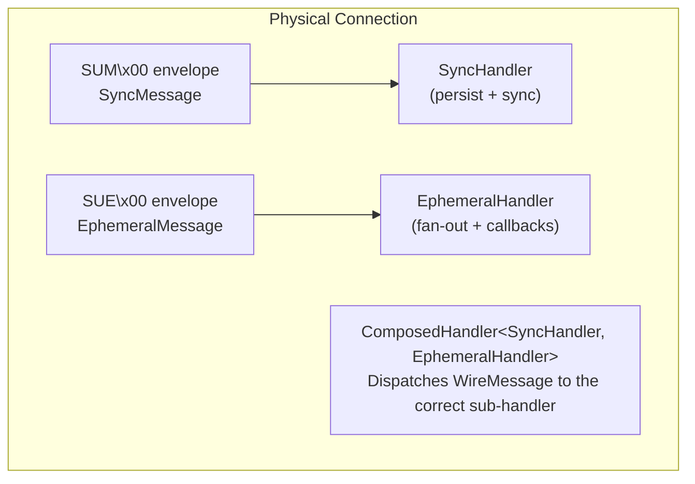
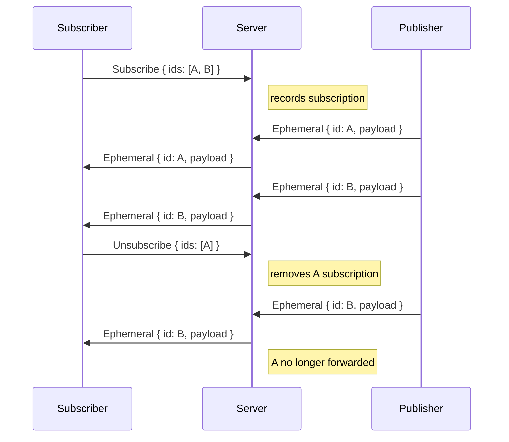
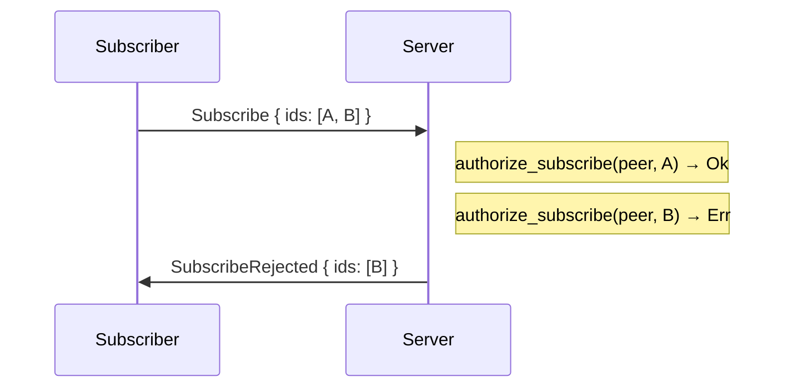
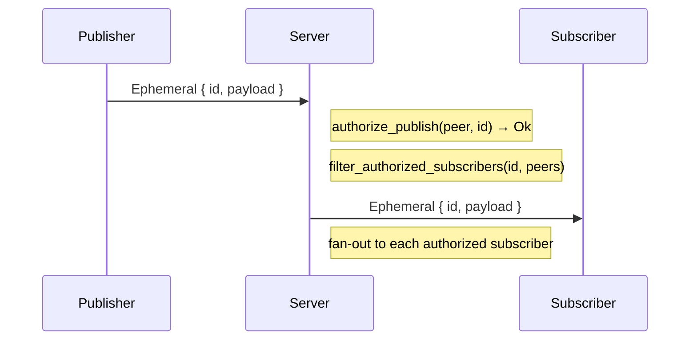

# Ephemeral Message Protocol

This document describes the wire format and architecture for Subduction's
ephemeral (non-persisted) messaging system. Ephemeral messages complement
the sync protocol with transient signals: cursor positions, selections,
typing indicators, presence, and other application-level events.

## Design Principles

- _Best-effort delivery_: No persistence, no replay, no ordering guarantees
- _Connection-level auth_: Relies on established peer identity; no per-message signing
- _Topic-scoped_: Messages are addressed to a `SedimentreeId` topic
- _Opaque payloads_: The protocol is payload-agnostic; applications filter by convention (e.g., first byte is a type tag)
- _Independent policy_: `EphemeralPolicy` is separate from `StoragePolicy` — a peer may have one without the other

## Architecture



## Wire Format

### Envelope

Ephemeral messages use the same envelope structure as sync messages,
with schema `SUE\x00` (Subduction Ephemeral v0):

```
╔════════╦══════════╦═════╦═════════════════════╗
║ Schema ║   Size   ║ Tag ║      Payload        ║
║   4B   ║    4B    ║ 1B  ║     (variable)      ║
╚════════╩══════════╩═════╩═════════════════════╝
```

| Field  | Size     | Description                                  |
|--------|----------|----------------------------------------------|
| Schema | 4 bytes  | `SUE\x00` (0x53 0x55 0x45 0x00)             |
| Size   | 4 bytes  | Total message size in bytes (big-endian u32) |
| Tag    | 1 byte   | Message type discriminant (see below)        |
| Payload| variable | Tag-specific data                            |

**Schema dispatch.** A single connection may carry both sync (`SUM\x00`)
and ephemeral (`SUE\x00`) traffic. The receiver reads the first 4 bytes
to determine which decoder to invoke. Unknown schemas are rejected.

### Message Tags

| Tag    | Message               | Direction |
|--------|-----------------------|-----------|
| `0x00` | Ephemeral             | Both      |
| `0x01` | Subscribe             | Client→Server |
| `0x02` | Unsubscribe           | Client→Server |
| `0x03` | SubscribeRejected     | Server→Client |

### Ephemeral (Tag 0x00)

An opaque payload published to a `SedimentreeId` topic.

```
╔═══════════════╦════════════╦═════════╗
║ SedimentreeId ║ PayloadLen ║ Payload ║
║      32B      ║   1-9B     ║ var     ║
╚═══════════════╩════════════╩═════════╝
```

| Field         | Size     | Description                         |
|---------------|----------|-------------------------------------|
| SedimentreeId | 32 bytes | Topic this message is published to  |
| PayloadLen    | 1-9 bytes| Payload length, [`bijou64`] encoded |
| Payload       | variable | Opaque application data             |

[`bijou64`]: ../bijou64/SPEC.md

### Subscribe (Tag 0x01)

Request to receive ephemeral messages for the listed topics.

```
╔═══════╦═══════════════════════════════════╗
║ Count ║          SedimentreeId[]          ║
║  2B   ║          Count × 32B             ║
╚═══════╩═══════════════════════════════════╝
```

| Field | Size      | Description                             |
|-------|-----------|-----------------------------------------|
| Count | 2 bytes   | Number of IDs (big-endian u16, max 65535) |
| IDs   | Count×32B | `SedimentreeId` values to subscribe to  |

### Unsubscribe (Tag 0x02)

Remove subscriptions for the listed topics. Same layout as Subscribe.

```
╔═══════╦═══════════════════════════════════╗
║ Count ║          SedimentreeId[]          ║
║  2B   ║          Count × 32B             ║
╚═══════╩═══════════════════════════════════╝
```

### SubscribeRejected (Tag 0x03)

Notification that some subscribe requests were rejected by policy.
Contains only the rejected IDs; accepted IDs are implied by omission.

```
╔═══════╦═══════════════════════════════════╗
║ Count ║          SedimentreeId[]          ║
║  2B   ║          Count × 32B             ║
╚═══════╩═══════════════════════════════════╝
```

## Protocol Flows

### Subscribe + Receive



### Subscribe Rejection



Only rejected IDs are returned. Subscription for A proceeds silently.

### Publish + Fan-Out



The server re-checks authorization at fan-out time (not just subscribe time),
handling revocation correctly.

### Disconnect Cleanup

When a peer's last connection drops, the server removes the peer from all
ephemeral subscription sets. No explicit protocol message is needed — the
connection close signal triggers cleanup via `on_peer_disconnect`.

## WireMessage Multiplexing

A single physical connection carries both sync and ephemeral traffic
via the `WireMessage` enum:

```rust
enum WireMessage {
    Sync(Box<SyncMessage>),     // SUM\x00 schema
    Ephemeral(EphemeralMessage), // SUE\x00 schema
}
```

Encoding is _transparent_: encoding a `WireMessage::Sync(msg)` produces
identical bytes to encoding `msg` directly. Decoding reads the 4-byte
schema header to determine the variant.

`SyncMessage` is boxed (~344 bytes) while `EphemeralMessage` is small
(~56 bytes), avoiding Clippy's large-enum-variant warning.

## ComposedHandler

The `ComposedHandler<A, B>` receives `WireMessage` values and routes
them to the appropriate sub-handler:

```
WireMessage::Sync(m)      →  sync_handler.handle(conn, *m)
WireMessage::Ephemeral(m) →  ephemeral_handler.handle(conn, m)
```

`on_peer_disconnect` is forwarded to both sub-handlers sequentially.

## Authorization: EphemeralPolicy

Ephemeral authorization is separate from storage authorization:

```
ConnectionPolicy  — "can this peer connect?"
StoragePolicy     — "can this peer read/write persistent data?"
EphemeralPolicy   — "can this peer subscribe/publish ephemeral messages?"
```

The `EphemeralPolicy` trait:

```rust
trait EphemeralPolicy<K: FutureForm> {
    type SubscribeDisallowed: Error;
    type PublishDisallowed: Error;

    fn authorize_subscribe(&self, peer: PeerId, id: SedimentreeId)
        -> K::Future<'_, Result<(), Self::SubscribeDisallowed>>;

    fn authorize_publish(&self, peer: PeerId, id: SedimentreeId)
        -> K::Future<'_, Result<(), Self::PublishDisallowed>>;

    fn filter_authorized_subscribers(&self, id: SedimentreeId, peers: Vec<PeerId>)
        -> K::Future<'_, Vec<PeerId>>;
}
```

| Method | When called | Failure behavior |
|--------|------------|------------------|
| `authorize_subscribe` | On `Subscribe` message | Sends `SubscribeRejected` for denied IDs |
| `authorize_publish` | On inbound `Ephemeral` | Silently drops the message |
| `filter_authorized_subscribers` | Before fan-out | Excludes unauthorized peers from delivery |

`filter_authorized_subscribers` is the security invariant — it handles
revocation by re-checking at delivery time, not just at subscribe time.

`OpenEphemeralPolicy` allows all operations (for development and testing).

## Configuration

| Parameter | Default | Description |
|-----------|---------|-------------|
| `max_payload_size` | 65,536 bytes (64 KB) | Messages exceeding this are silently dropped |
| `channel_capacity` | 1,024 | Bounded callback channel capacity |

## Non-Goals

- _Guaranteed delivery_: Messages are best-effort; lost on disconnect
- _Ordering guarantees_: No sequence numbers or causal ordering
- _Persistence / replay_: No storage, no catch-up on reconnect
- _Per-message signing_: Connection-level auth is sufficient
- _Rate limiting_: Can be added as a policy concern later
- _Sub-document topics_: Applications filter locally by payload convention

## Crate: `subduction_ephemeral`

| Module | Contents |
|--------|----------|
| `message` | `EphemeralMessage` enum + `Encode`/`Decode` impls |
| `wire` | `WireMessage` enum (sync + ephemeral multiplexer) |
| `handler` | `EphemeralHandler` — fan-out, subscriptions, callbacks |
| `composed` | `ComposedHandler<A, B>` — `WireMessage` dispatch |
| `policy` | `EphemeralPolicy` trait + `OpenEphemeralPolicy` |
| `config` | `EphemeralConfig`, `EphemeralEvent` |
