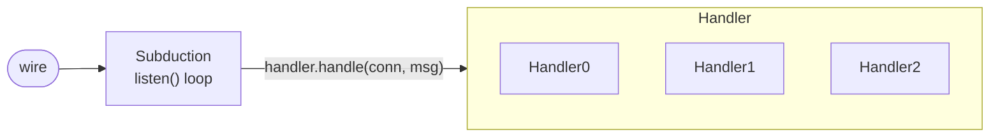
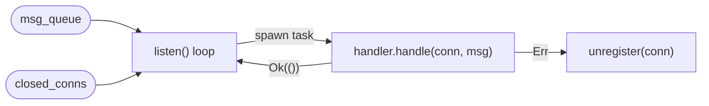

# Handler Trait

The `Handler` trait decouples _what to do with a message_ from _how messages arrive_. The `Subduction` listen loop calls `handler.handle(conn, msg)` for each message received from the wire.

## Architecture



## Trait Definition

```rust
pub trait Handler<K: FutureForm, C: Connection<K>> {
    /// Wire message type. Must support decoding from bytes.
    type Message: Decode;

    /// Error type. Returning Err signals a broken connection.
    type HandlerError: Error;

    /// Handle a single message from an authenticated peer.
    fn handle<'a>(
        &'a self,
        conn: &'a Authenticated<C, K>,
        message: Self::Message,
    ) -> K::Future<'a, Result<(), Self::HandlerError>>;
}
```

### Error Semantics

Returning `Err` from `handle()` signals that the connection is broken and should be dropped. If a handler wants to be lenient about a particular message (e.g., a policy rejection), it should return `Ok(())` and log the issue internally.

### Message Type

The `Connection` trait hardcodes `Message` as the wire type for `send()` and `recv()`. `Handler::Message` must implement `From<Message>` for the listen loop to route decoded messages to the handler.

## SyncHandler

`SyncHandler` is the default handler implementing the standard sync protocol. It is self-contained: it holds `Arc` references to shared state and does not depend on `Subduction` internals.

### State Sharing

Both `Subduction` and `SyncHandler` hold `Arc` references to the same shared data:

| Field | Type | Purpose |
|-------|------|---------|
| `sedimentrees` | `Arc<ShardedMap<SedimentreeId, Sedimentree, N>>` | In-memory document cache |
| `connections` | `Arc<Mutex<Map<PeerId, NonEmpty<Authenticated<C, K>>>>>` | Active peer connections |
| `subscriptions` | `Arc<Mutex<Map<SedimentreeId, Set<PeerId>>>>` | Sync subscriptions |
| `storage` | `StoragePowerbox<S, P>` | Persistent storage + policy |
| `pending_blob_requests` | `Arc<Mutex<PendingBlobRequests>>` | Tracks outstanding blob requests |
| `depth_metric` | `M` | Fragment depth computation |

### Shared Helpers

Duplicated logic between `Subduction` and `SyncHandler` is extracted into free functions in two modules:

- **`subduction/ingest.rs`** — Data ingestion: `insert_commit_locally`, `insert_fragment_locally`, `minimize_tree`, `get_blob`, `recv_batch_sync_response`
- **`subduction/peers.rs`** — Peer management: `add_subscription`, `remove_peer_from_subscriptions`, `get_authorized_subscriber_conns`, `unregister`

Both types keep thin `&self` delegation wrappers (1–3 lines) that pass their `Arc`-wrapped fields to the shared functions.

## Handler Composition

Custom handlers can replace or compose with `SyncHandler`:

### Replacing SyncHandler

Use `SubductionBuilder::build_with_handler()` to supply a custom handler:

```rust
let my_handler = Arc::new(MyHandler::new(/* ... */));
let (subduction, listener, manager) = SubductionBuilder::new()
    .signer(signer)
    .storage(storage, policy)
    .spawner(spawner)
    .build_with_handler(my_handler);
```

### Composing Handlers

Multiple handlers can be composed via a wrapper that delegates to the right handler based on message variant:

```rust
struct ComposedHandler<Sync, Custom> {
    sync: Arc<Sync>,
    custom: Arc<Custom>,
}

impl<K, C> Handler<K, C> for ComposedHandler<SyncHandler<...>, CustomHandler>
where
    K: FutureForm,
    C: Connection<K>,
{
    type Message = Message;
    type HandlerError = ComposedError;

    fn handle(&self, conn, msg) -> ... {
        match &msg {
            // Route to sync handler
            Message::LooseCommit { .. }
            | Message::Fragment { .. }
            | Message::BatchSyncRequest(_)
            // ...
            => self.sync.handle(conn, msg),

            // Route to custom handler
            Message::Ephemeral { .. }
            => self.custom.handle(conn, msg),
        }
    }
}
```

## SubductionBuilder

`SubductionBuilder` provides type-safe construction of `Subduction` + `SyncHandler`:

```rust
let (subduction, handler, listener_fut, manager_fut) =
    SubductionBuilder::<_, _, _, _, 256>::new()
        .signer(signer)
        .storage(storage, Arc::new(OpenPolicy))
        .spawner(TokioSpawn)
        .discovery_id(DiscoveryId::new(b"my-service"))
        .build();
```

### Type-State Pattern

Required fields are tracked at the type level via an `Unset` marker:

| Field | Required | Default |
|-------|----------|---------|
| `signer` | Yes | — |
| `spawner` | Yes | — |
| `storage` | Yes | — |
| `discovery_id` | No | `None` |
| `depth_metric` | No | `CountLeadingZeroBytes` |
| `nonce_cache` | No | `NonceCache::default()` |
| `max_pending_blob_requests` | No | 10,000 |
| `sedimentrees` | No | `ShardedMap::new()` |

Calling `build()` is a compile error until all required fields are set. Setters can be called in any order.

### Build Variants

- **`build()`** — Constructs `SyncHandler` automatically. Returns `(Arc<Subduction>, Arc<SyncHandler>, ListenerFuture, ManagerFuture)`.
- **`build_with_handler(handler)`** — Accepts a custom handler. Returns `(Arc<Subduction>, ListenerFuture, ManagerFuture)`.

### Raw Constructor

`Subduction::new()` remains public for power users who need full control over shared state construction.

## Dispatch Model

`Subduction::listen()` uses concurrent dispatch via `FuturesUnordered`:



Messages for different connections are dispatched concurrently. Dispatch errors cause the offending connection to be unregistered.

## `#[future_form]` Constraint

The `#[future_form]` macro generates concrete impls for `Sendable` and `Local`, not generic over `F`. This means:

- `H` (handler type) _cannot_ be a type parameter on the `Subduction` struct — the bound `H: Handler<F, C>` can't be proven when `F` is generic.
- Instead, `H` lives on `listen()` as a method-level generic and on `StartListener` as a trait-level generic.
- `build()` requires explicit bounds: `SyncHandler<F,S,C,P,M,N>: Handler<F,C>`.
