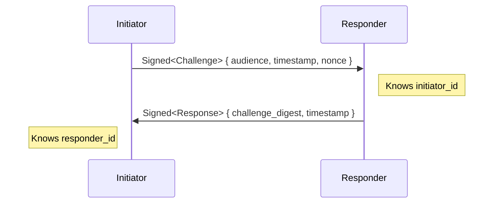
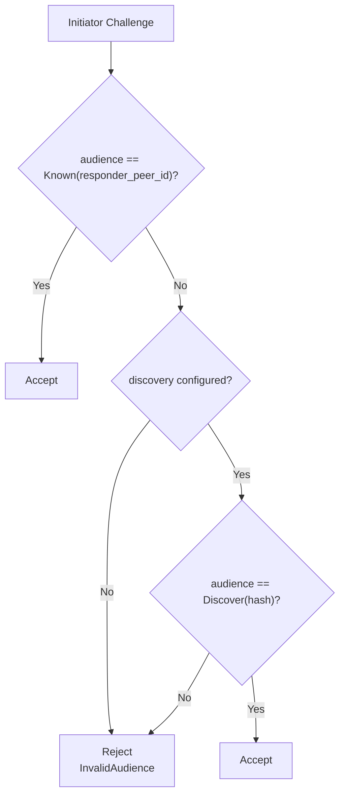
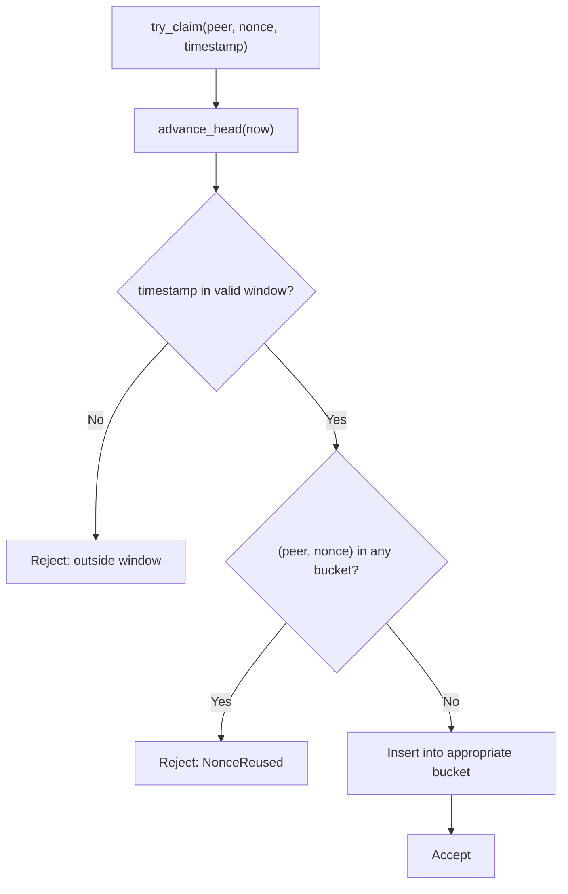
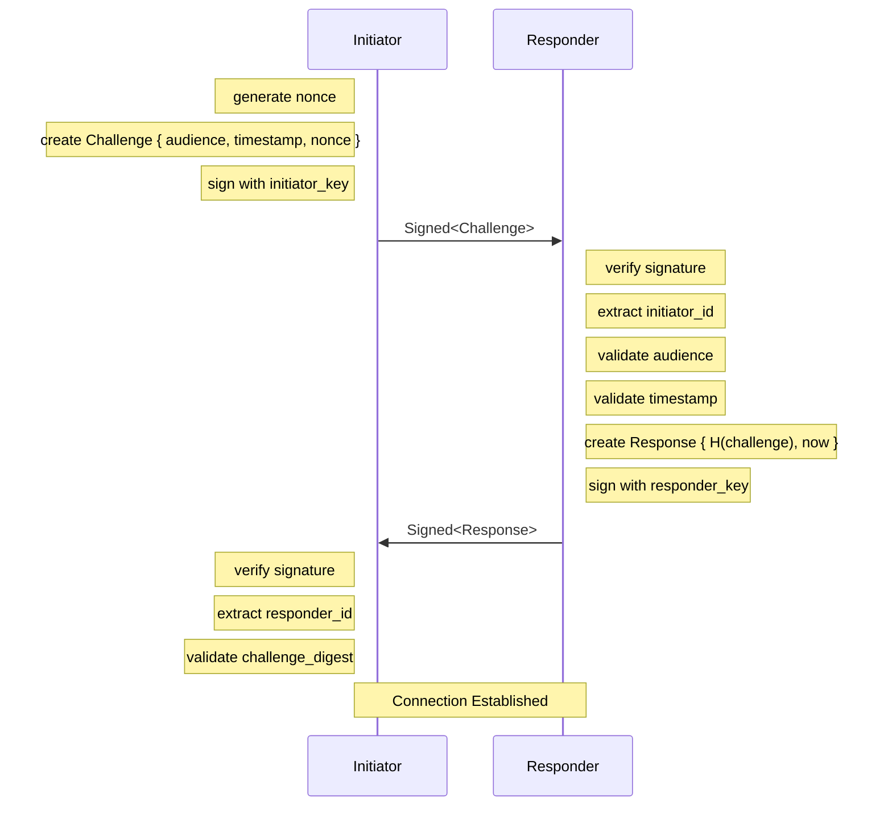
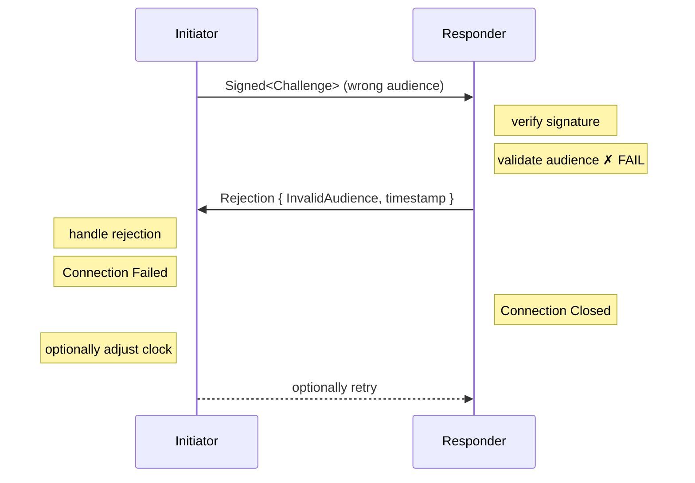

# Handshake Protocol

The Subduction handshake establishes mutual identity between peers. It answers _"who is connecting?"_ but does not answer _"can they connect?"_ — that's the job of `ConnectionPolicy`.

## Overview

The handshake is a two-message protocol using Ed25519 signatures. Either peer can initiate a connection — the protocol is symmetric. We call the peer that opens the connection the _initiator_ and the peer that accepts it the _responder_.

> [!NOTE]
> In some deployments, one peer may act as a dedicated server (always responding, never initiating), but this is a deployment choice, not a protocol requirement. The handshake itself is fully peer-to-peer.



Both parties learn each other's `PeerId` from the signature's issuer (the Ed25519 verifying key).

## Message Types

### Challenge (Initiator → Responder)

```rust
struct Challenge {
    audience: Audience,           // Who the initiator expects to reach
    timestamp: TimestampSeconds,  // Initiator's current time (replay protection)
    nonce: Nonce,                 // 128-bit random value (uniqueness)
}
```

The challenge is wrapped in `Signed<Challenge>`, which includes:
- The canonical binary-encoded payload (see [protocol.md](./protocol.md#serialization))
- The initiator's Ed25519 signature
- The initiator's verifying key (from which `PeerId` is derived)

### Response (Responder → Initiator)

```rust
struct Response {
    challenge_digest: Digest<Challenge>,  // BLAKE3 hash binding to the challenge
    server_timestamp: TimestampSeconds,   // Responder's current time (drift correction)
}
```

The response is wrapped in `Signed<Response>`, proving the responder's identity.

### Rejection (Responder → Initiator, unsigned)

```rust
struct Rejection {
    reason: RejectionReason,
    server_timestamp: TimestampSeconds,  // Informational only
}
```

Rejection reasons:
- `ClockDrift` — Initiator timestamp too far from responder's clock
- `InvalidAudience` — Audience doesn't match this peer
- `ReplayedNonce` — Nonce was already used (replay attack)
- `InvalidSignature` — Signature verification failed

> [!WARNING]
> Rejections are unsigned. Initiators should not trust `server_timestamp` for drift correction if the drift exceeds `MAX_PLAUSIBLE_DRIFT` (±10 minutes).

## Audience Modes

The `Audience` enum supports two connection modes:

| `Known(PeerId)` | `Discover([u8; 32])` |
|-----------------|----------------------|
| Initiator knows the responder's peer ID | Initiator knows a service name (e.g. "sync.example.com") |
| Typical: direct peer connections where IDs are pre-shared | Typical: connecting to a well-known endpoint or load-balanced service |

### Discovery Mode

When using discovery mode:
1. The service name is hashed with BLAKE3 to produce 32 bytes
2. Initiator sends `Audience::Discover(hash)`
3. Responder validates: incoming hash matches its configured service name's hash

```
"sync.example.com" ──BLAKE3──► [u8; 32] ──► Audience::Discover(...)
```

### Audience Validation

The responder accepts connections if the audience matches **either**:
1. `Audience::Known(responder_peer_id)` — always accepted
2. `Audience::Discover(hash)` — accepted if discovery mode is configured and hash matches



## Validation

### Responder Validates Challenge

1. **Signature** — Verify Ed25519 signature; extract initiator's `PeerId`
2. **Audience** — Must match `Known(responder_peer_id)` or configured discovery audience
3. **Timestamp** — Must be within `max_drift` of responder's clock (default: 60s configurable)

### Initiator Validates Response

1. **Signature** — Verify Ed25519 signature; extract responder's `PeerId`
2. **Challenge Digest** — Must equal `BLAKE3(original_challenge)`; prevents replay

## Replay Protection

Multiple mechanisms prevent replay attacks:

| Mechanism | Protects Against |
|-----------|------------------|
| **Nonce** | Replay of same challenge to same peer |
| **Timestamp** | Replay of old challenges (outside drift window) |
| **Challenge Digest** | Replay of responses to different challenges |
| **Audience** | Misdirection to wrong peer |

## Nonce Tracking

The responder maintains a `NonceCache` to detect replayed challenges. Each entry is keyed by `(PeerId, Nonce)` — the initiator's identity and the challenge nonce.

### Design

```
┌──────────┬──────────┬──────────┬──────────┐
│ Bucket 0 │ Bucket 1 │ Bucket 2 │ Bucket 3 │
│  0–3 min │  3–6 min │  6–9 min │ 9–12 min │
└──────────┴──────────┴──────────┴──────────┘
     ↑
   head (rotates as time advances)
```

- **4 buckets × 3 minutes = 12 minute window**
- Covers `MAX_PLAUSIBLE_DRIFT` (±10 min) plus buffer
- Entries placed in bucket based on challenge timestamp
- Lazy GC: buckets cleared on rotation during `advance_head()`

### Claim Flow



### When to Record Nonces

Only record nonces for _successful_ handshakes — after signature verification passes:

```rust
// In server_handshake(), after verifying the challenge signature:
nonce_cache
    .try_claim(initiator_id, challenge.nonce, challenge.timestamp)
    .await?;
```

Recording failed attempts would allow attackers to exhaust the cache with invalid signatures.

### Memory Bounds

Each entry is `(PeerId, Nonce)` = 32 + 16 = 48 bytes. With the 12-minute window:

| Handshakes/sec | Entries | Memory  |
|----------------|---------|---------|
| 1              | ~720    | ~35 KB  |
| 10             | ~7,200  | ~350 KB |
| 100            | ~72,000 | ~3.5 MB |

Bucket rotation automatically evicts old entries — no background GC task needed.

### Platform Considerations

The lazy GC design works uniformly across platforms:

- **Native (tokio)**: No background tasks to manage
- **Wasm (browser)**: Page navigation clears state naturally; no cleanup required

## Clock Drift Handling

### Configurable Drift Window

The `max_drift` parameter (default: 60 seconds) controls how much clock difference is tolerated during handshake validation.

### Drift Correction

Initiators can learn their clock offset from responder timestamps:

```rust
struct DriftCorrection {
    offset_secs: i32,  // responder_time - initiator_time
}
```

The `MAX_PLAUSIBLE_DRIFT` constant (±10 minutes) bounds corrections to reject implausible timestamps from attackers.

```
Initiator clock: 12:00:00
Responder clock: 12:00:30
                 ────────
Drift offset:    +30 seconds

Future requests: initiator adjusts timestamp by +30s
```

## Wire Format

All messages use the canonical binary codec (see [protocol.md](./protocol.md#serialization)), wrapped in a `HandshakeMessage` enum:

```rust
enum HandshakeMessage {
    SignedChallenge(Signed<Challenge>),
    SignedResponse(Signed<Response>),
    Rejection(Rejection),
}
```

Sent as WebSocket binary frames.

## Security Properties

| Property | Mechanism |
|----------|-----------|
| **Initiator Authentication** | Ed25519 signature on Challenge |
| **Responder Authentication** | Ed25519 signature on Response |
| **Replay Prevention** | Nonce + Timestamp + Challenge Digest |
| **Binding** | Response includes hash of specific Challenge |
| **Audience Verification** | Initiator specifies intended recipient |
| **Freshness** | Timestamp within configurable drift window |

## Sequence Diagram (Success)



## Sequence Diagram (Rejection)



## Type-State Pattern: `Signed<T>` → `Verified<T>`

The handshake uses a _witness pattern_ to enforce signature verification at the type level.

### The Problem

Without type enforcement, it's easy to forget verification:

```rust
// DANGEROUS: payload accessed without verification
let challenge = signed_challenge.payload();  // Hypothetical unsafe API
```

### The Solution

`Signed<T>` intentionally provides **no direct access** to the payload. The only way to access it is through `try_verify()`, which returns `Verified<T>`:

```
T ──seal──► Signed<T> ──try_verify──► Verified<T>
              (unverified)              (witness)
```

### Types

```rust
/// A signed payload — payload is inaccessible until verified
pub struct Signed<T> {
    payload_bytes: Vec<u8>,
    signature: Signature,
    issuer: VerifyingKey,
    _marker: PhantomData<T>,
}

/// Witness that verification succeeded — only constructible via try_verify()
pub struct Verified<T> {
    issuer: VerifyingKey,
    payload: T,
}

impl<T> Verified<T> {
    // Only accessible after verification
    pub fn issuer(&self) -> VerifyingKey { ... }
    pub fn payload(&self) -> &T { ... }
}
```

### Usage

```rust
// Verification is REQUIRED to access the payload
let verified: Verified<Challenge> = signed_challenge.try_verify()?;
let challenge: &Challenge = verified.payload();
let initiator_id = PeerId::from(verified.issuer());
```

If `try_verify()` succeeds, the `Verified<T>` value is _proof_ that verification succeeded. The type system prevents accessing unverified data.

### Why This Matters

| Without Witness | With Witness |
|-----------------|--------------|
| Runtime checks ("did I verify?") | Compile-time guarantee |
| Easy to forget | Impossible to forget |
| Bugs hide until production | Bugs caught at compile time |

> [!NOTE]
> This pattern is used only for _authentication_ (proving identity). For _authorization_ (proving permission), see your policy layer (e.g., Keyhive for capability-based access control).

## Implementation Notes

### Creating a Challenge (Initiator)

```rust
let challenge = Challenge::new(audience, now, Nonce::random());
let signed = Signed::seal(&signer, challenge).await;
```

### Verifying a Challenge (Responder)

```rust
let verified = signed_challenge.try_verify()?;
let challenge = verified.payload();
challenge.validate(&expected_audience, now, max_drift)?;
let initiator_id = PeerId::from(verified.issuer());
```

### Creating a Response (Responder)

```rust
let response = Response::for_challenge(&challenge, now);
let signed = Signed::seal(&signer, response).await;
```

### Verifying a Response (Initiator)

```rust
let verified = signed_response.try_verify()?;
let response = verified.payload();
response.validate(&original_challenge)?;
let responder_id = PeerId::from(verified.issuer());
```

## Transport Abstraction

The handshake protocol is transport-agnostic. The `Handshake` trait abstracts over the underlying transport layer:

```rust
pub trait Handshake<K: FutureForm> {
    type Error;
    fn send(&mut self, bytes: Vec<u8>) -> K::Future<'_, Result<(), Self::Error>>;
    fn recv(&mut self) -> K::Future<'_, Result<Vec<u8>, Self::Error>>;
}
```

Implementations exist for:
- `WebSocketHandshake<T>` — wraps `async_tungstenite::WebSocketStream<T>`
- Browser `WebSocket` — via `subduction_wasm`

## High-Level API

The `initiate` and `respond` functions perform the complete handshake protocol and return an `Authenticated<C, K>` connection plus any extra data from the `build_connection` closure:

### Initiator Side

```rust
use subduction_core::connection::handshake;

// Closure returns (Connection, ExtraData) tuple
let (authenticated, ()) = handshake::initiate(
    transport,  // impl Handshake, consumed
    |transport, peer_id| (MyConnection::new(transport, peer_id), ()),
    &signer,
    Audience::known(expected_peer_id),
    TimestampSeconds::now(),
    Nonce::random(),
).await?;

// authenticated: Authenticated<MyConnection, K>
```

### Responder Side

```rust
use subduction_core::connection::handshake;

// Closure returns (Connection, ExtraData) tuple
let (authenticated, ()) = handshake::respond(
    transport,  // impl Handshake, consumed
    |transport, peer_id| (MyConnection::new(transport, peer_id), ()),
    &signer,
    &nonce_cache,
    our_peer_id,
    Some(Audience::discover(b"my-service")),  // optional discovery
    TimestampSeconds::now(),
    Duration::from_secs(60),  // max clock drift
).await?;

// authenticated: Authenticated<MyConnection, K>
```

### `Authenticated<C>` Witness Type

The `Authenticated<C, K>` wrapper is a _witness type_ proving the connection completed handshake verification:

```rust
pub struct Authenticated<C: Connection<K>, K: FutureForm> {
    inner: C,
    _marker: PhantomData<fn() -> K>,
}
```

The `peer_id()` method delegates to `self.inner.peer_id()` — the inner `Connection` stores the verified peer ID (set by `build_connection` during handshake). There's no redundant field because the connection already holds the authoritative identity.

Key properties:

| Property | Guarantee |
|----------|-----------|
| **Construction** | Only via `handshake::initiate` or `handshake::respond` |
| **`peer_id()`** | Delegates to inner connection; ID was set from verified signature |
| **`inner`** | The wrapped connection, accessible via `inner()` |

This ensures that any code receiving an `Authenticated<C, K>` can trust that the peer identity was verified through the handshake protocol — there's no way to construct it with an arbitrary `PeerId`.
