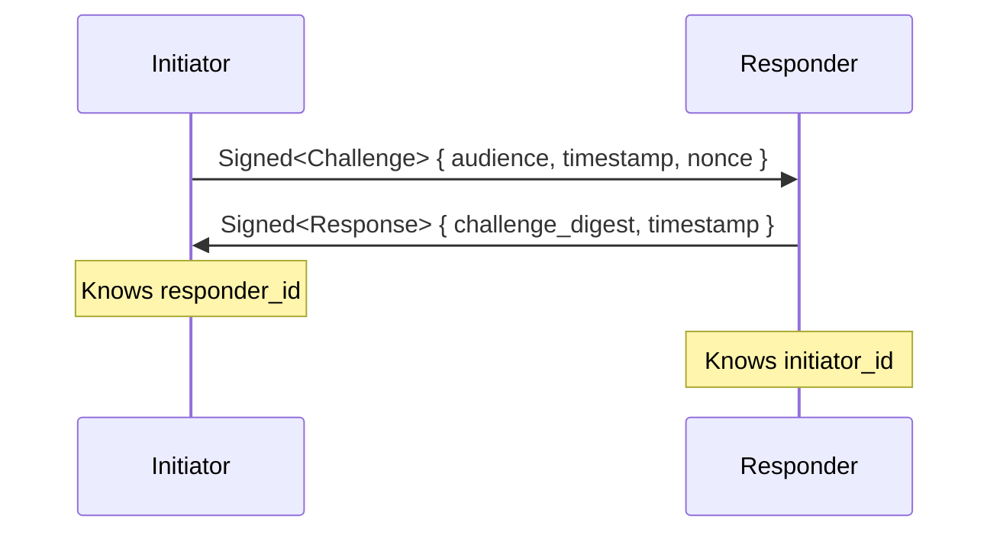
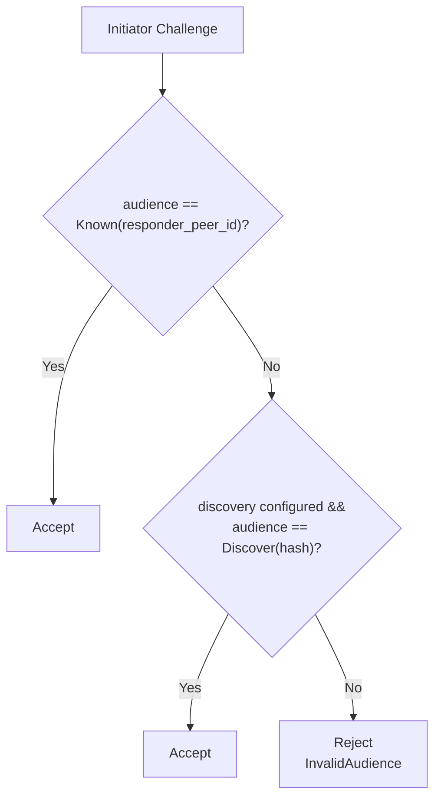
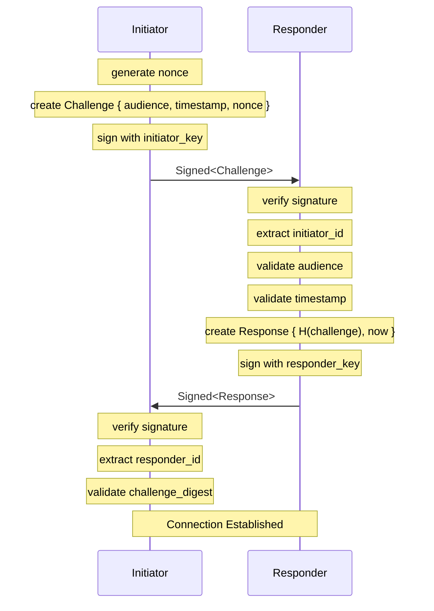
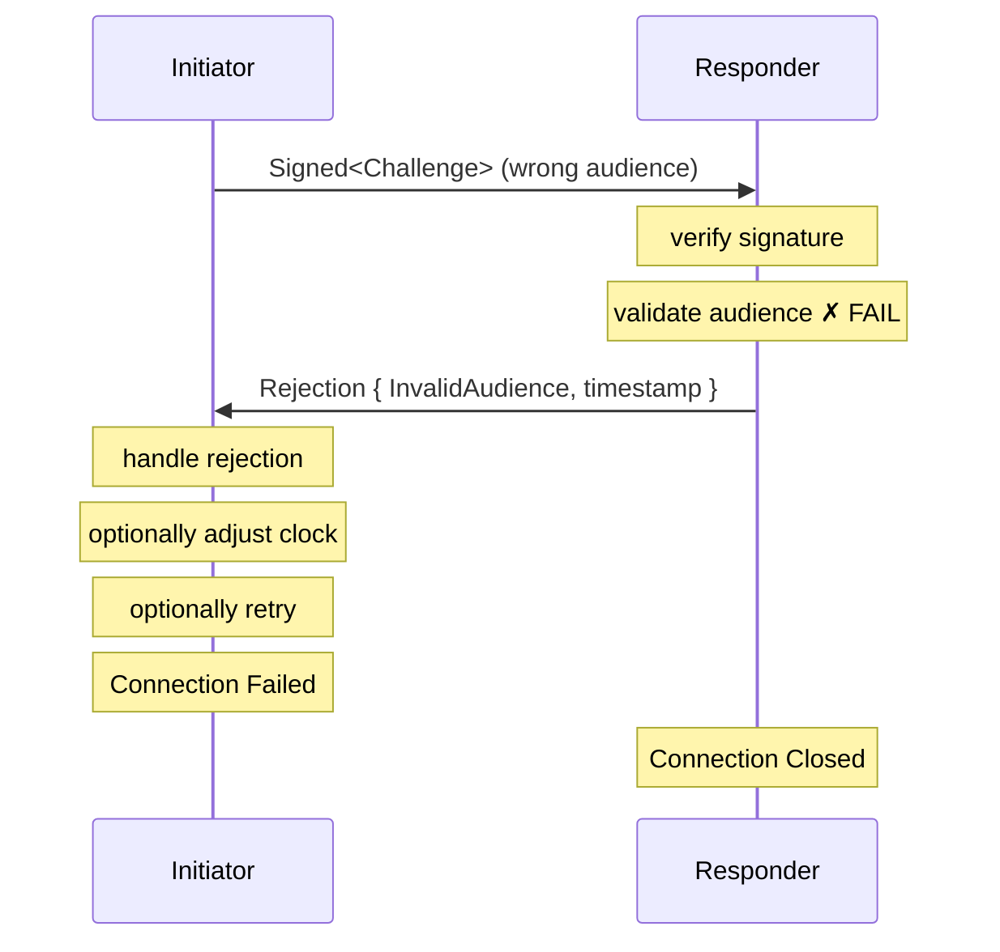

# Handshake Protocol

The Subduction handshake establishes mutual identity between peers. It answers _"who is connecting?"_ but does not answer _"can they connect?"_ — that's the job of `ConnectionPolicy`.

## Overview

The handshake is a two-message protocol using Ed25519 signatures. Either peer can initiate a connection — the protocol is symmetric. We call the peer that opens the connection the _initiator_ and the peer that accepts it the _responder_.

> [!NOTE]
> In some deployments, one peer may act as a dedicated server (always responding, never initiating), but this is a deployment choice, not a protocol requirement. The handshake itself is fully peer-to-peer.



Both parties learn each other's `PeerId` from the signature's issuer (the Ed25519 verifying key).

## Message Types

### Challenge (Initiator → Responder)

```rust
struct Challenge {
    audience: Audience,           // Who the initiator expects to reach
    timestamp: TimestampSeconds,  // Initiator's current time (replay protection)
    nonce: Nonce,                 // 128-bit random value (uniqueness)
}
```

The challenge is wrapped in `Signed<Challenge>`, which includes:
- The CBOR-encoded payload
- The initiator's Ed25519 signature
- The initiator's verifying key (from which `PeerId` is derived)

### Response (Responder → Initiator)

```rust
struct Response {
    challenge_digest: Digest<Challenge>,  // BLAKE3 hash binding to the challenge
    server_timestamp: TimestampSeconds,   // Responder's current time (drift correction)
}
```

The response is wrapped in `Signed<Response>`, proving the responder's identity.

### Rejection (Responder → Initiator, unsigned)

```rust
struct Rejection {
    reason: RejectionReason,
    server_timestamp: TimestampSeconds,  // Informational only
}
```

Rejection reasons:
- `ClockDrift` — Initiator timestamp too far from responder's clock
- `InvalidAudience` — Audience doesn't match this peer
- `ReplayedNonce` — Nonce was already used (replay attack)
- `InvalidSignature` — Signature verification failed

> [!WARNING]
> Rejections are unsigned. Initiators should not trust `server_timestamp` for drift correction if the drift exceeds `MAX_PLAUSIBLE_DRIFT` (±5 minutes).

## Audience Modes

The `Audience` enum supports two connection modes:

| `Known(PeerId)` | `Discover([u8; 32])` |
|-----------------|----------------------|
| Initiator knows the responder's peer ID | Initiator knows a service name (e.g., "sync.example.com") |
| Typical: direct peer connections where IDs are pre-shared | Typical: connecting to a well-known endpoint or load-balanced service |

### Discovery Mode

When using discovery mode:
1. The service name is hashed with BLAKE3 to produce 32 bytes
2. Initiator sends `Audience::Discover(hash)`
3. Responder validates: incoming hash matches its configured service name's hash

```
"sync.example.com" ──BLAKE3──► [u8; 32] ──► Audience::Discover(...)
```

### Audience Validation

The responder accepts connections if the audience matches **either**:
1. `Audience::Known(responder_peer_id)` — always accepted
2. `Audience::Discover(hash)` — accepted if discovery mode is configured and hash matches



## Validation

### Responder Validates Challenge

1. **Signature** — Verify Ed25519 signature; extract initiator's `PeerId`
2. **Audience** — Must match `Known(responder_peer_id)` or configured discovery audience
3. **Timestamp** — Must be within `max_drift` of responder's clock (default: 60s configurable)

### Initiator Validates Response

1. **Signature** — Verify Ed25519 signature; extract responder's `PeerId`
2. **Challenge Digest** — Must equal `BLAKE3(original_challenge)`; prevents replay

## Replay Protection

Multiple mechanisms prevent replay attacks:

| Mechanism | Protects Against |
|-----------|------------------|
| **Nonce** | Replay of same challenge to same peer |
| **Timestamp** | Replay of old challenges (outside drift window) |
| **Challenge Digest** | Replay of responses to different challenges |
| **Audience** | Misdirection to wrong peer |

## Clock Drift Handling

### Configurable Drift Window

The `max_drift` parameter (default: 60 seconds) controls how much clock difference is tolerated during handshake validation.

### Drift Correction

Initiators can learn their clock offset from responder timestamps:

```rust
struct DriftCorrection {
    offset_secs: i32,  // responder_time - initiator_time
}
```

The `MAX_PLAUSIBLE_DRIFT` constant (±5 minutes) bounds corrections to reject implausible timestamps from attackers.

```
Initiator clock: 12:00:00
Responder clock: 12:00:30
                 ────────
Drift offset:    +30 seconds

Future requests: initiator adjusts timestamp by +30s
```

## Wire Format

All messages are CBOR-encoded, wrapped in a `HandshakeMessage` enum:

```rust
enum HandshakeMessage {
    SignedChallenge(Signed<Challenge>),
    SignedResponse(Signed<Response>),
    Rejection(Rejection),
}
```

Sent as WebSocket binary frames.

## Security Properties

| Property | Mechanism |
|----------|-----------|
| **Initiator Authentication** | Ed25519 signature on Challenge |
| **Responder Authentication** | Ed25519 signature on Response |
| **Replay Prevention** | Nonce + Timestamp + Challenge Digest |
| **Binding** | Response includes hash of specific Challenge |
| **Audience Verification** | Initiator specifies intended recipient |
| **Freshness** | Timestamp within configurable drift window |

## Sequence Diagram (Success)



## Sequence Diagram (Rejection)



## Implementation Notes

### Creating a Challenge (Initiator)

```rust
let challenge = Challenge::new(audience, now, Nonce::random());
let signed = Signed::seal(&signer, challenge).await;
```

### Verifying a Challenge (Responder)

```rust
let verified = signed_challenge.try_verify()?;
let challenge = verified.payload();
challenge.validate(&expected_audience, now, max_drift)?;
let initiator_id = PeerId::from(verified.issuer());
```

### Creating a Response (Responder)

```rust
let response = Response::for_challenge(&challenge, now);
let signed = Signed::seal(&signer, response).await;
```

### Verifying a Response (Initiator)

```rust
let verified = signed_response.try_verify()?;
let response = verified.payload();
response.validate(&original_challenge)?;
let responder_id = PeerId::from(verified.issuer());
```
