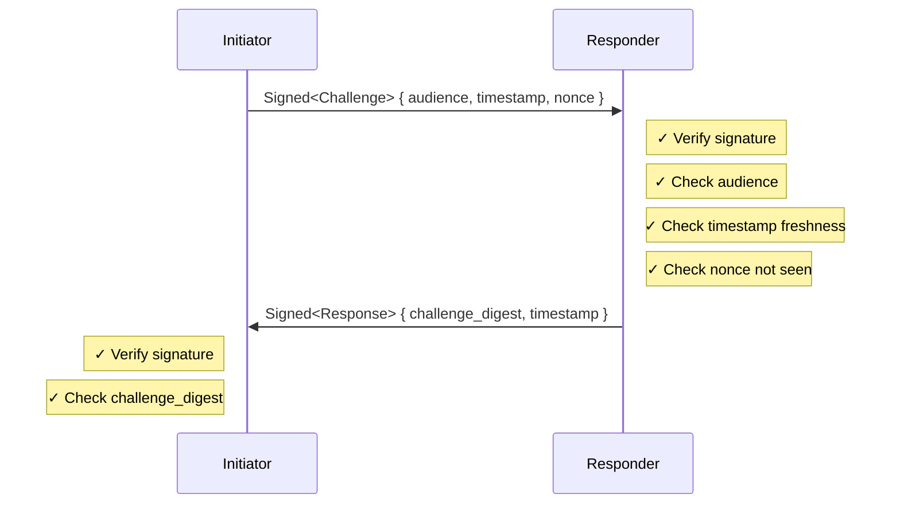
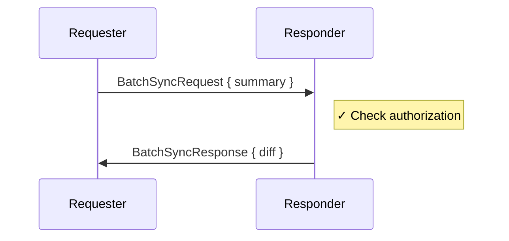
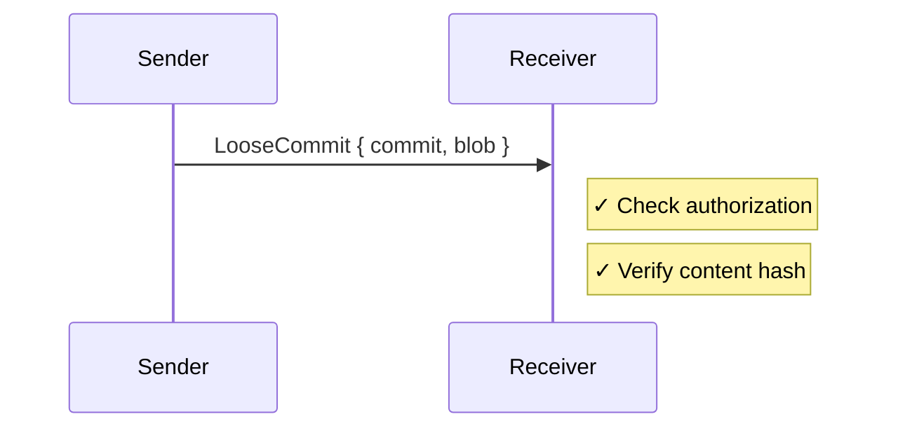

# Protocol Security Rationale

Security properties of each protocol layer.

## Handshake

**Security properties:**
- Mutual authentication (both parties sign)
- Replay protection (nonce + timestamp + digest binding)
- Audience binding (prevents misdirection)

## Batch Sync

**Security properties:**
- Authorization checked before returning data
- Content-addressed integrity (hash verification)
- No information leak on unauthorized request (empty diff)

## Incremental Sync

**Security properties:**
- Authorization checked before accepting
- Content integrity via BLAKE3 digest
- Idempotent (duplicates harmless)
