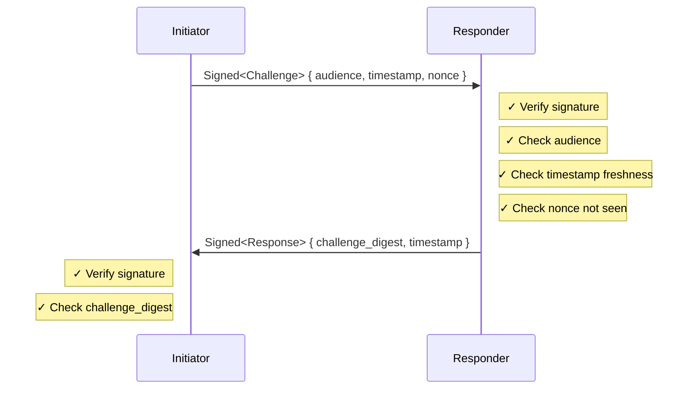
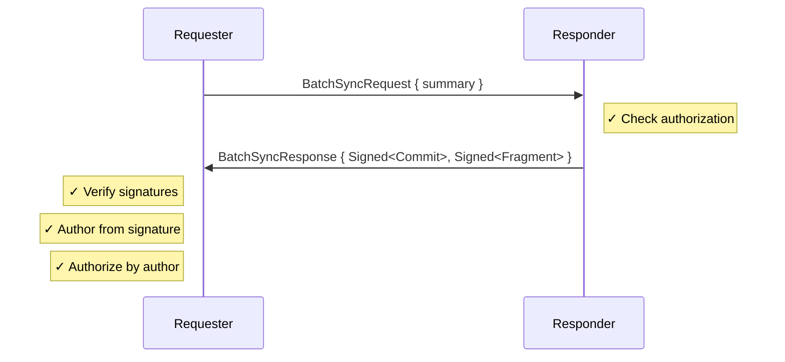
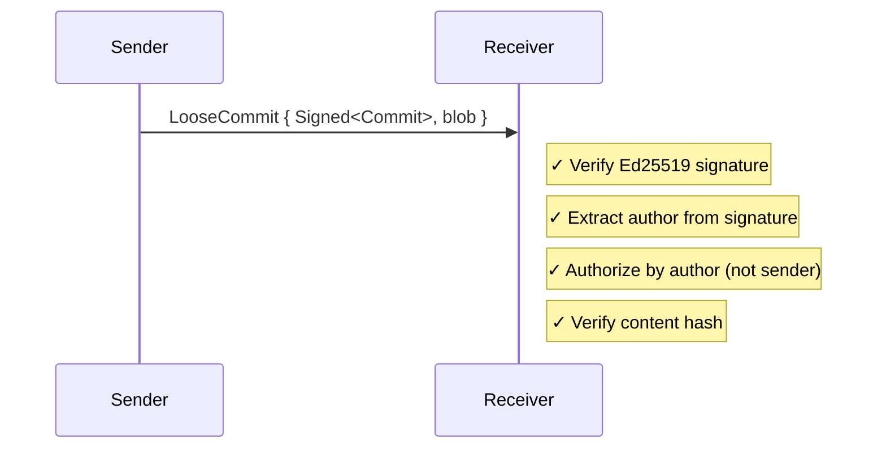

# Protocol Security Rationale

Security properties of each protocol layer.

## Handshake

**Security properties:**
- Mutual authentication (both parties sign)
- Replay protection (nonce + timestamp + digest binding)
- Audience binding (prevents misdirection)

## Batch Sync

**Security properties:**
- Authorization checked before returning data
- **Signed payloads** — Commits and fragments are `Signed<T>` with author signature
- **Author verification** — Author identity comes from cryptographic signature, not sender claim
- Content-addressed integrity (BLAKE3 hash verification)
- CAS storage keyed by digest — prevents tampering
- No information leak on unauthorized request (empty diff)

## Incremental Sync

**Security properties:**
- **Signature verification** — Ed25519 signature verified before processing
- **Author from signature** — Author identity is cryptographic, not trusted from sender
- **Authorization by author** — Policy checks author identity, sender is just transport
- Content integrity via BLAKE3 digest
- CAS storage keyed by digest — deduplication and tamper detection
- Idempotent (duplicates harmless)

> [!NOTE]
> The sender (connection peer) may differ from the author (signature issuer). A peer can relay data signed by others. Authorization is always checked against the _author_, not the _sender_. This enables multi-hop forwarding while maintaining authorship accountability.
