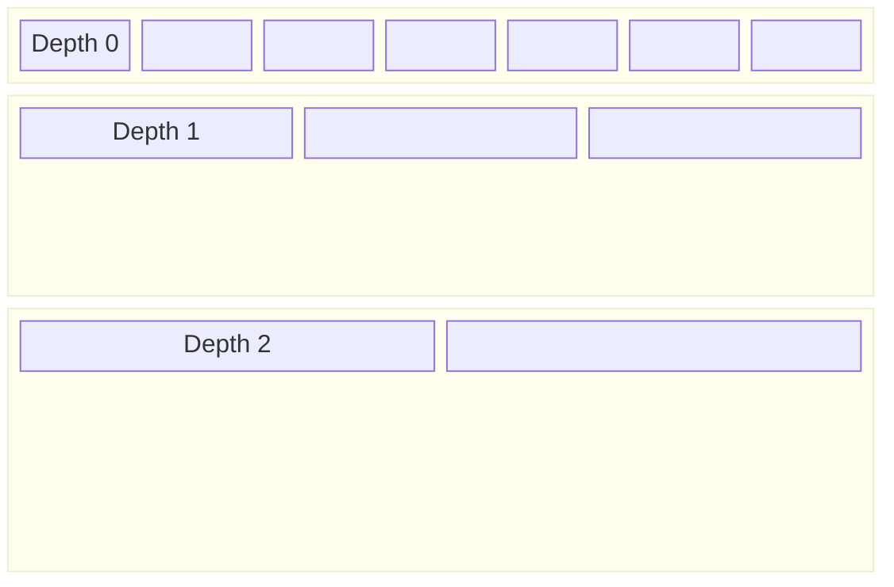
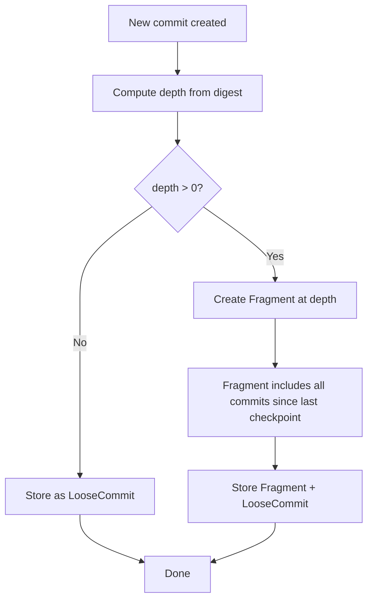
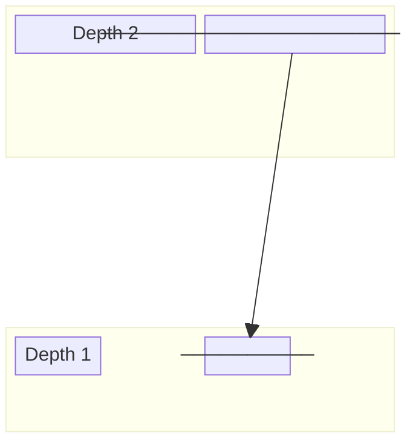
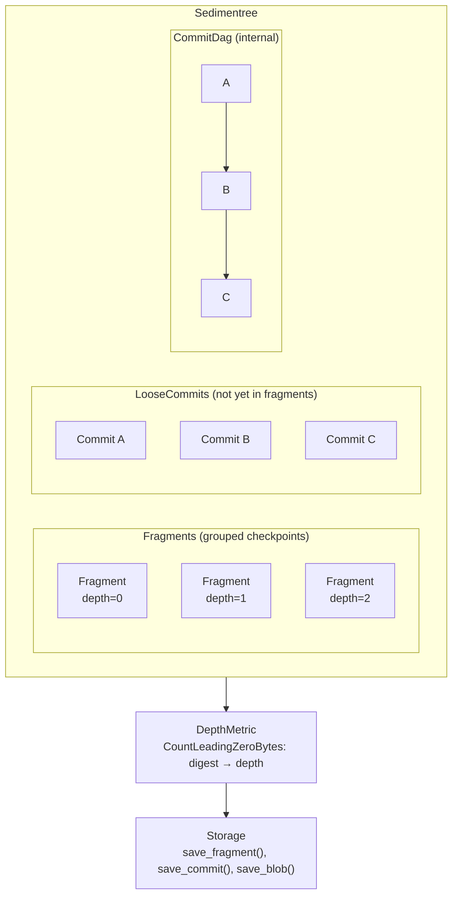
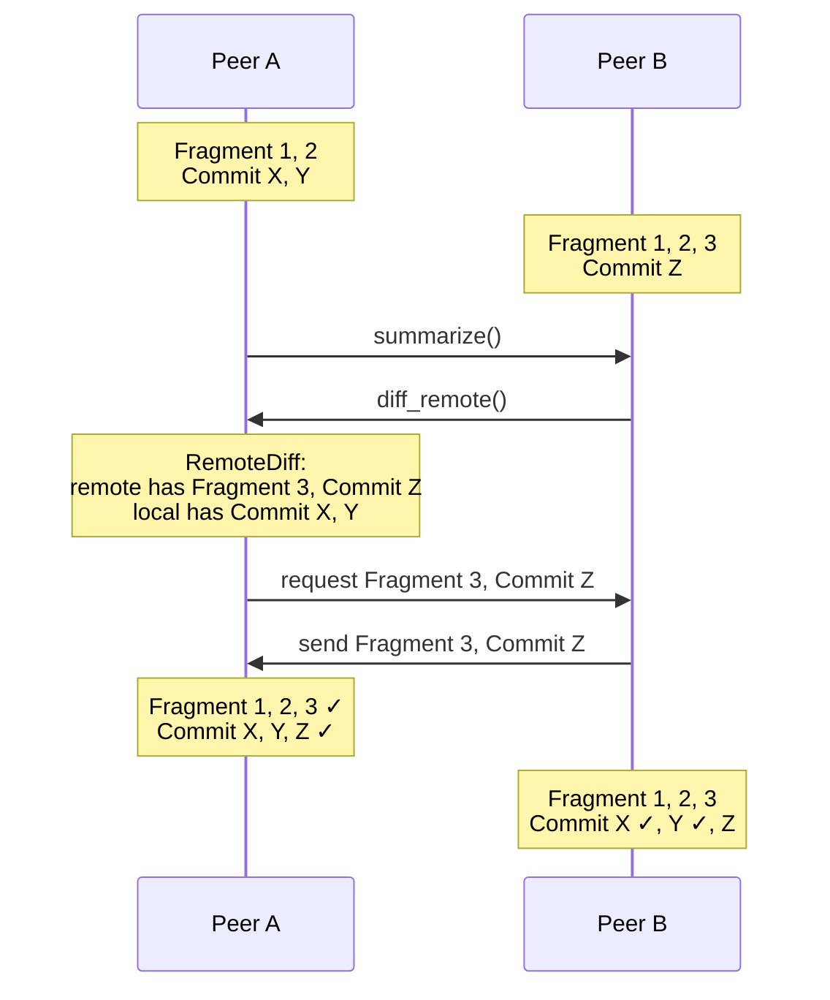

# Sedimentree

Sedimentree is a depth-based partitioning scheme for content-addressed data. It enables efficient synchronization of encrypted or opaque payloads without requiring knowledge of the actual content.

## Overview

Sedimentree organizes commits into hierarchical layers (strata) based on the number of leading zero bytes in their content hashes. This creates a natural, deterministic partitioning that allows peers to efficiently diff and sync.



Higher depth = exponentially fewer fragments, each covering more history.

## Core Types

### Digest

A 32-byte BLAKE3 hash identifying content:

```rust
struct Digest([u8; 32]);
```

The leading byte pattern determines depth placement.

### LooseCommit

The minimal unit of change — a single operation in the DAG:

```rust
struct LooseCommit {
    digest: Digest,        // Content hash
    parents: Vec<Digest>,  // Causal dependencies
    blob_meta: BlobMeta,   // Size + hash of associated blob
}
```

Loose commits form a directed acyclic graph (DAG) via parent pointers.

### Fragment

A checkpoint grouping multiple commits at a specific depth:

```rust
struct Fragment {
    summary: FragmentSummary,   // Head + boundary
    checkpoints: Vec<Digest>,  // Interior checkpoints
    digest: Digest,            // Hash of the fragment itself
}

struct FragmentSummary {
    head: Digest,              // Most recent commit
    boundary: Vec<Digest>,     // Ending commits
    blob_meta: BlobMeta,
}
```

Fragments consolidate history, reducing the number of items to track and sync.

### Sedimentree

The main container aggregating all metadata:

```rust
struct Sedimentree {
    fragments: Set<Fragment>,
    commits: Set<LooseCommit>,
}
```

### FingerprintSummary

A compact wire representation for [batch sync](./sync/batch.md) reconciliation:

```rust
struct FingerprintSummary {
    seed: FingerprintSeed,                               // 128-bit SipHash key (random per request)
    commit_fingerprints: Vec<Fingerprint<CommitId>>,     // 8 bytes each
    fragment_fingerprints: Vec<Fingerprint<FragmentId>>, // 8 bytes each
}
```

Uses 8-byte SipHash-2-4 keyed hashes instead of full 32-byte digests, reducing sync request payload by ~75%. Fingerprints are computed over _causal identity_ only: `digest()` for commits, `head + boundary` for fragments (excluding `blob_meta`).

> [!NOTE]
> `SedimentreeSummary` (with full digests) still exists for local diffing and testing but is no longer used on the wire.

## Depth Partitioning

### How Depth is Computed

The `DepthMetric` trait determines depth from a digest:

```rust
trait DepthMetric {
    fn to_depth(&self, digest: Digest) -> Depth;
}
```

The default implementation counts leading zero bytes:

```
0x00001234... → Depth 2 (two leading zero bytes)
0x00abcdef... → Depth 1 (one leading zero byte)
0x12345678... → Depth 0 (no leading zeros)
```

### Placement Rules

A commit can appear at any depth up to its computed depth:

| Digest Pattern        | Can appear at    |
|-----------------------|------------------|
| No leading zeros      | Depth 0 only     |
| 1+ leading zero bytes | Depth 0 or 1     |
| 2+ leading zero bytes | Depth 0, 1, or 2 |

### Probability Distribution

Leading zeros occur with probability 1/256 per byte:
    
| Depth | Probability | ~Frequency   |
|-------|-------------|--------------|
| 0     | 255/256     | Most commits |
| 1     | 1/256       | ~1 in 256    |
| 2     | 1/65536     | ~1 in 65K    |

## Fragment Boundaries

When a commit's hash has enough leading zeros, it triggers a fragment checkpoint:



Fragments at higher depths subsume fragments at lower depths, creating a hierarchical structure.

## Diffing and Sync

### Local Diff

Compare two full sedimentrees:

```rust
let diff: Diff = local.diff(&remote);
// diff.left_missing_fragments  — what local needs
// diff.right_missing_fragments — what remote needs
```

### Remote Diff

Compare local tree against a remote summary:

```rust
let diff: RemoteDiff = local.diff_remote(&remote_summary);
// Identifies what to request from remote
// Identifies what to send to remote
```

### Fragment Support

A deeper fragment can "support" (fully contain) a shallower one:



This allows redundancy elimination during minimization.

## Minimization

Remove redundant fragments and commits:

```rust
let minimal = tree.minimize(&depth_metric);
```

1. Sort fragments by depth
2. Remove fragments fully supported by deeper ones
3. Remove commits covered by fragment boundaries
4. Result: minimal equivalent tree

Two trees with the same content will have identical minimal representations.

### Minimal Hash

Produce a deterministic fingerprint:

```rust
let hash: MinimalTreeHash = tree.minimal_hash(&depth_metric);
```

1. Minimize the tree
2. Collect all digests (heads, boundaries, checkpoints, commits)
3. Sort deterministically
4. BLAKE3 hash the sorted sequence

Identical content → identical hash, regardless of sync order.

## Properties

| Property | Mechanism |
|----------|-----------|
| **Content-addressed** | All items identified by BLAKE3 hash |
| **Deterministic** | Same content → same structure |
| **Opaque-friendly** | Works with encrypted payloads |
| **Self-balancing** | Hash distribution creates natural partitioning |
| **Idempotent** | Receiving same data twice is safe |
| **Commutative** | Merge order doesn't matter |

## Architecture



## Example: Sync Flow


