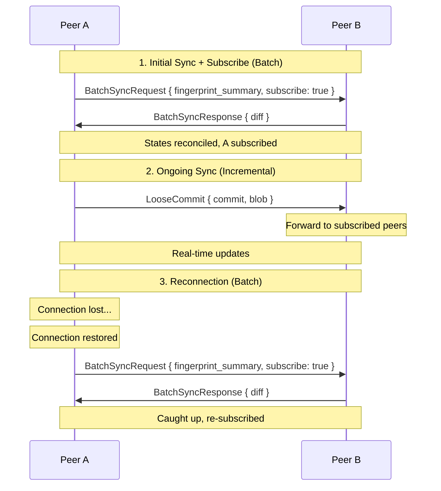

# Sync Protocols

Subduction uses two complementary sync protocols to keep sedimentrees consistent across peers, with an optional subscription mechanism for real-time updates.

## Overview

| Protocol | Direction | Scope | Use Case |
|----------|-----------|-------|----------|
| [Batch](./batch.md) | Pull (request/response) | Entire sedimentree | Initial sync, reconnection |
| [Incremental](./incremental.md) | Push (fire-and-forget) | Single commit/fragment | Real-time updates |
| [Subscriptions](./subscriptions.md) | Opt-in | Per sedimentree | Live update filtering |
| [Reconnection](./reconnection.md) | Automatic | Per connection | Connection recovery |

Batch sync uses [fingerprint-based reconciliation](./batch.md#fingerprint-based-reconciliation) — compact 8-byte SipHash keyed hashes instead of full 32-byte digests — to minimize request payload (~75% reduction).

## Typical Usage

## Comparison

| Aspect | Batch Sync | Incremental Sync |
|--------|------------|------------------|
| **Direction** | Pull (request/response) | Push (fire-and-forget) |
| **Scope** | Entire sedimentree state | Single commit or fragment |
| **Latency** | One round-trip | Immediate |
| **Bandwidth** | Efficient for large diffs | Efficient for small changes |
| **Ordering** | Snapshot at request time | No guarantees |
| **Reliability** | Guaranteed delivery | Best-effort |

## When to Use Each

### Batch Sync

- First connection to a peer
- Reconnecting after disconnect
- Periodic consistency check
- Joining an existing document

### Incremental Sync

- Active editing sessions
- Real-time collaboration
- Low-latency updates
- Continuous synchronization

## Consistency Model

Both protocols are **eventually consistent**:

1. Incremental sync provides low-latency propagation
2. Batch sync recovers from missed messages
3. Content-addressing ensures identical data has identical hashes
4. Idempotent storage means duplicates are harmless

If incremental messages are lost (network issues, peer offline), batch sync on reconnection will catch up.
