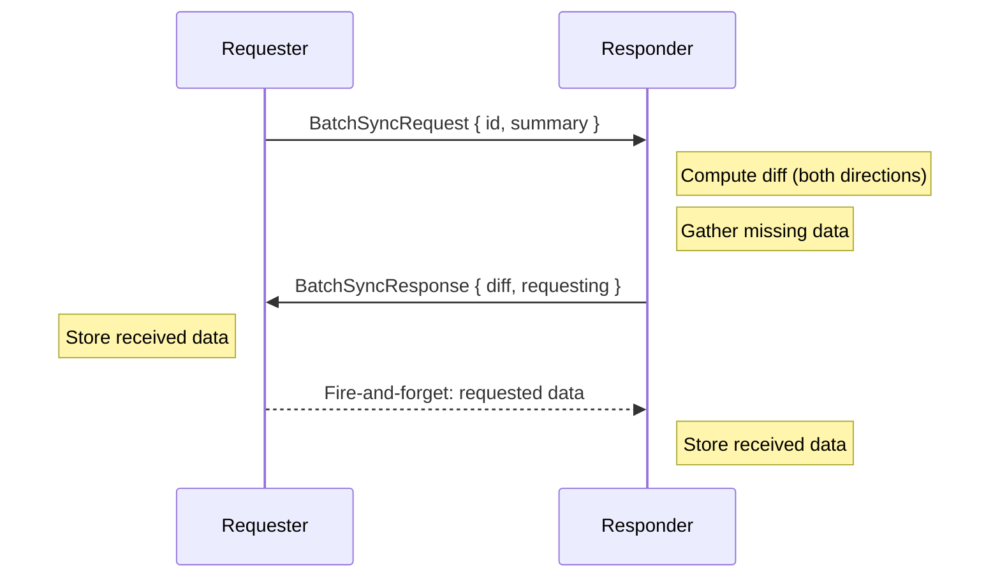
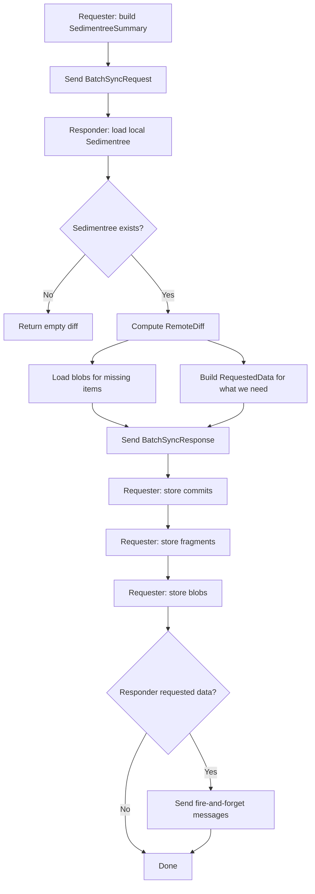
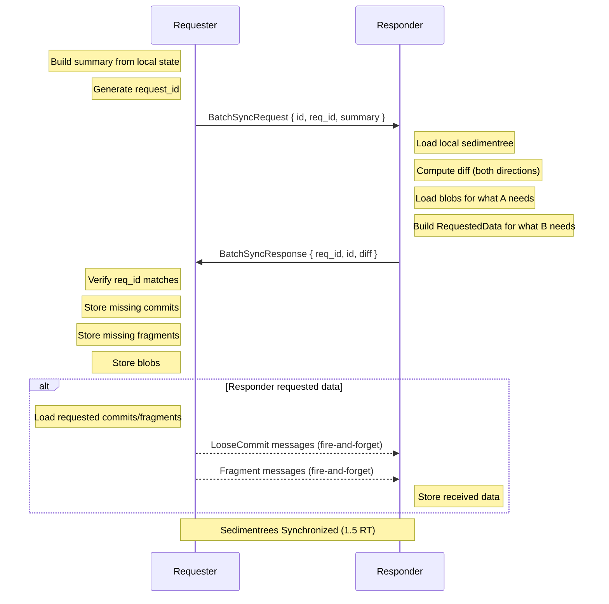

# Batch Sync Protocol

Batch sync reconciles the complete state of a sedimentree between two peers in 1.5 round trips. It answers _"what data am I missing?"_ and _"what data are you missing?"_ by comparing metadata summaries.

## Overview

Batch sync is a bidirectional protocol. The requester sends their current `SedimentreeSummary`, and the responder:
1. Computes what the requester is missing and sends it
2. Computes what the responder is missing and requests it back

This completes full bidirectional sync in 1.5 round trips instead of requiring two separate sync operations.

> [!NOTE]
> Batch sync transfers metadata *and* blob data together. For large sedimentrees, consider incremental sync for ongoing updates after the initial batch sync.



The requester learns what they're missing; the responder provides it and also requests what _they're_ missing. The requester then sends the requested data as fire-and-forget messages.

## Message Types

### BatchSyncRequest (Requester → Responder)

```rust
struct BatchSyncRequest {
    id: SedimentreeId,                       // Which sedimentree to sync
    req_id: RequestId,                       // Correlation ID for request/response matching
    sedimentree_summary: SedimentreeSummary, // Requester's current state
    subscribe: bool,                         // Opt into live updates for this sedimentree
}

struct RequestId {
    requestor: PeerId, // Who initiated the request
    nonce: u64,        // Unique per-connection counter
}
```

The `SedimentreeSummary` is a compact representation of the sedimentree's structure — fragment digests and loose commit digests at each depth level.

When `subscribe: true`, the responder adds the requester to the subscription set for this sedimentree after completing the sync. See [Subscriptions](./subscriptions.md) for details.

### BatchSyncResponse (Responder → Requester)

```rust
struct BatchSyncResponse {
    req_id: RequestId, // Must match the request
    id: SedimentreeId, // Which sedimentree was synced
    diff: SyncDiff,    // The data the requester is missing
}

struct SyncDiff {
    missing_commits: Vec<(Signed<LooseCommit>, Blob)>,  // Commits requester lacks
    missing_fragments: Vec<(Signed<Fragment>, Blob)>,   // Fragments requester lacks
    requesting: RequestedData,                          // What responder wants back
}

struct RequestedData {
    commit_digests: Set<Digest<LooseCommit>>,    // Commits responder lacks
    fragment_summaries: Set<FragmentSummary>,    // Fragments responder lacks
}
```

The response includes signed metadata and blob data, so the requester can verify authorship and store everything immediately. See [protocol.md](../protocol.md) for the `Signed<T>` envelope format.

## Sync Flow



## Diffing Algorithm

The responder computes what the requester is missing:

```rust
// Responder's perspective
let local: Sedimentree = storage.load(id);
let remote_summary: SedimentreeSummary = request.sedimentree_summary;

// What does the remote peer NOT have that we DO have?
let diff: RemoteDiff = local.diff_for_remote(&remote_summary);
```

The diff algorithm compares:
1. **Loose commits** — commits not yet rolled into fragments
2. **Fragments at each depth** — using checkpoint digests for efficient comparison

## Wire Format

Messages are CBOR-encoded and wrapped in the `Message` enum:

```rust
enum Message {
    // ... other variants ...
    BatchSyncRequest(BatchSyncRequest),
    BatchSyncResponse(BatchSyncResponse),
}
```

Sent as WebSocket binary frames.

## Properties

| Property | Mechanism |
|----------|-----------|
| **Consistency** | Summary-based diffing ensures convergence |
| **Efficiency** | Only missing data transferred |
| **Bidirectional** | 1.5 RT completes sync in both directions |
| **Correlation** | `RequestId` links response to request |
| **Self-confirming** | Running sync twice confirms success |

## Sequence Diagram (Success)



## Implementation Notes

### Initiating a Batch Sync

```rust
let summary = local_sedimentree.summarize();
let req_id = conn.next_request_id().await;

let response = conn.call(
    BatchSyncRequest {
        id,
        req_id,
        sedimentree_summary: summary,
        subscribe: true,  // Opt into live updates
    },
    Some(timeout),
).await?;

// Verify and store the received data
for (signed_commit, blob) in response.diff.missing_commits {
    // Verify signature; author extracted from signature, not sender
    let verified = signed_commit.verify()?;
    let putter = policy.authorize_put(sender, verified.author(), id).await?;

    // CAS storage: returns digest, keyed by content hash
    putter.save_loose_commit(verified).await?;
    putter.save_blob(blob).await?;
}
for (signed_fragment, blob) in response.diff.missing_fragments {
    let verified = signed_fragment.verify()?;
    let putter = policy.authorize_put(sender, verified.author(), id).await?;

    putter.save_fragment(verified).await?;
    putter.save_blob(blob).await?;
}
// If subscribe: true, we're now subscribed for incremental updates
```

### Handling a Batch Sync Request

```rust
let BatchSyncRequest { id, req_id, sedimentree_summary } = request;

// Compute diff (both directions)
let local = sedimentrees.get(&id)?;
let remote_diff = local.diff_for_remote(&sedimentree_summary);

// What we have that they don't → send to them
let missing_commits = /* load commits + blobs for remote_diff.local_commits */;
let missing_fragments = /* load fragments + blobs for remote_diff.local_fragments */;

// What they have that we don't → request from them
let requesting = RequestedData {
    commit_digests: remote_diff.remote_commits.iter().map(|c| c.digest()).collect(),
    fragment_summaries: remote_diff.remote_fragment_summaries.iter().cloned().collect(),
};

BatchSyncResponse {
    req_id,
    id,
    diff: SyncDiff { missing_commits, missing_fragments, requesting },
}
```

### Handling Requested Data (Requester Side)

After receiving the response, the requester sends the data the responder requested:

```rust
// Process the response
for (signed_commit, blob) in response.diff.missing_commits {
    // Store what we received...
}

// Send what responder requested (fire-and-forget)
for commit_digest in response.diff.requesting.commit_digests {
    if let Some(commit) = storage.load_commit(id, commit_digest).await? {
        conn.send(Message::LooseCommit { id, commit, blob }).await?;
    }
}
for summary in response.diff.requesting.fragment_summaries {
    if let Some(fragment) = storage.load_fragment_by_summary(id, &summary).await? {
        conn.send(Message::Fragment { id, fragment, blob }).await?;
    }
}
```

## Bidirectional Sync (1.5 RT)

The protocol completes bidirectional sync in 1.5 round trips:

| Step | Direction | Content                                              |
|------|-----------|------------------------------------------------------|
| 1    | A → B     | `BatchSyncRequest` with A's summary                  |
| 2    | B → A     | `BatchSyncResponse` with data A needs + what B wants |
| 3    | A → B     | Fire-and-forget messages with data B requested       |

After step 3, both peers have each other's data.

### Why Fire-and-Forget?

The third step uses fire-and-forget (no acknowledgment) because:

1. **TCP guarantees delivery** — If the connection stays up, data arrives
2. **Idempotent by design** — Receiving the same commit/fragment twice deduplicates safely
3. **Self-healing** — Any missed data is caught on the next sync cycle
4. **Simpler protocol** — No additional message types or state tracking

## Confirmation

The protocol does not include an explicit confirmation message. This is intentional.

### "Confirmation Is Just Another Sync"

If you need to confirm that a sync completed successfully, simply **run batch sync again**:

```
First sync:
  A → B: BatchSyncRequest (A's summary)
  B → A: BatchSyncResponse (data + requesting)
  A → B: Fire-and-forget data

Second sync:
  A → B: BatchSyncRequest (A's updated summary)
  B → A: BatchSyncResponse
         └─ If first sync succeeded: empty diff, empty requesting
         └─ If fire-and-forget failed: re-requests same data
  A → B: (re-send if needed)
```

The second sync implicitly confirms the first:
- **Empty `requesting`** = first sync's fire-and-forget succeeded
- **Non-empty `requesting`** = first sync's fire-and-forget failed, automatically retried

This is cleaner than adding explicit confirmation because:
- No new message types needed
- No special state tracking
- Uses the existing idempotent protocol
- Self-healing by design

> [!TIP]
> **Confirmation is just another sync.** The protocol is self-confirming through repetition. This aligns with CRDT philosophy: don't add special cases, let the normal merge process handle it.

