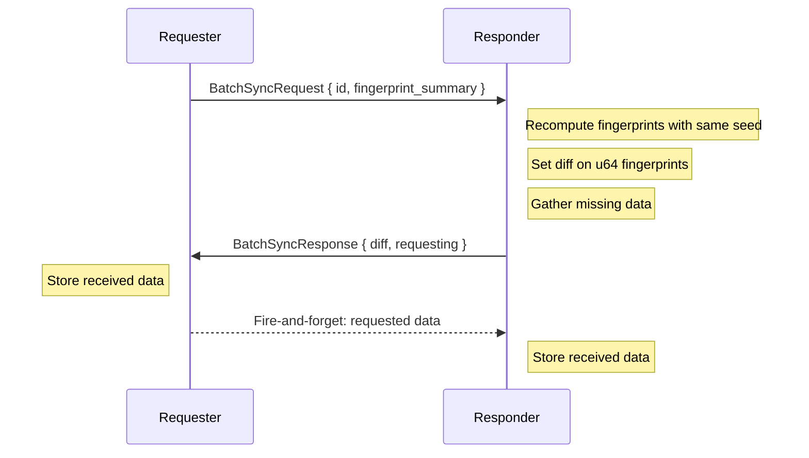
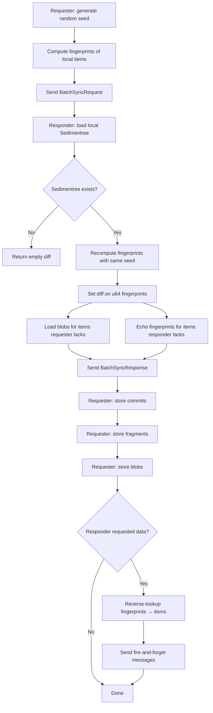
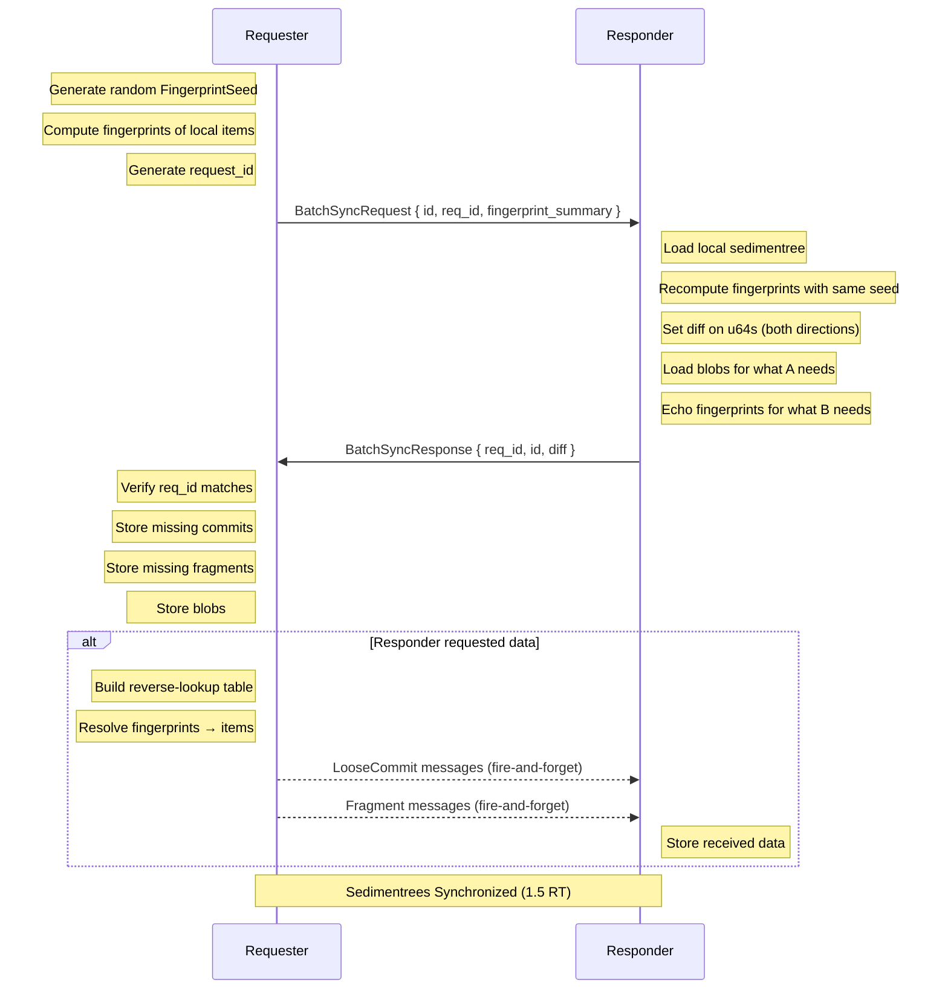

# Batch Sync Protocol

Batch sync reconciles the complete state of a sedimentree between two peers in 1.5 round trips. It answers _"what data am I missing?"_ and _"what data are you missing?"_ by comparing compact fingerprint summaries.

## Overview

Batch sync is a bidirectional protocol. The requester sends a `FingerprintSummary` — a set of short keyed hashes of their local items — and the responder:
1. Computes what the requester is missing and sends it
2. Computes what the responder is missing and requests it back (echoing the requester's fingerprints)

This completes full bidirectional sync in 1.5 round trips instead of requiring two separate sync operations.

> [!NOTE]
> Batch sync transfers metadata _and_ blob data together. For large sedimentrees, consider incremental sync for ongoing updates after the initial batch sync.



The requester learns what they're missing; the responder provides it and also requests what _they're_ missing. The requester then sends the requested data as fire-and-forget messages.

## Fingerprint-Based Reconciliation

Instead of sending full 32-byte digests for every item, the requester computes short **fingerprints** — 8-byte [SipHash-2-4](https://www.aumasson.jp/siphash/siphash.pdf) keyed hashes — using a random per-request seed. Both sides use the same seed to fingerprint their items, then diff on `u64` values.

This reduces request payload by ~75%. For a document with 1200 items:
- Full digests: ~38 KB
- Fingerprints: ~9.6 KB

### Causal Identity

Fingerprints are computed over an item's _causal identity_, not its full structural content:

| Type | Fingerprinted fields | Excluded |
|------|---------------------|----------|
| Commits | `digest()` (content hash) | parents, blob_meta |
| Fragments | `head` + `boundary` (causal range) | blob_meta, checkpoints |

Excluding `blob_meta` from fragment fingerprints means two differently-compressed fragments covering the same causal range are considered equivalent. This enables future optimizations (re-compression, fragment covering) without changing the wire protocol.

### Collision Analysis

SipHash-2-4 produces 64-bit output. Birthday collision probability:

| Items per sync | Collision probability |
|----------------|----------------------|
| 1,000          | ~2.7 × 10⁻¹¹        |
| 10,000         | ~2.7 × 10⁻⁹         |
| 100,000        | ~2.7 × 10⁻⁷         |

A per-request random seed prevents precomputed collisions. Worst case: a collision causes one item to be skipped this round, caught on next sync (different seed).

## Message Types

### BatchSyncRequest (Requester → Responder)

```rust
struct BatchSyncRequest {
    id: SedimentreeId,                           // Which sedimentree to sync
    req_id: RequestId,                           // Correlation ID for request/response matching
    fingerprint_summary: FingerprintSummary,     // Compact keyed hashes of requester's items
    subscribe: bool,                             // Opt into live updates for this sedimentree
}

struct FingerprintSummary {
    seed: FingerprintSeed,                       // 128-bit SipHash key (random per request)
    commit_fingerprints: Vec<Fingerprint<CommitId>>,     // 8 bytes each
    fragment_fingerprints: Vec<Fingerprint<FragmentId>>, // 8 bytes each
}

struct RequestId {
    requestor: PeerId, // Who initiated the request
    nonce: u64,        // Unique per-connection counter
}
```

When `subscribe: true`, the responder adds the requester to the subscription set for this sedimentree after completing the sync. See [Subscriptions](./subscriptions.md) for details.

### BatchSyncResponse (Responder → Requester)

```rust
struct BatchSyncResponse {
    req_id: RequestId, // Must match the request
    id: SedimentreeId, // Which sedimentree was synced
    diff: SyncDiff,    // The data the requester is missing
}

struct SyncDiff {
    missing_commits: Vec<(Signed<LooseCommit>, Blob)>,  // Commits requester lacks
    missing_fragments: Vec<(Signed<Fragment>, Blob)>,   // Fragments requester lacks
    requesting: RequestedData,                          // What responder wants back
}

struct RequestedData {
    commit_fingerprints: Vec<Fingerprint<CommitId>>,       // Commits responder lacks
    fragment_fingerprints: Vec<Fingerprint<FragmentId>>,   // Fragments responder lacks
}
```

The `requesting` field echoes back the requester's own fingerprints for items the responder doesn't have. The requester resolves these fingerprints to actual items using a reverse-lookup table (see below).

The response includes signed metadata and blob data, so the requester can verify authorship and store everything immediately. See [protocol.md](../protocol.md) for the `Signed<T>` envelope format.

## Sync Flow



## Diffing Algorithm

The responder recomputes fingerprints of its own items using the requester's seed, then performs set difference on `u64` values:

```rust
// Responder's perspective
let local: Sedimentree = storage.load(id);
let remote: &FingerprintSummary = &request.fingerprint_summary;

// What does the remote peer NOT have that we DO have?
// What do THEY have that WE don't?
let diff: FingerprintDiff = local.diff_remote_fingerprints(remote);
```

The diff produces:
- **Responder-only items** → send data to requester (with blobs)
- **Requester-only fingerprints** → echo back as `RequestedData`

## Reverse-Lookup (Requester Side)

When the response echoes back fingerprints, the requester must resolve them to actual items. This is done by building a reverse-lookup table from the in-memory sedimentree using the same seed:

```
┌──────────────────────────┐         ┌──────────────────────────┐
│    Fingerprint<CommitId> │ ──────> │    Digest<LooseCommit>   │
│    (8 bytes, from resp)  │         │    (32 bytes, for load)  │
└──────────────────────────┘         └──────────────────────────┘
```

```rust
// Build lookup tables from in-memory sedimentree + seed
let commit_lookup: Map<Fingerprint<CommitId>, Digest<LooseCommit>> =
    sedimentree.loose_commits()
        .map(|c| (Fingerprint::new(&seed, &c.commit_id()), c.digest()))
        .collect();

// Resolve each requested fingerprint → digest
for fp in response.requesting.commit_fingerprints {
    if let Some(digest) = commit_lookup.get(&fp) {
        let commit = storage.load_commit(id, digest).await?;
        conn.send(Message::LooseCommit { id, commit, blob }).await?;
    }
}
```

The lookup tables are ephemeral — built per-request, used once, then dropped.

## Wire Format

Messages are CBOR-encoded and wrapped in the `Message` enum:

```rust
enum Message {
    // ... other variants ...
    BatchSyncRequest(BatchSyncRequest),
    BatchSyncResponse(BatchSyncResponse),
}
```

Sent as WebSocket binary frames.

## Properties

| Property                  | Mechanism                                                 |
|---------------------------|-----------------------------------------------------------|
| **Consistency**           | Fingerprint-based diffing ensures convergence             |
| **Efficiency**            | ~75% smaller requests; only missing data transferred      |
| **Bidirectional**         | 1.5 RT completes sync in both directions                  |
| **Correlation**           | `RequestId` links response to request                     |
| **Self-confirming**       | Running sync twice confirms success                       |
| **Precompute-resistance** | Random per-request seed prevents chosen-collision attacks |

## Sequence Diagram (Success)



## Implementation Notes

### Initiating a Batch Sync

```rust
let seed = FingerprintSeed::random();
let summary = local_sedimentree.fingerprint_summarize(&seed);
let req_id = conn.next_request_id().await;

let response = conn.call(
    BatchSyncRequest {
        id,
        req_id,
        fingerprint_summary: summary,
        subscribe: true,  // Opt into live updates
    },
    Some(timeout),
).await?;

// Verify and store the received data
for (signed_commit, blob) in response.diff.missing_commits {
    // Verify signature; author extracted from signature, not sender
    let verified = signed_commit.verify()?;
    let putter = policy.authorize_put(sender, verified.author(), id).await?;

    // CAS storage: returns digest, keyed by content hash
    putter.save_loose_commit(verified).await?;
    putter.save_blob(blob).await?;
}
for (signed_fragment, blob) in response.diff.missing_fragments {
    let verified = signed_fragment.verify()?;
    let putter = policy.authorize_put(sender, verified.author(), id).await?;

    putter.save_fragment(verified).await?;
    putter.save_blob(blob).await?;
}
// If subscribe: true, we're now subscribed for incremental updates
```

### Handling a Batch Sync Request

```rust
let BatchSyncRequest { id, req_id, fingerprint_summary } = request;

// Load local state and diff using the requester's seed
let local = sedimentrees.get(&id)?;
let diff = local.diff_remote_fingerprints(&fingerprint_summary);

// What we have that they don't → send to them (with blobs)
let missing_commits = /* load commits + blobs for diff.responder_only_commits */;
let missing_fragments = /* load fragments + blobs for diff.responder_only_fragments */;

// What they have that we don't → echo their fingerprints back
let requesting = RequestedData {
    commit_fingerprints: diff.requestor_only_commit_fps,
    fragment_fingerprints: diff.requestor_only_fragment_fps,
};

BatchSyncResponse {
    req_id,
    id,
    diff: SyncDiff { missing_commits, missing_fragments, requesting },
}
```

### Handling Requested Data (Requester Side)

After receiving the response, the requester builds a reverse-lookup table and sends the data the responder requested:

```rust
// Build reverse-lookup: Fingerprint → Digest
let sedimentree = local_sedimentrees.get(&id);
let commit_fp_to_digest: Map<Fingerprint<CommitId>, Digest<LooseCommit>> =
    sedimentree.loose_commits()
        .map(|c| (Fingerprint::new(&seed, &c.commit_id()), c.digest()))
        .collect();

// Resolve fingerprints → items and send (fire-and-forget)
for fp in response.diff.requesting.commit_fingerprints {
    if let Some(digest) = commit_fp_to_digest.get(&fp) {
        if let Some(commit) = storage.load_commit(id, *digest).await? {
            let blob = storage.load_blob(id, commit.blob_meta().digest()).await?;
            conn.send(Message::LooseCommit { id, commit, blob }).await?;
        }
    }
}
// Same pattern for fragments...
```

## Bidirectional Sync (1.5 RT)

The protocol completes bidirectional sync in 1.5 round trips:

| Step | Direction | Content                                                       |
|------|-----------|---------------------------------------------------------------|
| 1    | A → B     | `BatchSyncRequest` with A's fingerprint summary               |
| 2    | B → A     | `BatchSyncResponse` with data A needs + fingerprints B wants  |
| 3    | A → B     | Fire-and-forget messages with data B requested                |

After step 3, both peers have each other's data.

### Why Fire-and-Forget?

The third step uses fire-and-forget (no acknowledgment) because:

1. **TCP guarantees delivery** — If the connection stays up, data arrives
2. **Idempotent by design** — Receiving the same commit/fragment twice deduplicates safely
3. **Self-healing** — Any missed data is caught on the next sync cycle
4. **Simpler protocol** — No additional message types or state tracking

## Confirmation

The protocol does not include an explicit confirmation message. This is intentional.

### "Confirmation Is Just Another Sync"

If you need to confirm that a sync completed successfully, simply **run batch sync again**:

```
First sync:
  A → B: BatchSyncRequest (A's fingerprint summary)
  B → A: BatchSyncResponse (data + requesting)
  A → B: Fire-and-forget data

Second sync:
  A → B: BatchSyncRequest (A's updated summary, new random seed)
  B → A: BatchSyncResponse
         └─ If first sync succeeded: empty diff, empty requesting
         └─ If fire-and-forget failed: re-requests same data
  A → B: (re-send if needed)
```

The second sync implicitly confirms the first:
- **Empty `requesting`** = first sync's fire-and-forget succeeded
- **Non-empty `requesting`** = first sync's fire-and-forget failed, automatically retried

This is cleaner than adding explicit confirmation because:
- No new message types needed
- No special state tracking
- Uses the existing idempotent protocol
- Self-healing by design

> [!TIP]
> **Confirmation is just another sync.** The protocol is self-confirming through repetition. This aligns with CRDT philosophy: don't add special cases, let the normal merge process handle it.
