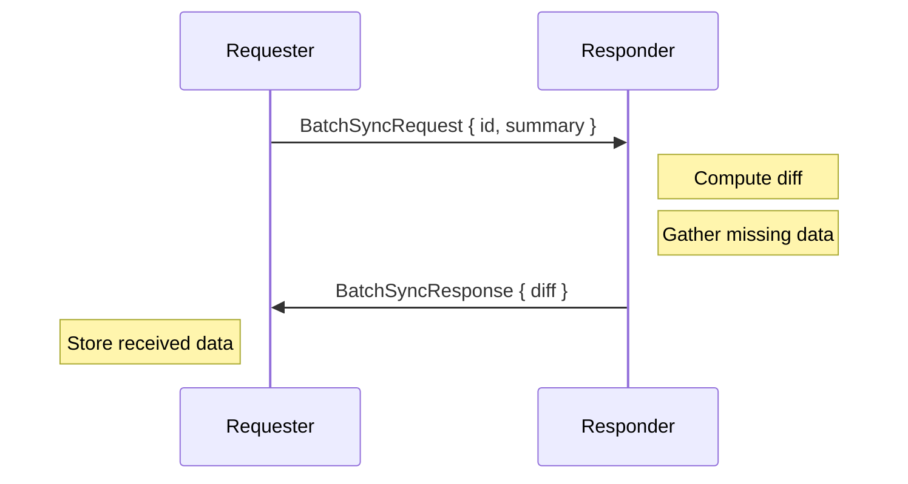
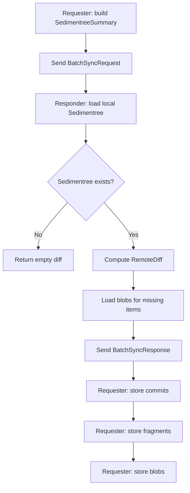
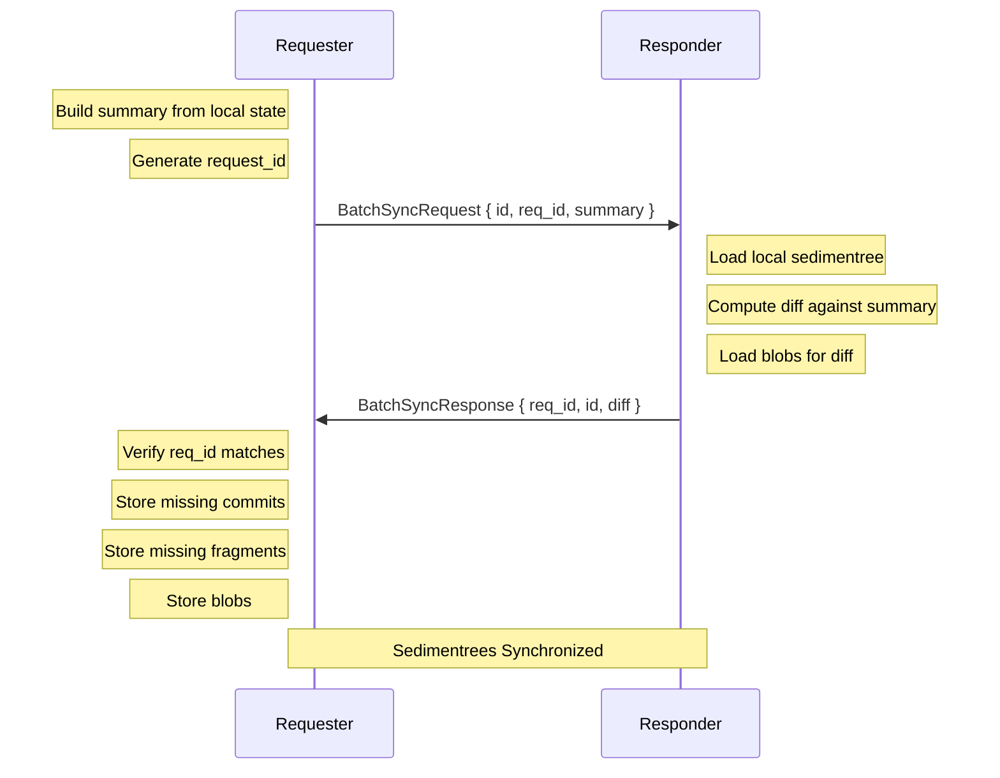

# Batch Sync Protocol

Batch sync reconciles the complete state of a sedimentree between two peers in a single request/response exchange. It answers _"what data am I missing?"_ by comparing metadata summaries.

## Overview

Batch sync is a pull-based protocol. The requester sends their current `SedimentreeSummary`, and the responder computes a diff and returns the missing commits and fragments with their blobs.

> [!NOTE]
> Batch sync transfers metadata *and* blob data together. For large sedimentrees, consider incremental sync for ongoing updates after the initial batch sync.



The requester learns what they're missing; the responder provides it in one response.

## Message Types

### BatchSyncRequest (Requester → Responder)

```rust
struct BatchSyncRequest {
    id: SedimentreeId,                       // Which sedimentree to sync
    req_id: RequestId,                       // Correlation ID for request/response matching
    sedimentree_summary: SedimentreeSummary, // Requester's current state
    subscribe: bool,                         // Opt into live updates for this sedimentree
}

struct RequestId {
    requestor: PeerId, // Who initiated the request
    nonce: u64,        // Unique per-connection counter
}
```

The `SedimentreeSummary` is a compact representation of the sedimentree's structure — fragment digests and loose commit digests at each depth level.

When `subscribe: true`, the responder adds the requester to the subscription set for this sedimentree after completing the sync. See [Subscriptions](./subscriptions.md) for details.

### BatchSyncResponse (Responder → Requester)

```rust
struct BatchSyncResponse {
    req_id: RequestId, // Must match the request
    id: SedimentreeId, // Which sedimentree was synced
    diff: SyncDiff,    // The data the requester is missing
}

struct SyncDiff {
    missing_commits: Vec<(LooseCommit, Blob)>, // Commits requester lacks
    missing_fragments: Vec<(Fragment, Blob)>,  // Fragments requester lacks
}
```

The response includes both metadata and blob data, so the requester can store everything immediately.

## Sync Flow



## Diffing Algorithm

The responder computes what the requester is missing:

```rust
// Responder's perspective
let local: Sedimentree = storage.load(id);
let remote_summary: SedimentreeSummary = request.sedimentree_summary;

// What does the remote peer NOT have that we DO have?
let diff: RemoteDiff = local.diff_for_remote(&remote_summary);
```

The diff algorithm compares:
1. **Loose commits** — commits not yet rolled into fragments
2. **Fragments at each depth** — using checkpoint digests for efficient comparison

## Wire Format

Messages are CBOR-encoded and wrapped in the `Message` enum:

```rust
enum Message {
    // ... other variants ...
    BatchSyncRequest(BatchSyncRequest),
    BatchSyncResponse(BatchSyncResponse),
}
```

Sent as WebSocket binary frames.

## Properties

| Property | Mechanism |
|----------|-----------|
| **Consistency** | Summary-based diffing ensures convergence |
| **Efficiency** | Only missing data transferred |
| **Atomicity** | Single request/response exchange |
| **Correlation** | `RequestId` links response to request |

## Sequence Diagram (Success)



## Implementation Notes

### Initiating a Batch Sync

```rust
let summary = local_sedimentree.summarize();
let req_id = conn.next_request_id().await;

let response = conn.call(
    BatchSyncRequest {
        id,
        req_id,
        sedimentree_summary: summary,
        subscribe: true,  // Opt into live updates
    },
    Some(timeout),
).await?;

// Store the received data
for (commit, blob) in response.diff.missing_commits {
    storage.save_loose_commit(id, commit).await?;
    storage.save_blob(blob).await?;
}
for (fragment, blob) in response.diff.missing_fragments {
    storage.save_fragment(id, fragment).await?;
    storage.save_blob(blob).await?;
}
// If subscribe: true, we're now subscribed for incremental updates
```

### Handling a Batch Sync Request

```rust
let BatchSyncRequest { id, req_id, sedimentree_summary } = request;

// Compute diff
let local = sedimentrees.get(&id)?;
let remote_diff = local.diff_for_remote(&sedimentree_summary);

// Gather blobs
let missing_commits = /* load commits + blobs */;
let missing_fragments = /* load fragments + blobs */;

BatchSyncResponse {
    req_id,
    id,
    diff: SyncDiff { missing_commits, missing_fragments },
}
```

