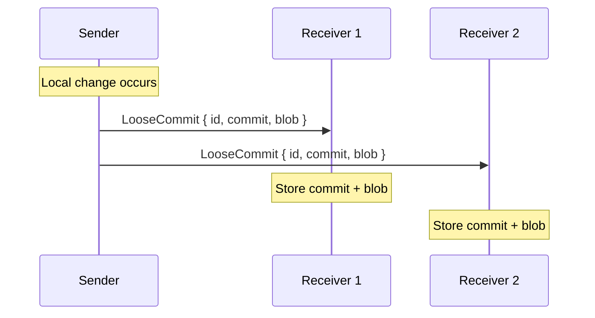
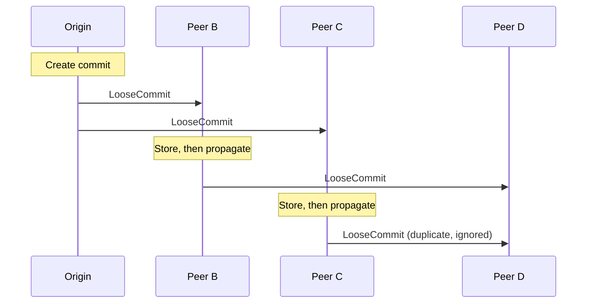
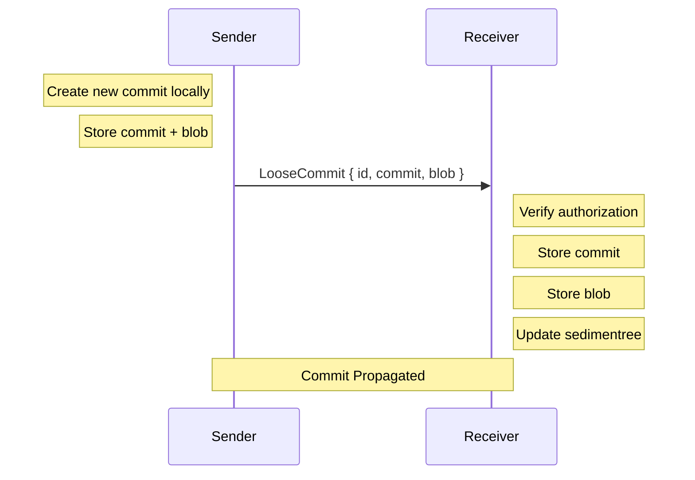
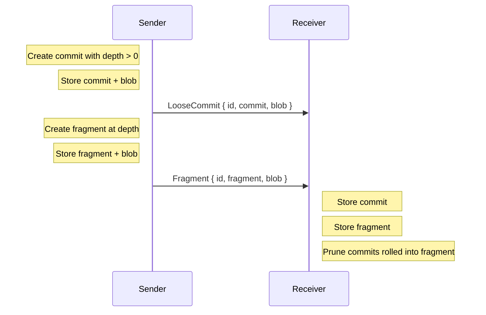

# Incremental Sync Protocol

Incremental sync propagates individual changes to all connected peers as they happen. It answers _"what just changed?"_ by pushing commits and fragments immediately.

## Overview

Incremental sync is a push-based protocol. When a peer adds a commit or fragment locally, it broadcasts the change to all connected peers. There is no request/response — messages are fire-and-forget.

> [!NOTE]
> Incremental sync assumes peers are already roughly synchronized. Use batch sync first to establish a baseline, then incremental sync for ongoing updates.



Changes propagate to all connected peers in parallel.

## Message Types

### LooseCommit (Sender → Receivers)

```rust
Message::LooseCommit {
    id: SedimentreeId,     // Which sedimentree this commit belongs to
    commit: LooseCommit,   // The commit metadata
    blob: Blob,            // The commit's data
}
```

A loose commit is a change that hasn't yet been rolled into a fragment. It includes:
- Content digest (BLAKE3 hash of the blob)
- Parent commit references
- Blob metadata (size, etc.)

### Fragment (Sender → Receivers)

```rust
Message::Fragment {
    id: SedimentreeId,    // Which sedimentree this fragment belongs to
    fragment: Fragment,   // The fragment metadata
    blob: Blob,           // The fragment's data
}
```

A fragment is created when a commit's hash has enough leading zero bytes to trigger a checkpoint at that depth. Fragments consolidate multiple commits into a single structure.

## Propagation

When a change occurs locally:

1. Store the commit/fragment and blob locally
2. Broadcast to all connected peers
3. Each peer stores and re-broadcasts to *their* peers (gossip)



Peers deduplicate by content digest — receiving the same commit twice is idempotent.

## Wire Format

Messages are CBOR-encoded and wrapped in the `Message` enum:

```rust
enum Message {
    LooseCommit { id, commit, blob },
    Fragment { id, fragment, blob },
    // ... other variants ...
}
```

Sent as WebSocket binary frames. No request ID — these are one-way messages.

## Properties

| Property | Mechanism |
|----------|-----------|
| **Low latency** | Push immediately on change |
| **Consistency** | Content-addressed deduplication |
| **Idempotency** | Same commit can be received multiple times safely |
| **Ordering** | No guarantees; CRDT handles conflicts |

## Sequence Diagram (Commit)



## Sequence Diagram (Fragment Boundary)



## Implementation Notes

### Sending a Commit

```rust
// Store locally first
storage.save_loose_commit(id, commit.clone()).await?;
storage.save_blob(blob.clone()).await?;
sedimentree.add_commit(commit.clone());

// Broadcast to all peers
let msg = Message::LooseCommit { id, commit, blob };
for conn in connections.values() {
    if let Err(e) = conn.send(&msg).await {
        // Connection failed, unregister it
        unregister(conn.id()).await;
    }
}

// Check if we need to create a fragment
let depth = depth_metric.to_depth(commit.digest());
if depth > Depth(0) {
    // Request fragment creation from application layer
    return Ok(Some(FragmentRequested::new(commit.digest(), depth)));
}
```

### Receiving a Commit

```rust
let Message::LooseCommit { id, commit, blob } = msg;

// Check authorization
let author = /* extract from signed payload or sender */;
policy.authorize_put(sender_peer_id, author, id).await?;

// Store locally
storage.save_loose_commit(id, commit.clone()).await?;
storage.save_blob(blob.clone()).await?;
sedimentree.add_commit(commit);

// Propagate to other peers (excluding sender)
for conn in connections.values() {
    if conn.peer_id() != sender_peer_id {
        conn.send(&msg).await?;
    }
}
```

### Receiving a Fragment

```rust
let Message::Fragment { id, fragment, blob } = msg;

// Check authorization
policy.authorize_put(sender_peer_id, author, id).await?;

// Store fragment
storage.save_fragment(id, fragment.clone()).await?;
storage.save_blob(blob.clone()).await?;
sedimentree.add_fragment(fragment);

// Prune loose commits that are now covered by this fragment
sedimentree.prune_commits_covered_by(&fragment);

// Propagate to other peers
for conn in connections.values() {
    if conn.peer_id() != sender_peer_id {
        conn.send(&msg).await?;
    }
}
```

## Error Handling

Incremental sync is best-effort:

- **Send failures**: Unregister the failed connection, continue with others
- **Authorization failures**: Log and discard, don't propagate
- **Storage failures**: Log error, may retry on next sync
- **Duplicate data**: Silently ignore (idempotent storage)

Consistency is eventually achieved through batch sync if incremental messages are lost.
