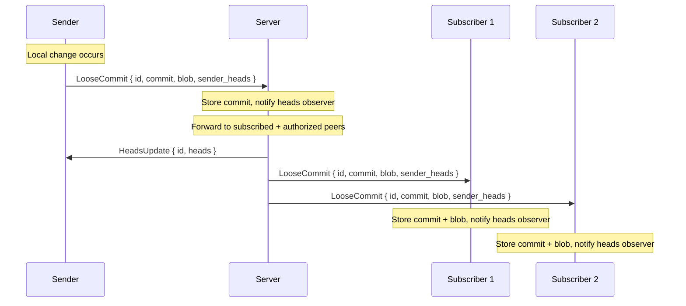
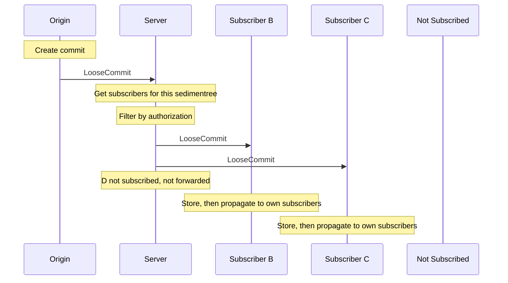
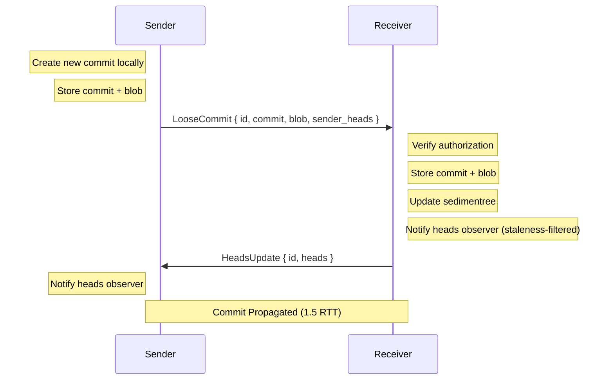
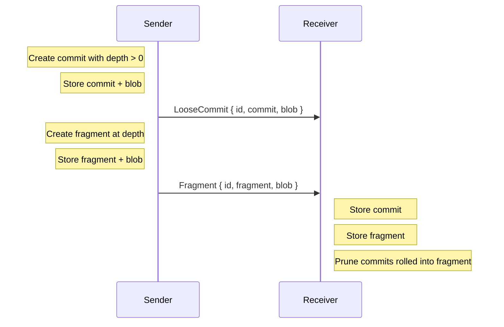

# Incremental Sync Protocol

Incremental sync propagates individual changes to subscribed and authorized peers as they happen. It answers _"what just changed?"_ by pushing commits and fragments immediately.

## Overview

Incremental sync is a push-based protocol. When a peer adds a commit or fragment locally, it forwards the change to peers who have subscribed to that sedimentree and are authorized to receive it. There is no request/response — messages are fire-and-forget.

> [!NOTE]
> Incremental sync assumes peers are already roughly synchronized. Use batch sync first to establish a baseline (with `subscribe: true` to opt into updates), then incremental sync for ongoing updates. See [Subscriptions](./subscriptions.md) for details.


```mermaid
sequenceDiagram
    participant A as Sender
    participant S as Server
    participant B as Subscriber 1
    participant C as Subscriber 2

    Note over A: Local change occurs

    A->>S: LooseCommit { id, commit, blob, sender_heads }
    Note over S: Store commit, notify heads observer
    Note over S: Forward to subscribed + authorized peers
    S->>A: HeadsUpdate { id, heads }
    S->>B: LooseCommit { id, commit, blob, sender_heads }
    S->>C: LooseCommit { id, commit, blob, sender_heads }

    Note over B: Store commit + blob, notify heads observer
    Note over C: Store commit + blob, notify heads observer
```

Changes propagate only to peers who have subscribed to that sedimentree.

## Message Types

### LooseCommit (Sender → Receivers)

```rust
Message::LooseCommit {
    id: SedimentreeId,             // Which sedimentree this commit belongs to
    commit: Signed<LooseCommit>,   // Signed commit metadata
    blob: Blob,                    // The commit's data
    sender_heads: RemoteHeads,     // Sender's current heads for this sedimentree
}
```

A loose commit is a change that hasn't yet been rolled into a fragment. The `Signed<LooseCommit>` envelope includes:
- Ed25519 signature from the author
- Author's verifying key (used for authorization)
- Binary-encoded commit payload (content digest, parent references, blob metadata)

The `sender_heads` carries the sender's current tip commits for the sedimentree, alongside a per-peer monotonic counter. The receiver uses the counter to detect out-of-order messages and the heads to update its view of the sender's state. See [`RemoteHeads`](./batch.md#remoteheads) for details.

See [protocol.md](../protocol.md#serialization) for the `Signed<T>` envelope format and encoding rules.

### Fragment (Sender → Receivers)

```rust
Message::Fragment {
    id: SedimentreeId,          // Which sedimentree this fragment belongs to
    fragment: Signed<Fragment>, // Signed fragment metadata
    blob: Blob,                 // The fragment's data
    sender_heads: RemoteHeads,  // Sender's current heads for this sedimentree
}
```

### HeadsUpdate (Post-Ingestion Acknowledgment)

```rust
Message::HeadsUpdate {
    id: SedimentreeId,     // Which sedimentree
    heads: RemoteHeads,    // Updated heads after ingesting the sender's data
}
```

After ingesting a commit or fragment, the receiver sends a `HeadsUpdate` back to the originating peer. This completes the _1.5 RTT second half_ — the originating peer learns that the receiver has processed its data and can see the updated heads.

A fragment is created when a commit's hash has enough leading zero bytes to trigger a checkpoint at that depth. Fragments consolidate multiple commits into a single structure.

## Propagation

When a change occurs locally:

1. Store the commit/fragment and blob locally
2. Forward to subscribed and authorized peers (not all connected peers)
3. Each peer stores and re-forwards to _their_ subscribers (gossip)


```mermaid
sequenceDiagram
    participant A as Origin
    participant S as Server
    participant B as Subscriber B
    participant C as Subscriber C
    participant D as Not Subscribed

    Note over A: Create commit

    A->>S: LooseCommit
    Note over S: Get subscribers for this sedimentree
    Note over S: Filter by authorization
    S->>B: LooseCommit
    S->>C: LooseCommit
    Note over S: D not subscribed, not forwarded

    Note over B: Store, then propagate to own subscribers
    Note over C: Store, then propagate to own subscribers
```

Peers deduplicate by content digest — receiving the same commit twice is idempotent.

> [!NOTE]
> The authorization check uses `filter_authorized_fetch` to batch-check which peers are allowed to receive the update. Peers whose access has been revoked simply stop receiving forwards — no explicit notification is sent.

## Wire Format

Messages use the canonical binary codec (see [protocol.md](../protocol.md#serialization)) and are wrapped in the `Message` enum:

```rust
enum Message {
    LooseCommit { id, commit, blob },
    Fragment { id, fragment, blob },
    // ... other variants ...
}
```

Sent as WebSocket binary frames with a maximum size of 5 MB. No request ID — these are one-way messages.

## Properties

| Property | Mechanism |
|----------|-----------|
| **Low latency** | Push immediately on change |
| **Consistency** | Content-addressed deduplication |
| **Idempotency** | Same commit can be received multiple times safely |
| **Ordering** | Per-peer monotonic counter on `RemoteHeads`; staleness-filtered on receive |
| **Heads tracking** | Application notified of remote peer's heads via `RemoteHeadsObserver` |

## Sequence Diagram (Commit)


```mermaid
sequenceDiagram
    participant A as Sender
    participant B as Receiver

    Note left of A: Create new commit locally
    Note left of A: Store commit + blob

    A->>B: LooseCommit { id, commit, blob, sender_heads }

    Note right of B: Verify authorization
    Note right of B: Store commit + blob
    Note right of B: Update sedimentree
    Note right of B: Notify heads observer (staleness-filtered)

    B->>A: HeadsUpdate { id, heads }
    Note left of A: Notify heads observer

    Note over A,B: Commit Propagated (1.5 RTT)
```

## Sequence Diagram (Fragment Boundary)


```mermaid
sequenceDiagram
    participant A as Sender
    participant B as Receiver

    Note left of A: Create commit with depth > 0
    Note left of A: Store commit + blob

    A->>B: LooseCommit { id, commit, blob }

    Note left of A: Create fragment at depth
    Note left of A: Store fragment + blob

    A->>B: Fragment { id, fragment, blob }

    Note right of B: Store commit
    Note right of B: Store fragment
    Note right of B: Prune commits rolled into fragment
```

## Implementation Notes

### Sending a Commit

```rust
// Store locally first
storage.save_loose_commit(id, commit.clone()).await?;
storage.save_blob(id, blob.clone()).await?;
sedimentree.add_commit(commit.clone());

// Compute current heads (without counter — stamped per-peer below)
let heads = sedimentree.heads(&depth_metric);

// Forward to subscribed and authorized peers
let subscriber_conns = get_authorized_subscriber_conns(id, &self.peer_id()).await;
for conn in subscriber_conns {
    let peer_id = conn.peer_id();
    // Each peer gets a unique counter from the shared PeerCounter.
    let msg: M = SyncMessage::LooseCommit {
        id,
        commit: commit.clone(),
        blob: blob.clone(),
        sender_heads: RemoteHeads {
            counter: send_counter.next(peer_id).await,
            heads: heads.clone(),
        },
    }.into();
    if let Err(e) = conn.send(&msg).await {
        // Connection failed, unregister it
        unregister(&conn).await;
    }
}

// Check if we need to create a fragment
let depth = depth_metric.to_depth(commit.digest());
if depth > Depth(0) {
    // Request fragment creation from application layer
    return Ok(Some(FragmentRequested::new(commit.digest(), depth)));
}
```

### Receiving a Commit

```rust
let Message::LooseCommit { id, signed_commit, blob, sender_heads } = msg;

// Notify heads observer (staleness-filtered via FilteredHeadsNotifier)
if !sender_heads.is_empty() {
    heads_notifier.notify(id, sender_peer_id, sender_heads);
}

// Verify signature; author extracted from signature, not sender
let verified = signed_commit.verify()?;
let author = verified.author();

// Check authorization (author from signature, not sender)
let putter = policy.authorize_put(sender_peer_id, author, id).await?;

// CAS storage: keyed by digest
putter.save_loose_commit(verified).await?;
putter.save_blob(blob.clone()).await?;

// Send HeadsUpdate back to originating peer
let heads_msg = SyncMessage::HeadsUpdate {
    id,
    heads: RemoteHeads {
        counter: send_counter.next(sender_peer_id).await,
        heads: sedimentree.heads(&depth_metric),
    },
};
conn.send(&heads_msg).await?;

// Forward to subscribed and authorized peers (excluding sender)
let heads = sedimentree.heads(&depth_metric);
let subscriber_conns = get_authorized_subscriber_conns(id, &sender_peer_id).await;
for sub_conn in subscriber_conns {
    let peer_id = sub_conn.peer_id();
    let msg: M = SyncMessage::LooseCommit {
        id,
        commit: signed_commit.clone(),
        blob: blob.clone(),
        sender_heads: RemoteHeads {
            counter: send_counter.next(peer_id).await,
            heads: heads.clone(),
        },
    }.into();
    sub_conn.send(&msg).await?;
}
```

### Receiving a Fragment

```rust
let SyncMessage::Fragment { id, signed_fragment, blob } = msg;

// Verify signature; author extracted from signature
let verified = signed_fragment.verify()?;
let author = verified.author();

// Check authorization
let putter = policy.authorize_put(sender_peer_id, author, id).await?;

// CAS storage: keyed by digest
putter.save_fragment(verified).await?;
putter.save_blob(blob.clone()).await?;

// Prune loose commits that are now covered by this fragment
sedimentree.prune_commits_covered_by(&verified.payload());

// Forward to subscribed and authorized peers (excluding sender)
let subscriber_conns = get_authorized_subscriber_conns(id, &sender_peer_id).await;
for conn in subscriber_conns {
    Connection::<K, M>::send(&conn, &msg).await?;
}
```

## Error Handling

Incremental sync is best-effort:

- **Send failures**: Unregister the failed connection, continue with others
- **Authorization failures**: Log and discard, don't propagate
- **Storage failures**: Log error, may retry on next sync
- **Duplicate data**: Silently ignore (idempotent storage)

Consistency is eventually achieved through batch sync if incremental messages are lost.
