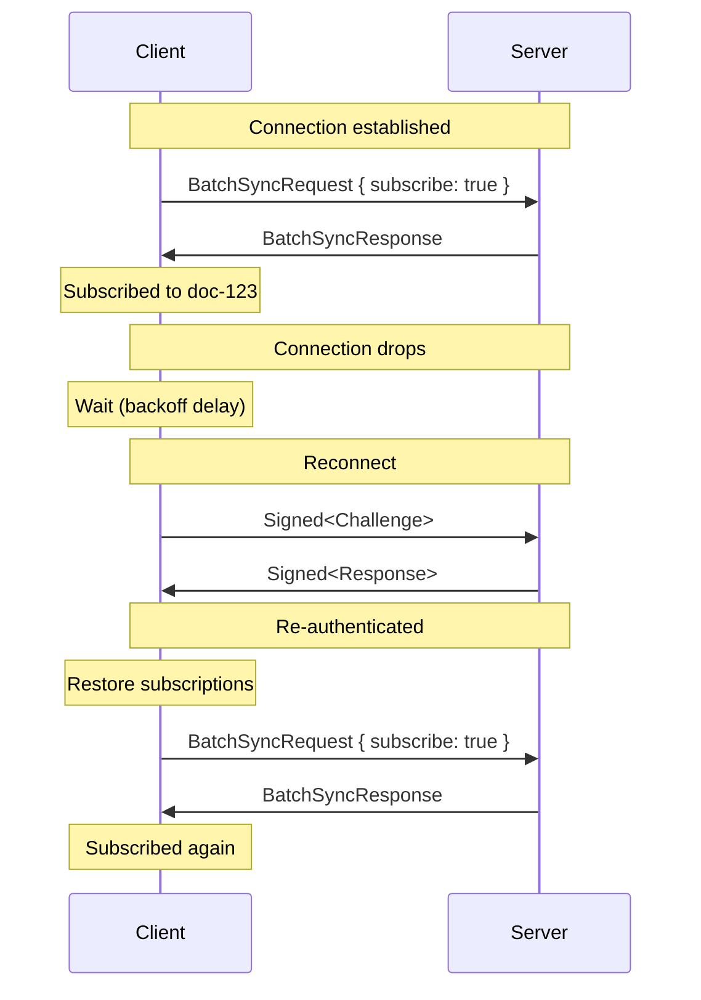
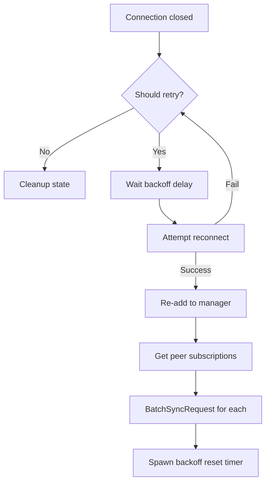

# Reconnection

Automatic reconnection with exponential backoff for client-initiated connections.

## Overview

When a connection drops unexpectedly, clients can automatically reconnect and restore their subscriptions. The protocol provides building blocks for reconnection; the actual reconnection loop is runtime-specific.



## Connection Identity

The connection manager assigns each connection a `ConnectionId` that survives reconnects:

| ID Type        | Scope                       | Survives Reconnect |
|----------------|-----------------------------|--------------------|
| `PeerId`       | Per peer identity           | Yes                |
| `ConnectionId` | Per logical connection      | Yes                |
| `TaskId`       | Per spawned task (internal) | No                 |

After reconnection, the same `ConnectionId` is reused via `Command::ReAdd`, allowing the system to track backoff state and subscriptions across reconnects.

## Backoff Strategy

Exponential backoff with jitter prevents thundering herd problems:

```
delay = min(base * factor^attempt, max) * jitter_factor
```

| Parameter | Default | Purpose                                  |
|-----------|---------|------------------------------------------|
| `base`    | 100ms   | Initial delay                            |
| `max`     | 30s     | Maximum delay cap                        |
| `factor`  | 2.0     | Exponential multiplier                   |
| `jitter`  | ±10%    | Randomization to prevent synchronization |

After a connection is healthy for a configurable period (e.g., 10 seconds), the backoff resets.

## Error Classification

Not all errors should trigger reconnection:

| Error Type         | Retryable | Rationale                     |
|--------------------|-----------|-------------------------------|
| Network timeout    | Yes       | Transient failure             |
| Connection reset   | Yes       | Transient failure             |
| DNS failure        | Yes       | May be temporary              |
| Handshake rejected | No        | Authentication/policy failure |
| Protocol violation | No        | Incompatible peer             |
| Explicit rejection | No        | Server refused connection     |

The `Reconnect` trait's `should_retry` method classifies errors:

```rust
trait Reconnect<K: FutureForm>: Connection<K> {
    type ReconnectionError: core::error::Error + Send + 'static;

    fn reconnect(&mut self) -> K::Future<'_, Result<(), Self::ReconnectionError>>;

    /// Return false for fatal errors that should not be retried.
    fn should_retry(&self, error: &Self::ReconnectionError) -> bool {
        true  // Default: all errors retryable
    }
}
```

## Subscription Restoration

Subduction tracks outgoing subscriptions per peer:

```rust
outgoing_subscriptions: Map<PeerId, Set<SedimentreeId>>
```

After successful reconnection, the client can restore subscriptions:



## State Management

Subduction provides building blocks; shutdown coordination is runtime-specific:

| Component           | Responsibility                                  |
|---------------------|-------------------------------------------------|
| `Subduction`        | Backoff state, subscription tracking            |
| Runtime             | Cancellation tokens, reconnection loop          |
| `ConnectionManager` | Task lifecycle, closed connection notifications |

### Subduction Methods

```rust
// Get next backoff delay (creates state if needed)
async fn get_reconnect_delay(&self, conn_id: ConnectionId) -> Duration;

// Get tracked subscriptions for a peer
async fn get_peer_subscriptions(&self, peer_id: PeerId) -> Set<SedimentreeId>;

// Re-register connection after successful reconnect
async fn on_reconnect_success(&self, conn_id: ConnectionId, conn: C) -> Result<(), ()>;

// Reset backoff after healthy period
async fn reset_backoff(&self, conn_id: ConnectionId);

// Cleanup after fatal reconnection failure
async fn on_reconnect_failed(&self, conn_id: ConnectionId);
```

## Example Reconnection Loop

Runtime-specific implementation (e.g., Tokio):

```rust
async fn reconnection_loop(
    subduction: Arc<Subduction<...>>,
    conn_id: ConnectionId,
    mut conn: impl Reconnect<Sendable>,
    cancel: CancellationToken,
) {
    loop {
        if cancel.is_cancelled() {
            return;
        }

        let delay = subduction.get_reconnect_delay(conn_id).await;
        tokio::select! {
            _ = cancel.cancelled() => return,
            _ = tokio::time::sleep(delay) => {}
        }

        match conn.reconnect().await {
            Ok(()) => break,
            Err(e) if conn.should_retry(&e) => continue,
            Err(_) => {
                subduction.on_reconnect_failed(conn_id).await;
                return;
            }
        }
    }

    // Success - re-register and restore subscriptions
    let _ = subduction.on_reconnect_success(conn_id, conn.clone()).await;

    let peer_id = conn.peer_id();
    for id in subduction.get_peer_subscriptions(peer_id).await {
        let _ = subduction.sync_with_peer(&peer_id, id, true, None).await;
    }

    // Reset backoff after healthy period
    tokio::spawn(async move {
        tokio::time::sleep(Duration::from_secs(10)).await;
        subduction.reset_backoff(conn_id).await;
    });
}
```

## Design Rationale

### Why No Shutdown Flag in Subduction?

Shutdown coordination varies by runtime:
- Tokio: `CancellationToken`
- async-std: Different cancellation mechanism
- Wasm: Browser-specific lifecycle

Subduction provides state management; the runtime provides cancellation.

### Why Track Subscriptions by PeerId?

`sync_with_peer` takes a `PeerId`, not a `ConnectionId`. After reconnect, we restore subscriptions for the peer, which may have multiple connections.

### Why Unlimited Retries?

The backoff caps at 30 seconds, so reconnection attempts are bounded in frequency. A max retry limit could be added later if needed, but for most use cases, continuous reconnection with capped delays is appropriate.
