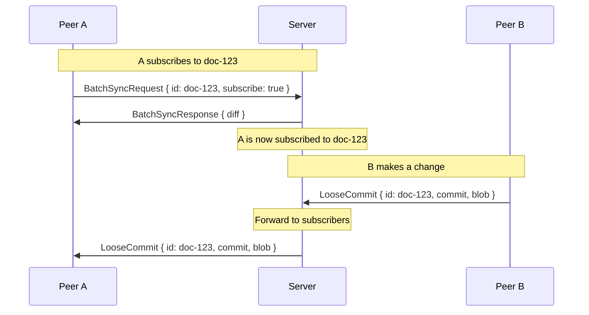
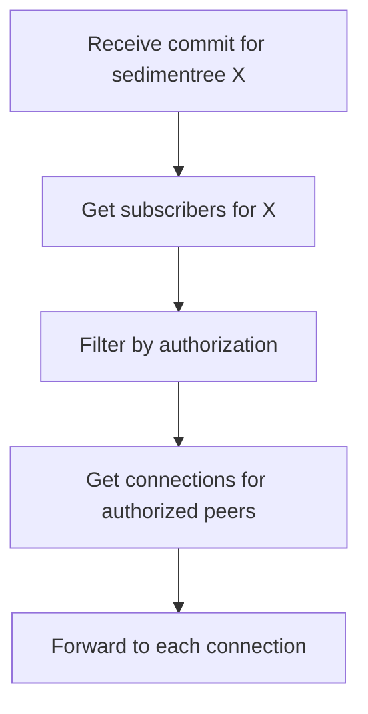
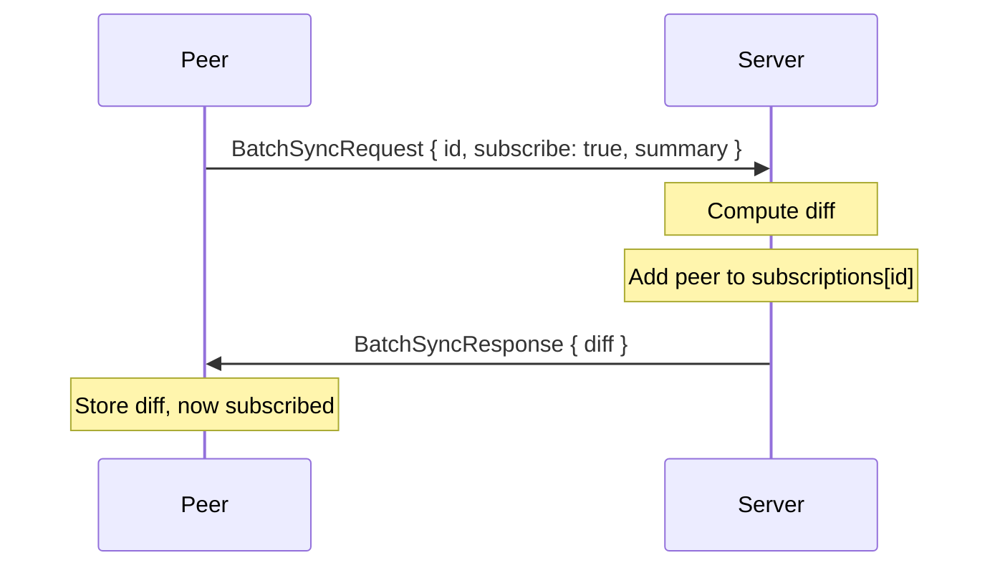
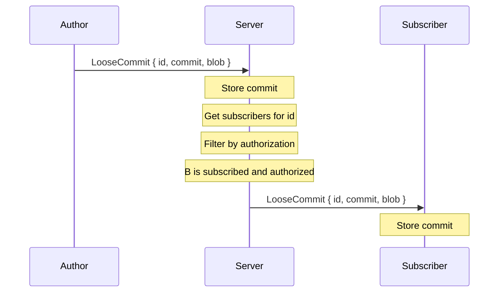
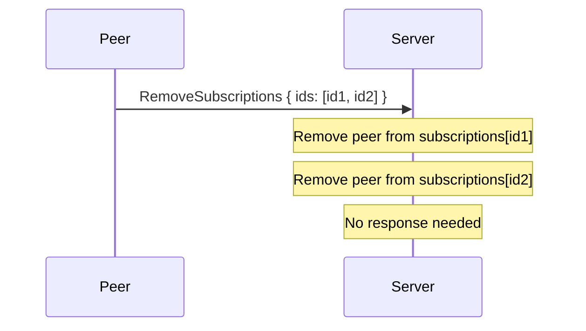
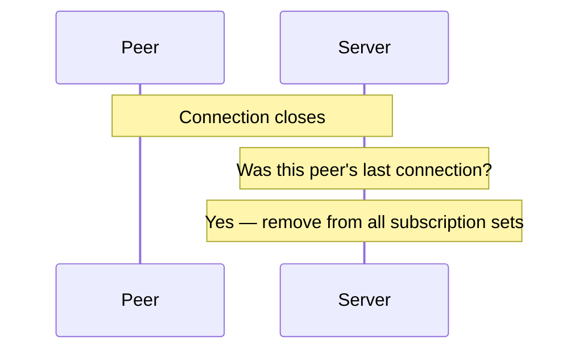

# Subscriptions

Subscriptions enable peers to receive real-time updates for specific sedimentrees. Rather than broadcasting to all connected peers, updates are forwarded only to peers who have explicitly subscribed _and_ are authorized to receive them.

## Overview

Subscriptions are opt-in. A peer must send a `BatchSyncRequest` with `subscribe: true` to receive future updates for that sedimentree. The server tracks which peers are subscribed to which sedimentrees, and filters updates accordingly.



## Subscription Model

### Subscribe via Batch Sync

Subscriptions are bundled with batch sync requests. This ensures the peer has current state before receiving incremental updates.

```rust
struct BatchSyncRequest {
    id: SedimentreeId,
    req_id: RequestId,
    sedimentree_summary: SedimentreeSummary,
    subscribe: bool,  // Opt into live updates
}
```

When `subscribe: true`:
1. Server performs normal batch sync
2. Server adds peer to subscription set for that sedimentree
3. Peer receives future commits/fragments for that sedimentree

### Unsubscribe Explicitly

Peers unsubscribe by sending a `RemoveSubscriptions` message:

```rust
struct RemoveSubscriptions {
    ids: Vec<SedimentreeId>,  // Sedimentrees to unsubscribe from
}
```

### Automatic Cleanup

When a peer disconnects (all connections closed), the server automatically removes them from all subscription sets. On reconnect, the peer must re-subscribe via `BatchSyncRequest { subscribe: true }`.

## Subscription State

The server maintains a map of sedimentree IDs to subscribed peer IDs:

```rust
subscriptions: Map<SedimentreeId, Set<PeerId>>
```

### Multiple Connections

A peer may have multiple simultaneous connections (e.g., different browser tabs). Subscriptions are tracked per-peer, not per-connection:

- Subscribe on _any_ connection adds the peer to the subscription set
- Updates are sent to _all_ connections for that peer
- Cleanup only occurs when the _last_ connection for a peer closes

## Forward Path

When a commit or fragment arrives, the server forwards it to subscribed peers who are also authorized:



### Authorization Check

Not all subscribers may be authorized to receive updates. The server uses `filter_authorized_fetch` to batch-check authorization:

```rust
trait StoragePolicy<K: FutureKind> {
    /// Filter sedimentree IDs to only those the peer is authorized to fetch.
    fn filter_authorized_fetch(
        &self,
        peer: PeerId,
        ids: Vec<SedimentreeId>,
    ) -> K::Future<'_, Vec<SedimentreeId>>;
}
```

This allows efficient authorization checking — for example, a Keyhive-based policy can look up the document's membership once and check if the peer has `Pull` access.

### Revocation

When a peer's access is revoked:
1. The peer learns about revocation via Keyhive (separate channel)
2. The server simply stops forwarding — the peer fails the `filter_authorized_fetch` check
3. No explicit "revocation notification" is needed from Subduction

## Message Flow

### Subscribing



### Receiving Updates



### Unsubscribing



### Disconnect Cleanup



## Design Rationale

### Why Bundle Subscribe with Batch Sync?

1. **Atomic operation** — peer gets current state and subscribes in one request
2. **No stale subscriptions** — subscription only created after successful sync
3. **Simpler protocol** — no separate "subscribe" message type

### Why Not Broadcast to All Peers?

1. **Bandwidth** — broadcasting to uninterested peers wastes bandwidth
2. **Privacy** — peers should only learn about documents they're authorized for
3. **Scale** — subscription sets are typically small relative to total connections

### Why Per-Peer Not Per-Connection?

1. **Consistency** — all tabs/windows see the same updates
2. **Simplicity** — client doesn't need to re-subscribe per connection
3. **Cleanup** — subscription persists across brief disconnects (within same session)

### Why No Pending/Activation Flow?

Earlier designs considered a "want list" where peers could express interest in documents they weren't yet authorized for, with activation notifications when access was granted. This was simplified:

1. **Keyhive handles auth notifications** — peers learn about access grants via Keyhive
2. **Peer can subscribe when ready** — once authorized, peer sends `BatchSyncRequest { subscribe: true }`
3. **Less state** — no "pending subscriptions" to track

## Implementation Notes

### Adding a Subscription

```rust
async fn add_subscription(&self, peer_id: PeerId, sedimentree_id: SedimentreeId) {
    let mut subscriptions = self.subscriptions.lock().await;
    subscriptions
        .entry(sedimentree_id)
        .or_default()
        .insert(peer_id);
}
```

### Removing Peer from All Subscriptions

```rust
async fn remove_peer_from_subscriptions(&self, peer_id: PeerId) {
    let mut subscriptions = self.subscriptions.lock().await;
    subscriptions.retain(|_id, peers| {
        peers.remove(&peer_id);
        !peers.is_empty()  // Remove entry if no subscribers left
    });
}
```

### Getting Authorized Subscriber Connections

```rust
async fn get_authorized_subscriber_conns(
    &self,
    sedimentree_id: SedimentreeId,
    exclude_peer: &PeerId,
) -> Vec<C> {
    // Get subscribed peers (excluding sender)
    let subscribers: Vec<PeerId> = {
        let subs = self.subscriptions.lock().await;
        subs.get(&sedimentree_id)
            .map(|peers| peers.iter()
                .filter(|p| *p != exclude_peer)
                .copied()
                .collect())
            .unwrap_or_default()
    };

    if subscribers.is_empty() {
        return Vec::new();
    }

    // Filter by authorization
    let authorized = self.policy
        .filter_authorized_fetch(/* for each subscriber */)
        .await;

    // Get connections for authorized peers
    self.get_connections_for_peers(&authorized).await
}
```

## Error Handling

| Scenario | Behavior |
|----------|----------|
| Subscribe to unknown sedimentree | Subscription created (diff will be empty) |
| Unsubscribe from non-subscribed | Silently ignored |
| Forward fails | Connection unregistered, continues with others |
| Authorization revoked | Peer stops receiving (no explicit notification) |
