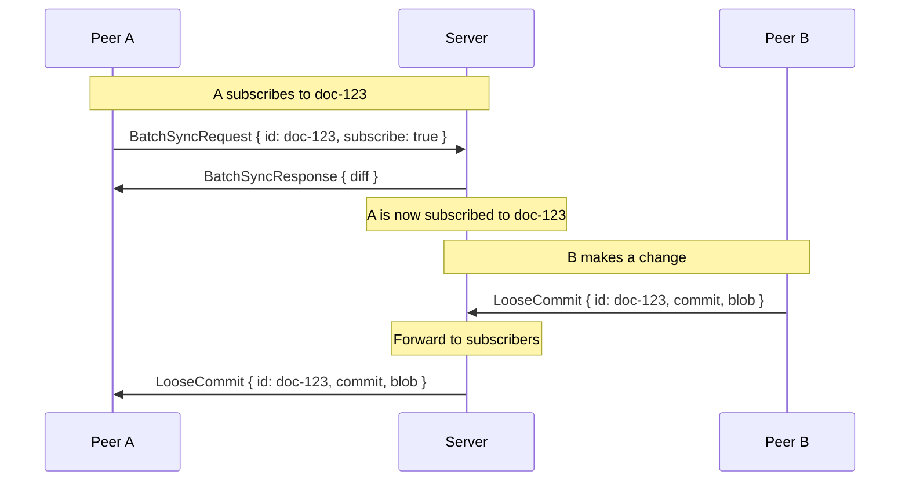
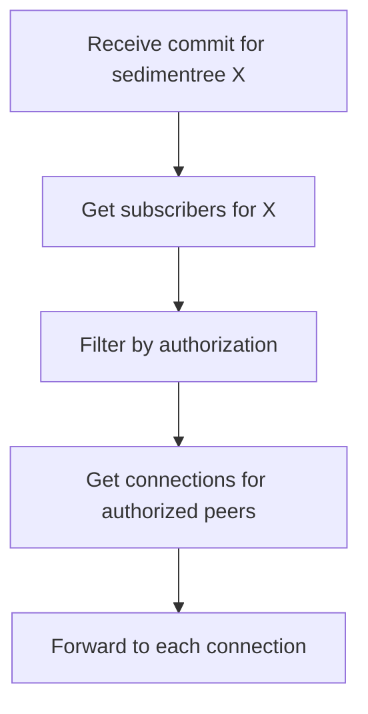
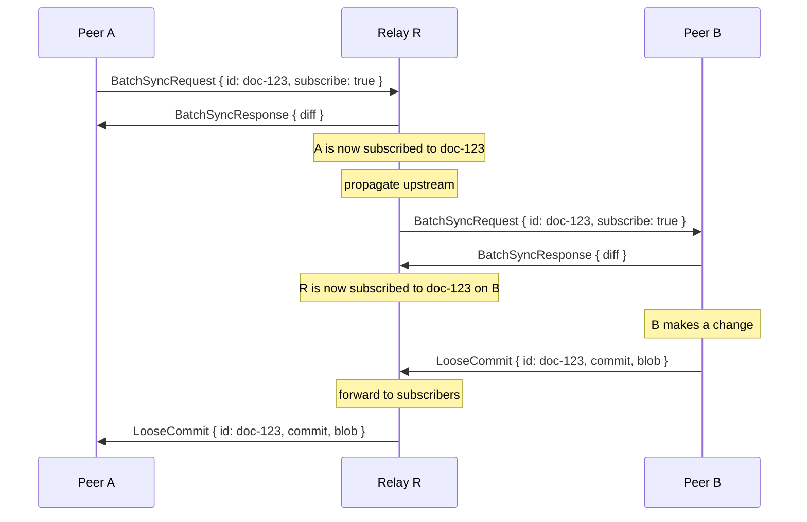
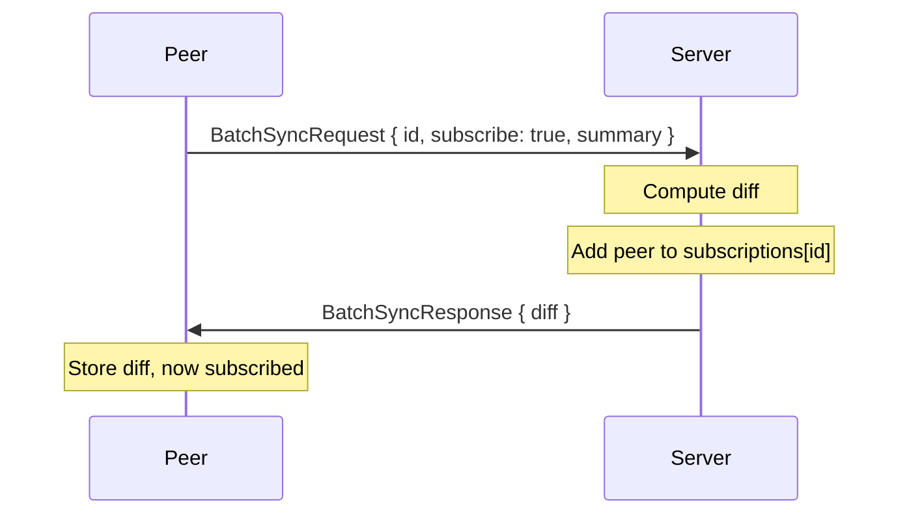
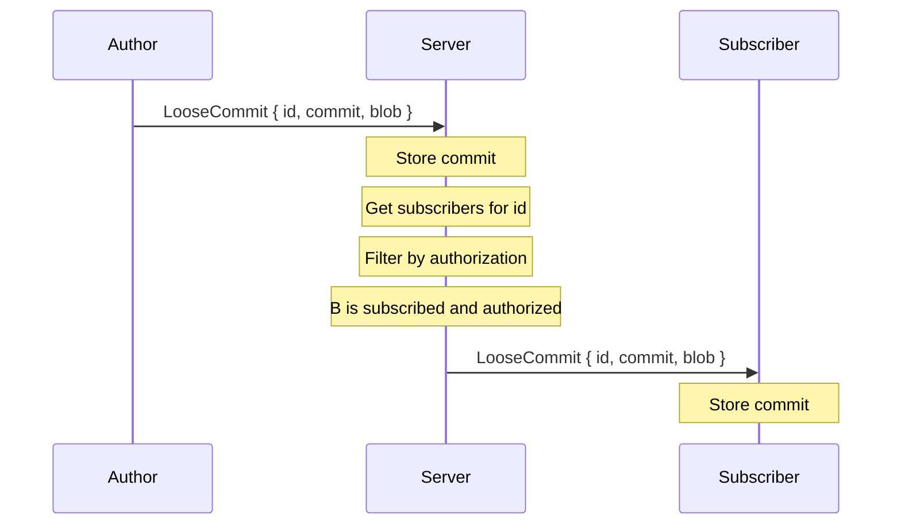
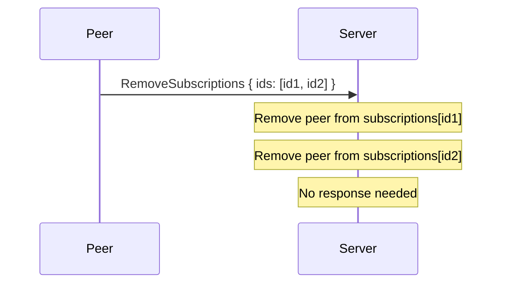
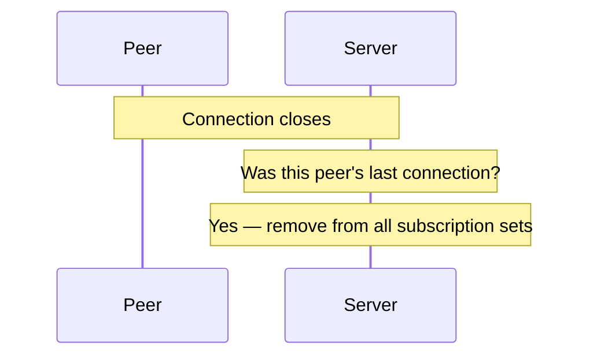
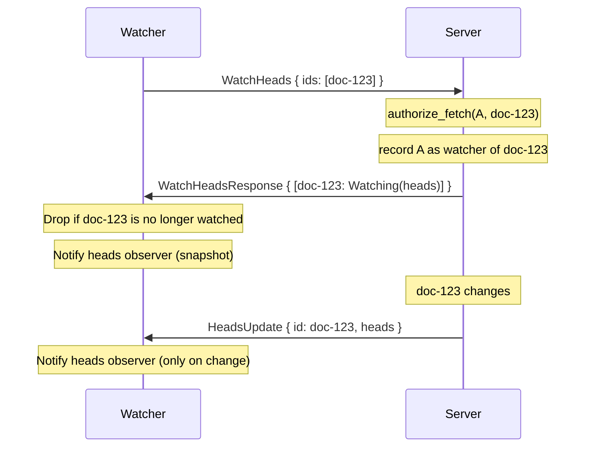

# Subscriptions

Subscriptions enable peers to receive real-time updates for specific sedimentrees. Rather than broadcasting to all connected peers, updates are forwarded only to peers who have explicitly subscribed _and_ are authorized to receive them.

## Overview

Subscriptions are opt-in. A peer must send a `BatchSyncRequest` with `subscribe: true` to receive future updates for that sedimentree. The server tracks which peers are subscribed to which sedimentrees, and filters updates accordingly.


```mermaid
sequenceDiagram
    participant A as Peer A
    participant S as Server
    participant B as Peer B

    Note over A,S: A subscribes to doc-123
    A->>S: BatchSyncRequest { id: doc-123, subscribe: true }
    S->>A: BatchSyncResponse { diff }
    Note over S: A is now subscribed to doc-123

    Note over B,S: B makes a change
    B->>S: LooseCommit { id: doc-123, commit, blob }

    Note over S: Forward to subscribers
    S->>A: LooseCommit { id: doc-123, commit, blob }
```

## Subscription Model

### Subscribe via Batch Sync

Subscriptions are bundled with batch sync requests. This ensures the peer has current state before receiving incremental updates.

```rust
struct BatchSyncRequest {
    id: SedimentreeId,
    req_id: RequestId,
    fingerprint_summary: FingerprintSummary,
    subscribe: bool,  // Opt into live updates
}
```

When `subscribe: true`:
1. Server performs normal batch sync
2. Server adds peer to subscription set for that sedimentree
3. Peer receives future commits/fragments for that sedimentree

### Unsubscribe Explicitly

Peers unsubscribe by sending a `RemoveSubscriptions` message:

```rust
struct RemoveSubscriptions {
    ids: Vec<SedimentreeId>,  // Sedimentrees to unsubscribe from
}
```

### Automatic Cleanup

When a peer disconnects (all connections closed), the server automatically removes them from all subscription sets.

### Reconnection Restoration

Subduction tracks outgoing subscriptions per peer. After a successful reconnection, the client can automatically restore subscriptions by re-sending `BatchSyncRequest { subscribe: true }` for each tracked sedimentree. See [reconnection.md](./reconnection.md) for details.

## Subscription State

The server maintains a map of sedimentree IDs to subscribed peer IDs:

```rust
subscriptions: Map<SedimentreeId, Set<PeerId>>
```

### Multiple Connections

A peer may have multiple simultaneous connections (e.g., different browser tabs). Subscriptions are tracked per-peer, not per-connection:

- Subscribe on _any_ connection adds the peer to the subscription set
- Updates are sent to _all_ connections for that peer
- Cleanup only occurs when the _last_ connection for a peer closes

## Push Invariant

A _push_ is a `LooseCommit` / `Fragment` message sent on the strength of a
subscription rather than in reply to a request. Three things trigger one:
data pushed to us by a peer (`recv_commit` / `recv_fragment`), data returned
to us in a `BatchSyncResponse` to our own request, and data authored locally
(`add_commit` / `add_fragment`). All three use one recipient set:

> A push for sedimentree _T_ from origin _O_ goes to exactly
> `(wants(T) ∩ may_fetch(T)) \ {O}`, where `wants(T) = subscriptions[T]` and
> `may_fetch(T)` is the subset of peers for which `filter_authorized_fetch(P, [T])`
> keeps _T_. _O_ is the peer the data came from, or this node for local writes.

Having new data for _T_ triggers a push, however it arrived; the arrival path
never widens or narrows the recipient set.

`subscriptions[T]` gains _P_ only when _P_ sends
`BatchSyncRequest { T, subscribe: true }`, or when this node sends one to _P_
(mutual subscription, so a node's own writes reach the peers it syncs with).
There is no "nobody is subscribed, so send it to everyone" fallback: a locally
authored commit on a tree with no authorized subscribers stays local until this
node opens a subscribing sync round (`sync_with_all_peers(id, subscribe =
true)`), after which mutual subscription and
[upstream propagation](#upstream-propagation-relay-topologies) carry later
commits. Such a fallback cannot distinguish an empty `wants(T)` from an empty
`wants(T) ∩ may_fetch(T)`, so it would fire exactly when policy had said no.

Data also moves in the request/response half of batch sync
(`send_requested_data`, `BatchSyncResponse`). Those are replies to a specific
request, gated by `authorize_fetch` on the responder, and are not pushes.

## Forward Path

When a commit or fragment arrives, the server forwards it to subscribed peers who are also authorized:


```mermaid
flowchart TD
    A[Receive commit for sedimentree X] --> B[Get subscribers for X]
    B --> C[Filter by authorization]
    C --> D[Get connections for authorized peers]
    D --> E[Forward to each connection]
```

### Authorization Check

Not all subscribers may be authorized to receive updates. The server uses `filter_authorized_fetch` to batch-check authorization:

```rust
trait StoragePolicy<K: FutureKind> {
    /// Filter sedimentree IDs to only those the peer is authorized to fetch.
    fn filter_authorized_fetch(
        &self,
        peer: PeerId,
        ids: Vec<SedimentreeId>,
    ) -> K::Future<'_, Vec<SedimentreeId>>;
}
```

This allows efficient authorization checking — for example, a Keyhive-based policy can look up the document's membership once and check if the peer has `Pull` access.

### Revocation

When a peer's access is revoked:
1. The peer learns about revocation via Keyhive (separate channel)
2. The server simply stops forwarding — the peer fails the `filter_authorized_fetch` check
3. No explicit "revocation notification" is needed from Subduction

## Upstream Propagation (Relay Topologies)

The forward path above handles the case where the publisher is directly
connected to the server. In relay topologies — where peer A is connected
to relay R, and R is connected to peer B who holds the data — A's
subscribe to R is not enough on its own. R has to also be subscribed to
B so that B's future commits reach R, and from there reach A via the
forward path.

To preserve that end-to-end reachability, every node that accepts an
inbound subscribing `BatchSyncRequest` also propagates the subscription
to its _upstream_ peers: the connections this node _dialed_
(`Direction::Dialed`, recorded at handshake). Propagation never subscribes a peer
that dialed us to a tree on a third party's behalf, and never tells it a
tree's ID.

Clients dial servers, relays dial the servers behind them, and servers dial
nobody: a hub server propagates nothing, and each relay in a chain forwards
one hop further up. Both ends of a simultaneous open are `Dialed`: each
is the other's upstream. There is no override: a node that dials
the peers it serves will propagate to them.

What the relay learns from upstream it pushes to its own subscribers, by
the [Push Invariant](#push-invariant), whether that data arrived as a push
or in the response to the relay's own request.


```mermaid
sequenceDiagram
    participant A as Peer A
    participant R as Relay R
    participant B as Peer B

    A->>R: BatchSyncRequest { id: doc-123, subscribe: true }
    R->>A: BatchSyncResponse { diff }
    Note over R: A is now subscribed to doc-123
    Note over R: propagate upstream
    R->>B: BatchSyncRequest { id: doc-123, subscribe: true }
    B->>R: BatchSyncResponse { diff }
    Note over R: R is now subscribed to doc-123 on B

    Note over B: B makes a change
    B->>R: LooseCommit { id: doc-123, commit, blob }
    Note over R: forward to subscribers
    R->>A: LooseCommit { id: doc-123, commit, blob }
```

### Authorization Gate

Propagation only runs when the originator is _authorized_ to fetch the
sedimentree. Handler success alone is too permissive: the handler returns
`Ok` even after sending a `SyncResult::Unauthorized` response. Without
this gate, an unauthorized peer could cause the relay to enroll in
upstream subscriptions whose traffic the egress filter would drop on the
return path — wasted bandwidth and dangling upstream state.

```rust
if handler_returned_ok
    && let Some(sed_id) = message.try_as_subscribe_request()
    && policy.authorize_fetch(originator, sed_id).await.is_ok()
{
    propagate_subscription(sed_id, originator).await;
}
```

### Idempotency

Each node tracks its _outgoing_ subscriptions per peer:

```rust
outgoing_subscriptions: Map<PeerId, Set<SedimentreeId>>
```

`sync_with_peer(.., subscribe = true, ..)` records `(peer, sedimentree)`
in this map on success. The propagation step skips any peer already
recorded for the requested sedimentree, so a second subscribe from A
for the same sedimentree does not cause R to re-issue its upstream
subscribe to B. Loops between mutually subscribed servers self-quench
after one round.

### Originator Exclusion

The propagation step iterates the peers this node dialed, other than the
originator. A's subscribe does not cause R to send a `BatchSyncRequest` back
to A.
This matters in topologies where A and B are mutual relays for each
other.

### Best Effort

Per-peer propagation failures are logged at `debug` and ignored. A
single peer being unreachable does not prevent the subscription from
reaching the remaining peers. The local handler-side `BatchSyncResponse`
to the originator has already been sent before propagation runs.

## Message Flow

### Subscribing


```mermaid
sequenceDiagram
    participant P as Peer
    participant S as Server

    P->>S: BatchSyncRequest { id, subscribe: true, summary }
    Note over S: Compute diff
    Note over S: Add peer to subscriptions[id]
    S->>P: BatchSyncResponse { diff }
    Note over P: Store diff, now subscribed
```

### Receiving Updates


```mermaid
sequenceDiagram
    participant A as Author
    participant S as Server
    participant B as Subscriber

    A->>S: LooseCommit { id, commit, blob }
    Note over S: Store commit
    Note over S: Get subscribers for id
    Note over S: Filter by authorization
    Note over S: B is subscribed and authorized
    S->>B: LooseCommit { id, commit, blob }
    Note over B: Store commit
```

### Unsubscribing


```mermaid
sequenceDiagram
    participant P as Peer
    participant S as Server

    P->>S: RemoveSubscriptions { ids: [id1, id2] }
    Note over S: Remove peer from subscriptions[id1]
    Note over S: Remove peer from subscriptions[id2]
    Note over S: No response needed
```

### Disconnect Cleanup


```mermaid
sequenceDiagram
    participant P as Peer
    participant S as Server

    Note over P,S: Connection closes
    Note over S: Was this peer's last connection?
    Note over S: Yes — remove from all subscription sets
```

## Heads Watches

A heads watch is the heads-only counterpart of a push subscription. Where a
subscription delivers every commit and fragment, a watch delivers only the
peer's current heads for a sedimentree, as a snapshot on establishment and a
`HeadsUpdate` on every change. The application uses watches to learn a peer's
heads without holding its data, for example to decide whether to sync or to
show whether a collaborator has converged.

| Aspect | Push subscription | Heads watch |
|---|---|---|
| Established by | `BatchSyncRequest { subscribe: true }` | `WatchHeads { ids }` |
| Initial state | `BatchSyncResponse` diff | `WatchHeadsResponse` snapshot |
| Delivers | `LooseCommit` / `Fragment` with `sender_heads` | `HeadsUpdate { id, heads }` |
| Admission check | `authorize_fetch` on the batch sync request | `authorize_fetch` per id |
| Fan-out filter | `filter_authorized_fetch` | `filter_authorized_fetch` |
| Removed by | `RemoveSubscriptions` | `UnwatchHeads` |
| Delivered on | every connection of the peer | one connection per peer |
| Cleared on disconnect | yes | yes |
| Propagates upstream | yes | no |


```mermaid
sequenceDiagram
    participant A as Watcher
    participant B as Server

    A->>B: WatchHeads { ids: [doc-123] }
    Note over B: authorize_fetch(A, doc-123)
    Note over B: record A as watcher of doc-123
    B->>A: WatchHeadsResponse { [doc-123: Watching(heads)] }
    Note over A: Drop if doc-123 is no longer watched
    Note over A: Notify heads observer (snapshot)

    Note over B: doc-123 changes
    B->>A: HeadsUpdate { id: doc-123, heads }
    Note over A: Notify heads observer (only on change)
```

### Default Deny

Heads reach the application's `RemoteHeadsObserver` _only_ for sedimentrees the
application has passed to `watch_heads`. Neither syncing a tree nor being
pushed one implies a watch, and a `HeadsUpdate` for an unwatched tree is
dropped before it is recorded. This keeps the observer from learning the
existence and `CommitId`s of trees the application never asked about, which a
relay would otherwise surface for every tree transiting it.

The gate is the local watch set, not the peer's answer. Heads for a watched
tree are delivered even if that peer refused the watch; heads for an unwatched
tree are dropped even if the peer confirmed one.

### Establishment

`WatchHeads` carries no request id. The peer answers with one outcome per id:

| Outcome | Meaning | Watcher's action |
|---|---|---|
| `Watching(heads)` | Recorded; `heads` is the peer's current view, empty if it holds nothing for the tree | Deliver the snapshot (if still watched) |
| `Unauthorized` | `authorize_fetch` refused | Log |
| `AtCapacity` | The peer already holds `MAX_WATCHES_PER_PEER` watches for the requester | Log |

A watch on a tree the peer does not hold yet is still recorded: the snapshot is
empty and the first commit arrives as a change. The response names the trees
and watching is idempotent, so a duplicate response is harmless.

`watch_heads(id)` sends `WatchHeads` to every connected peer and replays it to
each peer that connects later, so a watch outlives any one session. The
watcher's intent is the only state that survives a disconnect; the peer's
record of the watch is cleared with the rest of its session.

### Delivery and Deduplication

Every mutation of a local tree yields a `HeadsChanged` witness, and `propagate`
is its only consumer, building the ack, the subscription pushes, and a
`HeadsUpdate` for each watcher that will not learn the heads another way in
the same round:

```text
heads_only_targets(T) = (watchers(T) ∩ may_fetch(T))
                        \ push_recipients(T)      -- heads ride the push as sender_heads
                        \ { originator if acked }  -- heads ride the 1.5-RTT ack
```

`push_recipients(T)` is the [Push Invariant](#push-invariant) set.

Dropping the witness is a `must_use` warning (denied in CI), so a write path
that skips `propagate` is caught at build time. One function building every
frame means per-peer send counters are stamped in order, and a peer that both
subscribes and watches sees each change once. The `store_*` family discards
the witness deliberately: those writes are local until the next sync.

If the heads cannot be read (a storage error), the ack and pushes go out with
empty advisory heads but watchers receive nothing: for them the heads are the
payload, and `[]` means the tree was removed.

### Limits

`MAX_WATCHES_PER_PEER` bounds the watches one peer may hold; past it, further
`WatchHeads` ids are answered `AtCapacity` and not recorded. Watchers are
re-checked against `filter_authorized_fetch` at fan-out, so a revoked peer
stops hearing heads without a disconnect.

## Design Rationale

### Why Bundle Subscribe with Batch Sync?

1. **Atomic operation** — peer gets current state and subscribes in one request
2. **One round trip** — the subscription is recorded when the request is
   handled, before the fetch-policy check; an unauthorized subscriber is simply
   filtered out of every push by `may_fetch`
3. **Simpler protocol** — no separate "subscribe" message type

### Why Not Broadcast to All Peers?

1. **Bandwidth** — broadcasting to uninterested peers wastes bandwidth
2. **Privacy** — peers should only learn about documents they're authorized for
3. **Scale** — subscription sets are typically small relative to total connections

This applies to locally authored data too; see [Push Invariant](#push-invariant).

### Why Per-Peer Not Per-Connection?

1. **Consistency** — all tabs/windows see the same updates
2. **Simplicity** — client doesn't need to re-subscribe per connection
3. **Cleanup** — subscription persists across brief disconnects (within same session)

### Why No Pending/Activation Flow?

Earlier designs considered a "want list" where peers could express interest in documents they weren't yet authorized for, with activation notifications when access was granted. This was simplified:

1. **Keyhive handles auth notifications** — peers learn about access grants via Keyhive
2. **Peer can subscribe when ready** — once authorized, peer sends `BatchSyncRequest { subscribe: true }`
3. **Less state** — no "pending subscriptions" to track

## Implementation Notes

### Adding a Subscription

```rust
async fn add_subscription(&self, peer_id: PeerId, sedimentree_id: SedimentreeId) {
    let mut subscriptions = self.subscriptions.lock().await;
    subscriptions
        .entry(sedimentree_id)
        .or_default()
        .insert(peer_id);
}
```

### Removing Peer from All Subscriptions

```rust
async fn remove_peer_from_subscriptions(&self, peer_id: PeerId) {
    let mut subscriptions = self.subscriptions.lock().await;
    subscriptions.retain(|_id, peers| {
        peers.remove(&peer_id);
        !peers.is_empty()  // Remove entry if no subscribers left
    });
}
```

### Getting Authorized Subscriber Connections

```rust
async fn get_authorized_subscriber_conns(
    &self,
    sedimentree_id: SedimentreeId,
    exclude_peer: &PeerId,
) -> Vec<C> {
    // Get subscribed peers (excluding sender)
    let subscribers: Vec<PeerId> = {
        let subs = self.subscriptions.lock().await;
        subs.get(&sedimentree_id)
            .map(|peers| peers.iter()
                .filter(|p| *p != exclude_peer)
                .copied()
                .collect())
            .unwrap_or_default()
    };

    if subscribers.is_empty() {
        return Vec::new();
    }

    // Filter by authorization
    let authorized = self.policy
        .filter_authorized_fetch(/* for each subscriber */)
        .await;

    // Get connections for authorized peers
    self.get_connections_for_peers(&authorized).await
}
```

## Error Handling

| Scenario | Behavior |
|----------|----------|
| Subscribe to unknown sedimentree | Subscription created (diff will be empty) |
| Unsubscribe from non-subscribed | Silently ignored |
| Forward fails | Connection unregistered, continues with others |
| Authorization revoked | Peer stops receiving (no explicit notification) |
