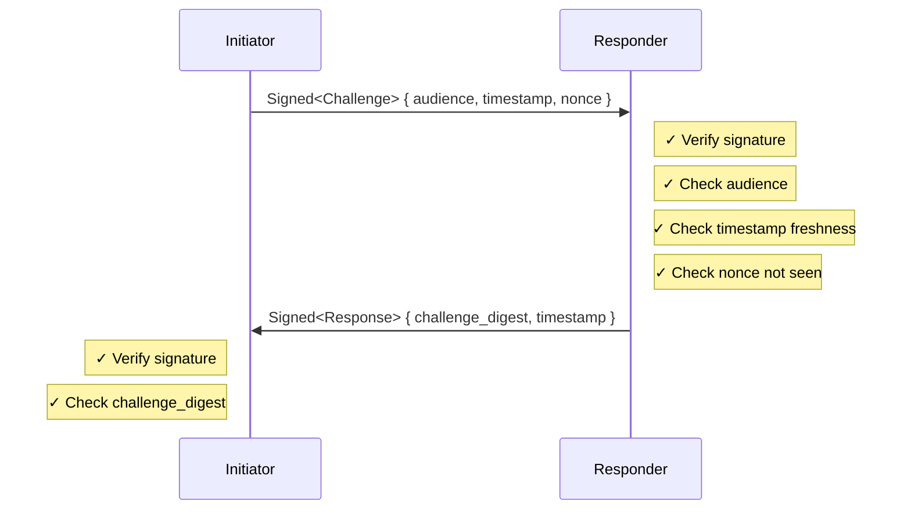
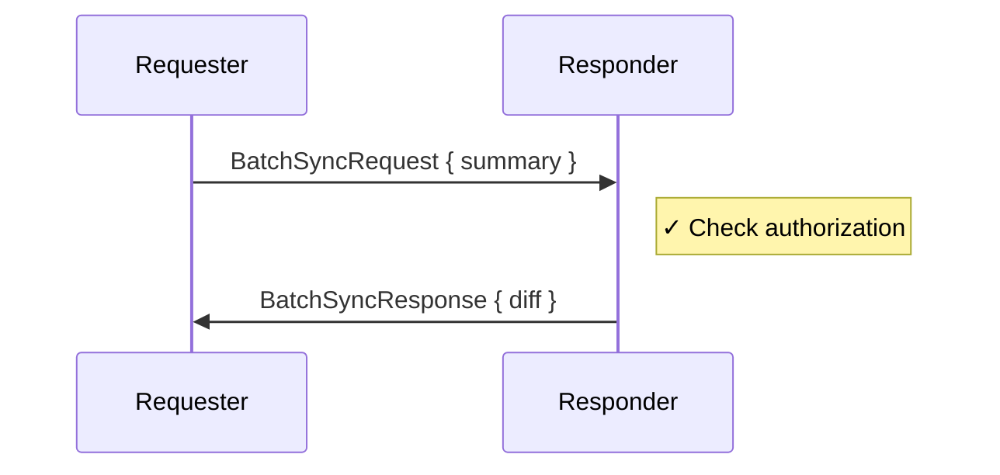
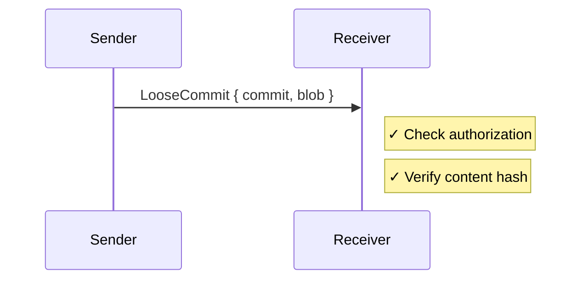

# Threat Model

This document describes the security assumptions, threats, and mitigations for the Subduction protocol.

## Trust Assumptions

### What We Trust

| Component         | Assumption                                     |
|-------------------|------------------------------------------------|
| **Ed25519**       | Signatures are unforgeable                     |
| **BLAKE3**        | Collision-resistant, preimage-resistant        |
| **TLS**           | Transport encryption and integrity (when used) |
| **Local storage** | Not compromised by attacker                    |
| **Private keys**  | Kept secret by their owners                    |

### What We Don't Trust

| Component            | Assumption                                            |
|----------------------|-------------------------------------------------------|
| **Network**          | Attacker can observe, delay, drop, or inject messages |
| **Peers**            | May be malicious, compromised, or buggy               |
| **Clocks**           | May drift significantly (±10 minutes tolerated)       |
| **Server operators** | May attempt unauthorized access                       |

## Security Goals

1. **Authentication** — Know who you're talking to
2. **Integrity** — Detect tampering with messages
3. **Replay protection** — Reject replayed handshakes
4. **Authorization** — Enforce access control per document
5. **Confidentiality** — Data encrypted at rest and in transit (via TLS + application-layer encryption)

## Threat Categories

### T1: Impersonation

**Threat:** Attacker claims to be a different peer.

**Mitigation:**
- Handshake requires Ed25519 signature on challenge
- `PeerId` derived from verifying key
- Response binds to specific challenge via digest

**Residual risk:** Private key compromise allows impersonation.

### T2: Replay Attack (Handshake)

**Threat:** Attacker captures and replays a valid `Signed<Challenge>` to establish a session as the victim.

**Mitigation:**
- 128-bit random nonce in each challenge
- Timestamp freshness check (configurable, default 60s)
- Nonce tracking rejects seen `(PeerId, Nonce)` pairs within drift window
- Challenge digest in response prevents response replay

**Residual risk:** Within the timestamp window, an attacker with network position could attempt replay before nonce is recorded. Mitigated by TLS (can't intercept) and short window.

### T3: Person-in-the-Middle (PITM)

**Threat:** Attacker intercepts and relays/modifies messages between peers.

**Mitigation:**
- TLS provides transport encryption and integrity
- Ed25519 signatures on handshake messages
- `Audience` field binds challenge to intended recipient

**Residual risk:** TLS termination proxy could observe traffic. Mitigated by application-layer encryption of document content.

### T4: Unauthorized Data Access

**Threat:** Peer requests data they shouldn't have access to.

**Mitigation:**
- `StoragePolicy::authorize_fetch()` checked before returning data
- `StoragePolicy::authorize_put()` checked before accepting data
- Empty diff returned for unauthorized requests (no information leak)

**Residual risk:** Policy misconfiguration could grant unintended access.

### T5: Denial of Service

**Threat:** Attacker floods server with requests to exhaust resources.

**Attack vectors:**
- Many handshake attempts (signature verification is CPU-intensive)
- Large sync requests
- Connection exhaustion

**Mitigation:**
- Cheap checks first (timestamp, audience) before signature verification
- Connection limits at transport layer
- TLS provides some protection (attacker must complete TLS handshake)

**Residual risk:** Determined attacker with resources can still DoS. Recommend rate limiting at load balancer.

### T6: Clock Manipulation

**Threat:** Attacker manipulates timestamps to bypass freshness checks or corrupt drift correction.

**Mitigation:**
- `MAX_PLAUSIBLE_DRIFT` (±10 minutes) bounds acceptable drift
- Drift correction only accepted from signed responses
- Unsigned rejections can only shift clock within plausible bounds

**Residual risk:** Attacker could cause one extra round-trip by injecting fake rejection. Acceptable tradeoff.

### T7: Nonce Exhaustion

**Threat:** Attacker fills nonce cache to cause legitimate nonces to be rejected.

**Mitigation:**
- Only successful handshakes record nonces (attacker can't fill cache with failed attempts)
- Generational buckets with TTL naturally expire old entries
- Per-peer tracking limits blast radius

**Residual risk:** None if nonce tracking only records successful handshakes.

### T8: Content Inference

**Threat:** Attacker infers document contents from metadata.

**Attack vectors:**
- Document size
- Sync frequency
- Number of commits/fragments
- Access patterns

**Mitigation:**
- Application-layer encryption of blob contents
- Sedimentree works with opaque, encrypted payloads
- Content-addressed storage reveals nothing about plaintext

**Residual risk:** Metadata analysis (size, timing) may reveal information. Consider padding for high-security applications.

## Protocol-Specific Analysis

### Handshake

**Security properties:**
- Mutual authentication (both parties sign)
- Replay protection (nonce + timestamp + digest binding)
- Audience binding (prevents misdirection)

### Batch Sync

**Security properties:**
- Authorization checked before returning data
- Content-addressed integrity (hash verification)
- No information leak on unauthorized request (empty diff)

### Incremental Sync

**Security properties:**
- Authorization checked before accepting
- Content integrity via BLAKE3 digest
- Idempotent (duplicates harmless)

## Out of Scope

The following are explicitly not addressed by Subduction:

| Item | Reason |
|------|--------|
| **Key management** | Delegated to application (e.g., Keyhive) |
| **Key revocation** | Delegated to policy layer |
| **Content encryption** | Application responsibility |
| **Network anonymity** | Use Tor/VPN if needed |
| **Forward secrecy** | TLS provides this at transport layer |

## Recommendations

### For Deployers

1. **Use TLS** — Always deploy behind TLS termination
2. **Rate limit** — Add rate limiting at load balancer
3. **Monitor** — Alert on unusual handshake failure rates
4. **Rotate keys** — Periodic key rotation limits compromise blast radius
5. **Audit policies** — Regularly review authorization rules

### For Application Developers

1. **Encrypt content** — Use application-layer encryption for sensitive data
2. **Validate policy** — Test authorization edge cases
3. **Handle errors** — Don't leak information in error messages
4. **Log security events** — Track failed auth attempts
