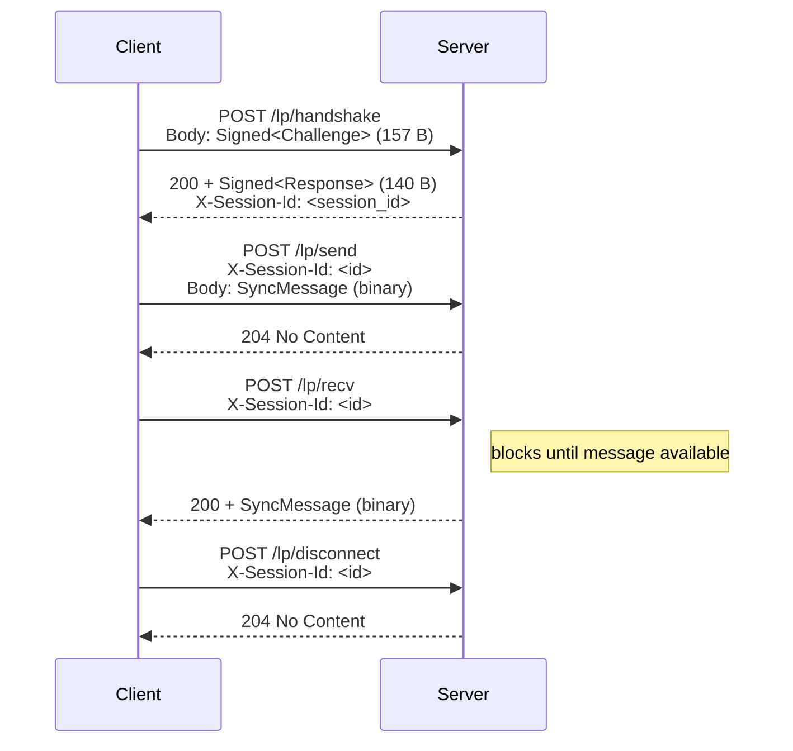

# Subduction HTTP Long-Poll

> [!WARNING]
> This is an early release preview. It has a very unstable API. No guarantees are given. DO NOT use for production use cases at this time. USE AT YOUR OWN RISK.

HTTP long-poll transport layer for the [Subduction](https://github.com/inkandswitch/subduction) sync protocol. Provides an alternative to WebSocket for environments where WebSocket connections are unreliable or unavailable (e.g. restrictive proxies, corporate firewalls, some serverless platforms).

## Protocol

The transport maps Subduction's bidirectional message stream onto HTTP request-response pairs:

## Endpoints

| Endpoint         | Method | Purpose                                |
|------------------|--------|----------------------------------------|
| `/lp/handshake`  | POST   | Ed25519 mutual authentication          |
| `/lp/send`       | POST   | Client sends a message to the server   |
| `/lp/recv`       | POST   | Client long-polls for the next message |
| `/lp/disconnect` | POST   | Clean session teardown                 |

## `no_std` Support

This crate is `no_std` compatible when the `std` feature is disabled. It requires `alloc` for dynamic memory allocation.

## License

See the workspace [`LICENSE`](../LICENSE) file.
