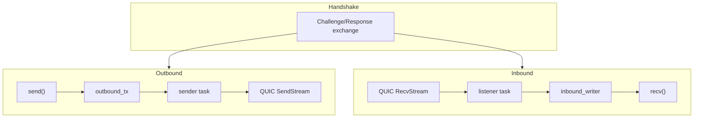

# Subduction Iroh

> [!WARNING]
> This is an early release preview. It has a very unstable API. No guarantees are given. DO NOT use for production use cases at this time. USE AT YOUR OWN RISK.

P2P QUIC transport layer for the [Subduction](https://github.com/inkandswitch/subduction) sync protocol using [iroh](https://iroh.computer/). Provides peer-to-peer connections with NAT traversal via relay servers and hole punching. Native-only (no Wasm support).

## Architecture

Each connection uses a single QUIC bidirectional stream with length-prefixed framing:

The `call()` method uses the same pending-map + oneshot pattern as the WebSocket and HTTP transports for request-response correlation.

## Authentication

This crate runs the full Subduction handshake (`Signed<Challenge>` / `Signed<Response>`) over the QUIC bidirectional stream. While Iroh already provides mutual TLS authentication at the transport layer, the Subduction handshake proves that the peer holds the expected _Subduction_ signing key (which may differ from the Iroh node identity).

## Connection Modes

| Mode                | Description                                      |
|---------------------|--------------------------------------------------|
| Discovery (default) | Connects via Iroh relay for NAT traversal        |
| Direct-only         | Requires explicit IP addresses, no relay traffic |
| Custom relay        | Routes through a user-specified relay URL        |

## Platform Support

This crate is **native-only** and does not support Wasm. For browser environments, use `subduction_websocket` or `subduction_http_longpoll`.

## License

See the workspace [`LICENSE`](../LICENSE) file.
